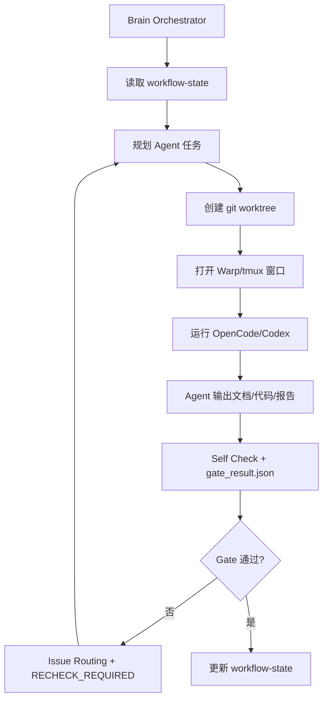

# bossResume 终端多 Agent 工作流

本文档是 bossResume 终端 Agent Loop 的历史入口说明。当前正式方案以 `agent-loop-docs/README.md`、`agent-loop-docs/process/brain-loop-protocol.md` 和 `scripts/agent-loop/README.md` 为准。

当前主方案采用：

```text
Brain Agent 讨论确认 + Brain Orchestrator 调度 + Warp/OpenCode 子 Agent + git worktree 隔离 + Gate/Issue/State loop
```

旧的 `docs/refactor-prd.md` 只作为历史兼容参考。当前正式 PRD 入口是：

- `docs/prd/bossresume-full-refactor-prd.md`
- `agent-loop-docs/prd-addendums/bossresume-full-refactor-prd-v1.2-agent-workflow-addendum.md`

## 1. 执行入口

```bash
npm run agent:brain -- --init-prd=docs/prd/bossresume-full-refactor-prd.md
npm run agent:brain -- --prd=docs/prd/bossresume-full-refactor-prd.md
npm run agent:state -- --prd-edit-mode=direct_edit
npm run agent:loop:verify -- --prd=docs/prd/bossresume-full-refactor-prd.md
npm run agent:loop:dry-run
npm run agent:loop
```

运行产物：

- `.agent-worktrees/`：每个 Agent 的独立 git worktree。
- `.agent-runs/`：每次 loop 的 prompt、日志、status 和 summary。
- `agent-loop-docs/`：当前 Agent Loop 流程状态、Review、Gate Result、Issue、测试、验收和归档。

## 2. 核心流程



## 3. 正式 Agent

正式角色以 `agent-loop-docs/process/agent-registry.md` 为准：

- `brain_agent`
- `product_agent`
- `ui_agent`
- `frontend_architect_agent`
- `backend_architect_agent`
- `frontend_agent`
- `backend_agent`
- `test_agent`
- `review_agent`
- `repair_agent`

旧名称如 `product_manager`、`frontend_dev`、`backend_dev`、`qa_tester`、`ui_designer` 只作为兼容别名。

## 4. Gate

Gate 规则以 `agent-loop-docs/process/gate-matrix.md` 为准。所有 Gate 只有三种结论：

- `APPROVED`
- `CHANGES_REQUESTED`
- `BLOCKED`

任何 Agent 输出缺少 Self Check 或 `agent-loop-docs/gate-results/*.json` 时，Gate 默认不得通过。

## 5. 业务代码阶段规则

业务代码阶段必须等待以下 Gate 通过：

1. PRD Gate
2. Architecture Gate 或 `ARCHITECTURE_IMPACT_REVIEW`
3. UI Gate
4. Design Gate

进入实现阶段后：

- `frontend_agent` 只在自己的 worktree 修改 `client/`。
- `backend_agent` 只在自己的 worktree 修改 `server/`。
- `test_agent` 负责测试报告和缺陷报告。
- `review_agent` 负责问题导向审查。
- `repair_agent` 只修 Brain 分派的 issue。

实现阶段通过后，短期同步已通过的 `client/` / `server/` 改动回主工作树，同时维护 `agent/integration/<feature>` integration branch；默认不直接 merge 到 `master`。

## 6. 相关文档

- `agent-loop-docs/README.md`
- `agent-loop-docs/process/brain-loop-protocol.md`
- `agent-loop-docs/process/agent-registry.md`
- `agent-loop-docs/process/gate-matrix.md`
- `scripts/agent-loop/README.md`
- `scripts/agent-loop/agents/*.md`
