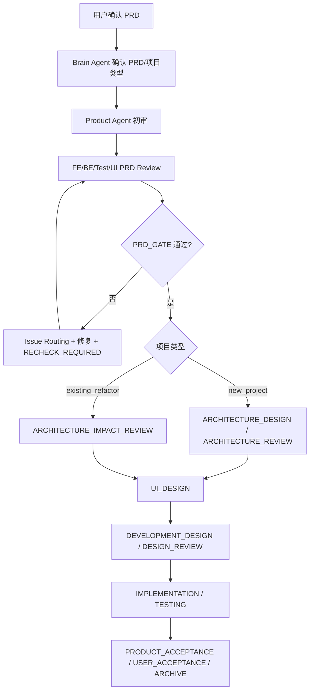

# BossResume 前后端整体改造 PRD v1.2 补充：多 Agent 流程与文档规范

适用主文档：`docs/prd/bossresume-full-refactor-prd.md`

本补充文档不替代主 PRD 的业务功能定义，而是补齐本次改造的终端全自动 Agent Loop、Brain Agent 总控、文档命名规范、Gate 决策、验收归档和文档清理策略。

当前 Agent Loop 运行态和产物统一放在 `agent-loop-docs/`；`docs/` 只保留 PRD、项目级架构/数据库、历史流程说明和历史 Review。

## 1. 本次补充目标

1. 建立以 `brain_agent` 为总控的多 Agent 研发链路。
2. 明确 Product、UI、Test、Frontend、Backend、Frontend Architect、Backend Architect、Review、Repair 的职责边界。
3. 建立 `PRD_GATE`、`ARCHITECTURE_GATE`、`UI_GATE`、`DESIGN_GATE`、`TEST_GATE`、`PRODUCT_ACCEPTANCE_GATE`、`USER_ACCEPTANCE_GATE`、`ARCHIVE_GATE`。
4. 建立统一文档命名、Review 问题格式、结构化 `gate_result.json` 和 Gate 决策格式。
5. 建立修复后 `RECHECK_REQUIRED` 复查机制，以及连续失败 3 次进入 `BLOCKED` 的停止规则。
6. 建立用户验收通过后的 `agent-loop-docs/archive/` 归档规范。

## 2. 多 Agent 总体流程



## 3. Agent 职责边界

| Agent | 职责 | 是否可改 PRD | 是否可改技术方案 | 是否可改业务代码 |
|---|---|---:|---:|---:|
| `brain_agent` | 总控流程、维护状态、汇总问题、判断 Gate、指派下一步 | 否 | 否 | 否 |
| `product_agent` | 审查 PRD、汇总多方 Review、按授权修订 PRD、产品验收 | 仅 `direct_edit` 且任务列出 editable files | 否 | 否 |
| `ui_agent` | PRD UI 评审、UI 设计、页面结构、视觉规范、交互状态 | 否 | 可产出/评审 UI 设计 | 否 |
| `test_agent` | PRD 可测性评审、测试设计、执行测试、提交缺陷、修复后复查 | 否 | 可评审 | 测试代码按任务授权 |
| `frontend_agent` | 前端 PRD Review、前端开发设计、按原子任务实现和自测 | 否 | 可产出前端设计 | 仅 `IMPLEMENTATION/REPAIR` |
| `backend_agent` | 后端 PRD Review、后端开发设计、按原子任务实现和自测 | 否 | 可产出后端设计 | 仅 `IMPLEMENTATION/REPAIR` |
| `frontend_architect_agent` | 前端架构设计/验收、已有重构项目前端架构影响评审 | 否 | 是，仅前端方案 | 否 |
| `backend_architect_agent` | 后端架构设计/验收、已有重构项目后端架构影响评审 | 否 | 是，仅后端方案 | 否 |
| `review_agent` | 设计文档、原子任务、修复后复查和风险审查 | 否 | 否 | 否 |
| `repair_agent` | 只修复测试或 Review 已确认的问题 | 否 | 否 | 仅 `REPAIR` 最小修复 |

旧名称如 `qa_tester`、`frontend_dev`、`backend_dev`、`frontend_architect`、`backend_architect` 只作为历史别名；正式流程使用上表名称。

## 4. Gate 通过标准

### 4.1 PRD_GATE

通过条件：

1. Product 初审完成，且包含 Self Check 和结构化 Gate Result。
2. Frontend、Backend、Test、UI 四方 PRD Review 完成。
3. Review Basis 必须引用 `agent-loop-docs/process/prd-review-standard.md`。
4. 无 BLOCKER、未处理 MAJOR 或必须用户确认的问题。
5. 未关闭问题必须登记 owner_agent、target_files、expected_fix、verification。

输出文档：

```text
agent-loop-docs/reviews/{feature-key}-{role}-prd-review-round-{round}.md
agent-loop-docs/gate-results/{feature-key}-{task}-round-{round}.json
agent-loop-docs/decisions/{feature-key}-prd-gate-round-{round}.md
```

### 4.2 ARCHITECTURE_GATE

新项目执行完整 `ARCHITECTURE_DESIGN` / `ARCHITECTURE_REVIEW`；已有重构项目执行轻量 `ARCHITECTURE_IMPACT_REVIEW`。

通过条件：

1. 新项目明确前后端边界、模块、接口契约、数据流、风险和验收标准。
2. 已有重构项目明确现有架构影响面、兼容风险、迁移影响和可测性。
3. 架构相关 Gate Result 全部 PASS。

### 4.3 UI_GATE

通过条件：页面结构、视觉规范、交互状态、组件规范、移动/桌面适配、异常状态明确，并输出 `agent-loop-docs/tech/*ui-design*.md`。

### 4.4 DESIGN_GATE

通过条件：UI/前端/后端/测试设计覆盖 PRD；前后端契约一致；测试方案可执行；任务拆分为原子级任务；每个原子任务有验收标准、自测命令和回滚方式。

### 4.5 TEST_GATE

通过条件：实现严格按设计文档和原子任务完成；相关类型检查、构建、测试或冒烟验证通过；阻塞缺陷关闭；实现改动无自动集成冲突。

### 4.6 PRODUCT_ACCEPTANCE_GATE 与 USER_ACCEPTANCE_GATE

Product Acceptance 通过条件：Product Agent 按 PRD 验收所有用户故事，已知风险和延期项写入验收报告。

User Acceptance 通过条件：用户明确确认通过，Brain Agent 检查必需文档齐全，无未关闭 Blocker，可以进入归档。

## 5. 循环规则

| 阶段 | 最大循环次数 | 超过后的处理 |
|---|---:|---|
| Product 初审 / PRD Review | 3 | Brain Agent 必须汇总争议点并向用户提问 |
| Architecture Design / Review / Impact Review | 3 | Brain Agent 必须要求架构 Agent 给出取舍方案 |
| UI Design | 3 | Brain Agent 必须明确 UI 阻塞项和 owner |
| Development Design / Design Review | 3 | Brain Agent 必须冻结必须改与可延后项 |
| Implementation / Test Repair | 3 | Brain Agent 必须输出阻塞问题、风险和人工决策点 |
| Product Acceptance | 2 | Product Agent 必须明确不通过原因和验收差距 |

禁止无限循环。任一 Gate 连续 3 轮未通过，必须停止推进并进入 `BLOCKED`。

## 6. 文档命名规范

`feature-key` 只能使用小写英文、数字和短横线，禁止中文、空格、下划线和日期。

| 文档类型 | 命名格式 |
|---|---|
| PRD | `docs/prd/{feature-key}-prd.md` |
| PRD Review | `agent-loop-docs/reviews/{feature-key}-{role}-prd-review-round-{round}.md` |
| UI/技术/测试设计 | `agent-loop-docs/tech/{feature-key}-{type}-v{round}.md` |
| Gate Result | `agent-loop-docs/gate-results/{feature-key}-{task}-round-{round}.json` |
| Gate 决策 | `agent-loop-docs/decisions/{feature-key}-{gate}-round-{round}.md` |
| Issue Routing | `agent-loop-docs/issues/{feature-key}-issues-round-{round}.md` |
| 测试/修复报告 | `agent-loop-docs/test-reports/{feature-key}-{type}-round-{round}.md` |
| 产品/用户验收 | `agent-loop-docs/acceptance/{feature-key}-{type}-v{round}.md` |
| 归档 | `agent-loop-docs/archive/{feature-key}/round-{round}/` |

## 7. Review 问题格式

每个问题必须包含：`issue_id`、`severity`、`owner_agent`、`category`、`source_file`、`target_files`、`problem`、`expected_fix`、`verification`、`blocking`。

## 8. Brain Agent 总控规范

Brain Agent 默认维护文件：

```text
agent-loop-docs/process/workflow-state.md
agent-loop-docs/process/brain-discussion.md
agent-loop-docs/decisions/*.md
agent-loop-docs/issues/*.md
```

Brain Agent 必须：

1. 每轮开始前判断当前阶段。
2. 检查必需输入文档是否存在。
3. 生成下一个 Agent 的明确任务指令。
4. 汇总各 Agent 评审问题。
5. 判断 Gate 是 `APPROVED`、`CHANGES_REQUESTED` 还是 `BLOCKED`。
6. 更新 `agent-loop-docs/process/workflow-state.md`。
7. 遇到需求冲突、方案冲突、无法判断的问题时停止并向用户提问。
8. User Acceptance Gate 通过后执行归档检查。

Brain Agent 禁止直接修改业务代码、跳过 Gate、替产品/架构/开发/测试 Agent 完成正式产物、忽略 Blocker、归档未通过用户验收的需求。

## 9. 归档规范

只有满足以下条件，Brain Agent 才能执行归档：Test Gate 已通过、Product Acceptance Gate 已通过、User Acceptance Gate 已通过、无未关闭 Blocker、必需文档齐全。

归档目录格式：

```text
agent-loop-docs/archive/{feature-key}/round-{round}/
```

归档完成后，Brain Agent 必须更新 `agent-loop-docs/process/workflow-state.md`，记录完成状态和归档路径。

## 10. 文档和 Agent 清理策略

清理必须遵守“可确认再删除”的原则。

可以删除：明确是临时草稿且内容已合并、旧 Prompt/旧 Agent 配置且不再被引用、重复文档且有更新版本替代、空文件或调试记录。

禁止直接删除：`AGENTS.md`、当前 PRD、当前 Agent Loop 入口、不能确认用途的历史文档、业务代码、迁移脚本、测试文件。

删除前必须记录到清理报告，且同步更新所有引用路径。

## 11. 简单测试方案

本补充文档完成后，需要执行一次文档链路测试，不验证业务代码。

通过标准：

1. Brain Agent 能从 `agent-loop-docs/process/workflow-state.md` 判断当前阶段。
2. Brain Agent 能生成 Product Agent 的下一步指令。
3. 文档命名规则能覆盖 PRD、Review、Tech Plan、Test Report、Gate Decision、Acceptance、Archive。
4. 清理策略明确哪些文件不能删。
5. 归档规则明确触发条件和目录结构。
