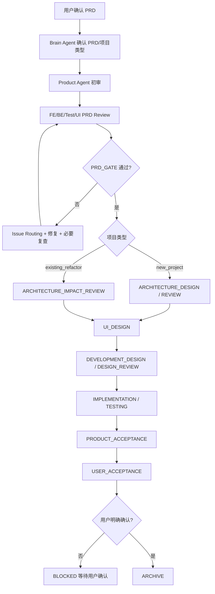

# bossResume Brain Loop Protocol

本文档定义终端版全自动 Agent Loop 的执行协议。核心原则：`brain_agent` 是可对话总大脑，只负责讨论方案、确认问题、维护状态、分派子 Agent、控制 loop；它没有编写业务代码的权利。

## 1. 两层大脑

| 层级 | 用户入口 | 底层入口 | 职责 | 是否写代码 |
|---|---|---|---|---|
| Brain Agent 常驻对话框 | `npm run agent -- chat` | `scripts/agent-loop/cli.mjs` | 长期挂在一个终端输入框中，展示状态卡，接收用户问题，保存对话历史，支持 `/status`、`/jobs`、`/watch`、`/logs`、`/preview`、`/next`、`/doctor`、`/history`、`/exit` | 否 |
| Brain Agent 单轮回答 | `npm run agent -- chat --once` | `npm run agent:brain` | 和用户讨论 PRD、确认执行哪份 PRD、澄清问题、读取已确认决策、维护 `workflow-state`、记录 `brain-discussion`、建议下一步命令 | 否 |
| Brain Orchestrator | `npm run agent -- next` 或常驻框中的 `/next` | `npm run agent:loop` | 根据 `workflow-state` 规划任务、打开子 Agent 窗口、创建 worktree、执行任务、收集 Gate/Issue、安排必要复查、推进状态、归档 | 否，负责调度 |
| Runtime Jobs | `npm run agent -- jobs` 或常驻框中的 `/jobs` | `scripts/agent-loop/run-status.mjs` | 读取 `.agent-runs/current-run.json`、`.agent-runs/current-tasks.json`、`.agent-runs/current-events.jsonl`，展示当前是否运行、卡在哪、父进程 PID、子 Agent 状态、日志和产物 | 否 |
| Status Card | `npm run agent -- status` 或常驻框中的 `/status` | `npm run agent:status` | 读取 `workflow-state`，展示当前 PRD、阶段、Gate、下一步 Agent、阻塞状态和推荐命令 | 否 |
| 子 Agent | OpenCode/Codex task | orchestrator 自动启动 | Product/UI/Frontend/Backend/Test/Architect/Review/Repair 分别产出文档、代码、测试或复查结果 | 仅在授权阶段 |

## 2. 持续对话协议

`npm run agent -- chat` 默认进入常驻对话框，不再一轮结束就退出。

普通文字会被发送给 `brain_agent` 讨论；内部命令由常驻对话框直接处理：

```text
/status   查看当前状态卡
/jobs     查看当前运行任务
/watch    持续刷新运行状态
/logs     查看结构化事件；可用 /logs raw 查看原始日志
/preview  预览下一轮 Agent，不真正执行
/next     后台执行下一轮 Agent Loop
/doctor   执行系统自检
/history  查看最近对话
/clear    清屏并重新显示状态
/help     查看命令帮助
/exit     退出常驻对话框
```

持续对话历史写入：

```text
agent-loop-docs/process/brain-conversation.jsonl
```

已确认决策写入：

```text
agent-loop-docs/process/confirmed-decisions.json
```

`confirmed-decisions.json` 是已确认事项的结构化事实来源，优先级高于最近聊天历史。最近聊天只提供上下文连续性，不能覆盖已确认决策、`workflow-state.md` 或 Gate 结果。

## 3. 完整流程



## 4. 状态机

| Phase | 负责 Agent | 目标 |
|---|---|---|
| `INTAKE` / `PRODUCT_REVIEW` | `product_agent` | PRD 初审，发现问题，必要时经 Brain 向用户提问 |
| `PRD_REVIEW` | `frontend_agent`,`backend_agent`,`test_agent`,`ui_agent` | 多方 PRD Review |
| `ARCHITECTURE_DESIGN` | `frontend_architect_agent`,`backend_architect_agent` | 新项目前后端架构设计 |
| `ARCHITECTURE_REVIEW` | 架构师/Test | 新项目架构验收 |
| `ARCHITECTURE_IMPACT_REVIEW` | 架构师/Test | 已有重构项目的架构影响评审，必须输出影响范围、兼容风险、迁移/回滚和可测性 |
| `UI_DESIGN` | `ui_agent` | 页面结构与视觉规范 |
| `DEVELOPMENT_DESIGN` | `frontend_agent`,`backend_agent`,`test_agent` | 前后端开发设计和测试设计，必须拆成原子任务 |
| `DESIGN_REVIEW` | Product/UI/Test/Architect/Review | 六角色按非重叠边界评审设计文档 |
| `IMPLEMENTATION` | `frontend_agent`,`backend_agent` | 严格按设计文档和原子任务实现，每个任务自测 |
| `TESTING` | `test_agent` | 测试、缺陷汇总、测试报告；仅允许修改 planner 授权的测试文件 |
| `PRODUCT_ACCEPTANCE` | `product_agent` | 按 PRD 逐条对照产品验收，引用测试报告，列出偏差和遗留问题 |
| `USER_ACCEPTANCE` | `brain_agent` + 用户 | 准备用户验收材料，等待用户明确确认 |
| `ARCHIVE` | `brain_agent` | 用户确认后归档 |

## 5. Gate 状态

| Gate 状态 | 含义 | 下一步 |
|---|---|---|
| `DRAFT` | 当前阶段尚未执行 | 按 phase 规划任务 |
| `CHANGES_REQUESTED` | Gate 未通过，但没有必须用户决策的问题 | 按 issue owner 分派责任 Agent 修复 |
| `RECHECK_REQUIRED` | 修复基础检查通过，但上一轮属于业务、架构、接口、数据库、实现或测试类问题 | 分派 Review/Test 或对应审核 Agent 复查 |
| `BLOCKED` | 存在 `HUMAN_DECISION_REQUIRED`、环境不可用、需求不清、连续失败 3 次或用户验收缺确认 | 停止 loop，交给 Brain Agent 和用户确认 |

每个 Agent 都必须产出 Markdown Self Check 和 `agent-loop-docs/gate-results/*.json`。Gate 的当前问题、当前阻塞、是否需要用户决策，必须以结构化 `gate_result.json` 为事实来源。

Markdown 只做结构性检查：输出文件是否存在、是否有 `## Self Check`、Self Check 是否声明结论、是否允许进入下一阶段、阶段级 Self Check 是否覆盖关键字段。Gate 不允许通过全文正则扫描 Markdown 里的 `BLOCKER` / `MAJOR` / `Open Questions` 来判断当前阻塞。

结构/格式类问题修复通过后，可以跳过额外复查直接推进；业务、架构、接口、数据库、实现、测试类问题修复通过后仍进入 `RECHECK_REQUIRED`。

## 6. DESIGN_REVIEW 六角色边界

| Agent | 只检查 | 禁止越界 |
|---|---|---|
| `product_agent` | PRD 覆盖、产品目标、验收条件、需求偏差、范围漂移 | 不审查 UI 视觉、前端架构、后端架构、测试实现 |
| `ui_agent` | 视觉规范、交互流程、页面状态、字段优先级、UI 设计落地一致性 | 不审查产品范围、接口契约、数据库、测试覆盖 |
| `test_agent` | 可测性、测试覆盖、测试数据、预期结果、异常路径、回归范围 | 不审查产品目标、视觉设计、前端架构、后端架构 |
| `frontend_architect_agent` | 前端架构、路由、组件边界、状态管理、接口接入、前端原子任务 | 不审查产品验收、视觉审美、后端表结构、测试用例细节 |
| `backend_architect_agent` | 后端架构、接口契约、数据模型、权限、幂等、迁移、后端原子任务 | 不审查视觉体验、前端组件实现、测试用例细节 |
| `review_agent` | 跨文档一致性、遗漏、原子任务质量、超范围实现风险、综合进入实现风险 | 不替专项 Agent 做领域审查，不修复问题 |

## 7. 用户验收硬约束

`USER_ACCEPTANCE_GATE` 文档协议已经明确，代码层也必须强制：

```json
{
  "user_confirmed": true,
  "confirmed_by": "user",
  "confirmed_at": "YYYY-MM-DD HH:mm:ss 北京时间"
}
```

没有上述字段时，Gate 必须不通过并生成 `HUMAN_DECISION_REQUIRED` issue。Product 验收、测试通过、Review 通过、Brain Agent 判断都不能代替用户验收。

## 8. 用户日常命令

```bash
npm run agent -- start docs/prd/bossresume-full-refactor-prd.md
npm run agent -- chat
npm run agent -- status
npm run agent -- jobs
npm run agent -- watch
npm run agent -- logs
npm run agent -- logs raw
npm run agent -- next --preview
npm run agent -- next
npm run agent -- next --foreground
npm run agent -- next --mode=single
npm run agent -- next --mode=auto --max-loops=10
npm run agent -- doctor
```

- `start`：首次初始化或明确重置 `agent-loop-docs/process/workflow-state.md`，同时清理上一轮 `.agent-runs/current-run.json` 和 `.agent-runs/current-tasks.json`。
- `chat`：打开常驻 Brain Agent 对话框。
- `status`：查看当前 PRD、阶段、Gate、下一步 Agent 和推荐命令。
- `jobs`：查看运行态、父进程 PID、子 Agent 状态、日志、产物和卡点。
- `logs`：查看结构化事件；`logs raw` 才看原始子 Agent 日志。
- `next --preview`：只预览下一步会启动哪些 Agent，不真正执行。
- `next`：后台启动下一轮 Agent Loop。
- `next --foreground`：前台阻塞执行。
- `doctor`：执行一键验收，检查 Agent Loop 工程自身是否可用。

## 9. 执行模式

```text
--mode=auto      自动推进到通过、需要用户决策或达到安全上限
--mode=single    只执行一轮
--mode=cautious  等同单轮，用于审慎推进
```

默认模式是 `auto`，默认安全上限是 10 轮。可以通过 `--max-loops=N` 或 `AGENT_LOOP_MAX_LOOPS=N` 调整。

## 10. 高级维护命令

```bash
npm run agent:brain
npm run agent:state
npm run agent:loop
npm run agent:loop:dry-run
npm run agent:loop:verify
```

高级命令仍然保留，但不作为用户日常主入口。

## 11. 安全边界

1. Brain Agent 没有业务代码编写权。
2. Brain Agent 默认只允许修改 `agent-loop-docs/process/workflow-state.md`、`agent-loop-docs/process/brain-discussion.md` 和 `agent-loop-docs/process/confirmed-decisions.json`。
3. 子 Agent 只有在对应阶段才有对应权限。
4. PRD 默认为 `review_only`，Product Agent 不直接改 PRD；只有 `direct_edit` 且任务列出 editable files 时才允许。
5. 文档流任务如修改 `client/` 或 `server/`，Gate 直接失败。
6. Test Agent 只能在 planner 授权的测试文件范围内修改测试代码，禁止修改业务实现。
7. 输出文件缺少 `## Self Check`，Gate 直接失败。
8. 缺少 `gate_result.json` 或结构化结论不是 PASS，Gate 不得通过。
9. `USER_ACCEPTANCE_GATE` 缺少用户确认记录时不得 PASS。
10. 阶段级 Self Check 未覆盖关键内容，Gate 直接失败。
11. 结构/格式类问题修复通过后可以跳过额外复查；业务、架构、实现、测试类问题仍必须复查。
12. 连续失败 3 次必须进入 `BLOCKED`。
13. `BLOCKED` 状态下 orchestrator 默认不创建 blocked-question 任务，只提示用户运行 `npm run agent -- chat`。
14. 实现阶段通过后，短期复制已通过的 `client/` / `server/` / 授权测试文件改动回主工作树，同时维护 `agent/integration/<feature>` integration branch；默认不直接 merge 到 `master`。
