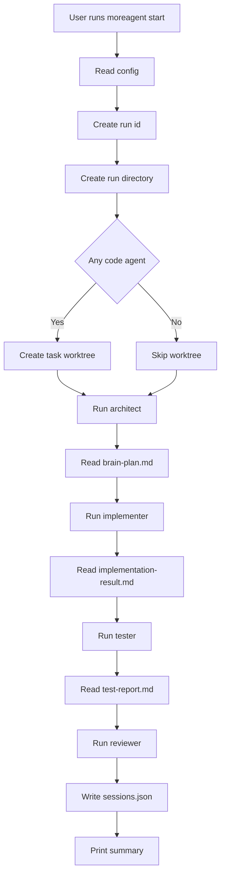
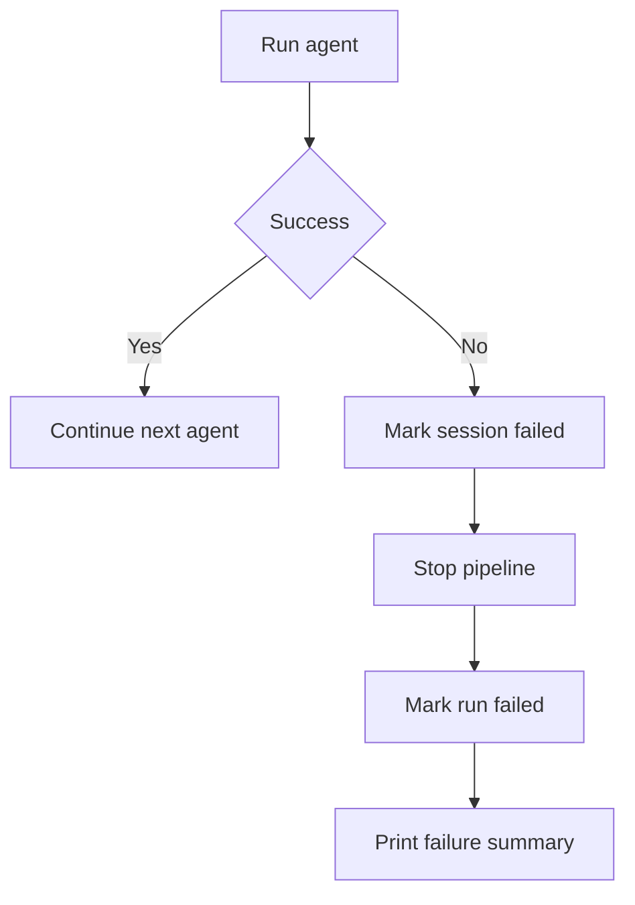
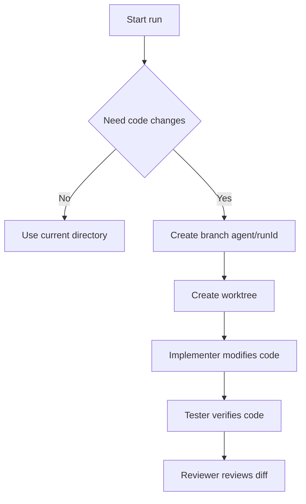
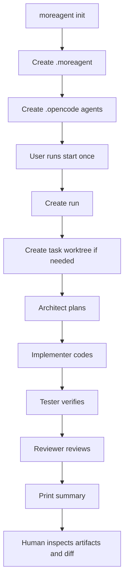
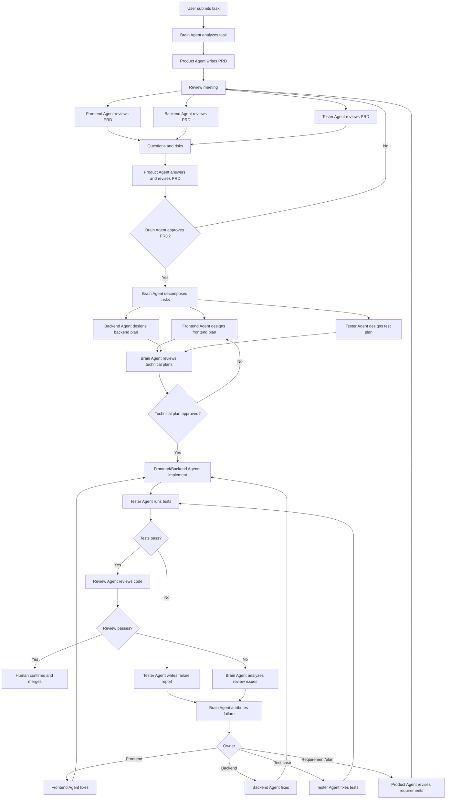

# MoreAgent Product Requirements Document

## 1. Product Overview

### 1.1 Product Name

MoreAgent

### 1.2 Product Positioning

MoreAgent is a project-level multi-agent and multi-session orchestration tool for AI coding workflows.

It is not a replacement for OpenCode, Codex, Claude Code, or other coding agents. It is a coordination layer above these tools. The first runtime target is OpenCode CLI.

The core goal is to let one local project behave like a small software team:

- an architect agent analyzes and plans
- an implementer agent modifies code
- a tester agent writes and runs checks
- a reviewer agent reviews the final result
- all agents run in isolated sessions
- code changes happen inside a controlled git worktree
- artifacts and logs are persisted for review
- humans keep final merge control

### 1.3 One-Sentence Summary

MoreAgent turns a single task into a controlled multi-agent development pipeline inside one repository.

### 1.4 Target Users

| User Type | Need |
|---|---|
| Solo developer | Use multiple AI coding agents without manually switching prompts and terminals |
| Frontend/backend engineer | Let AI perform planning, implementation, testing, and review in order |
| Technical lead | Standardize AI-assisted development workflow inside a project |
| AI power user | Manage OpenCode sessions, worktrees, artifacts, and execution logs |
| Small team | Keep AI-generated changes reviewable and auditable |

### 1.5 Core Value

MoreAgent should solve these problems:

1. AI coding sessions are hard to manage once multiple agents are involved.
2. Agents easily pollute each other's context.
3. Agents can overwrite each other's code changes.
4. AI-generated work often lacks durable plans, test reports, and review records.
5. Users cannot easily see what happened during an AI coding task.
6. It is unsafe to let AI continuously modify the main working tree.

MoreAgent solves these through:

- one agent, one role
- one run, one task worktree
- one agent, one artifact directory
- sequential pipeline execution in MVP
- fail-fast behavior
- human-controlled final merge

### 1.6 Reference Projects and Borrowing Boundaries

MoreAgent can learn from two adjacent open-source projects, but its product scope remains different:

| Project | What MoreAgent Should Borrow | What MoreAgent Should Not Copy Into MVP |
|---|---|---|
| CCManager | runtime profiles, worktree management, session state detection, project-level configuration | full TUI, multi-project dashboard, complex terminal multiplexing |
| gstack | role-based workflows, reusable prompt/skill templates, review and QA phase contracts | large skill marketplace, browser subsystem, deployment automation, long-term memory system |

MVP borrowing boundaries:

- Borrow runtime stability ideas from CCManager: command preflight, worktree safety, state detection, and runtime profiles.
- Borrow workflow discipline from gstack: explicit agent inputs, outputs, checklists, and artifact contracts.
- Do not add TUI, web UI, auto-deploy, browser automation, persistent memory, or a skill marketplace in MVP.

## 2. Product Scope

### 2.1 MVP Scope

The MVP focuses on local project-level usage.

Supported:

- `moreagent init`
- `moreagent start --once --task "..."` 
- `moreagent start --once --task "..." --agent <name>`
- local `.moreagent` state directory
- local `.opencode/agents` generation
- OpenCode CLI runtime
- sequential pipeline
- artifact persistence
- stdout/stderr logs
- git worktree isolation for code-modifying agents
- fail-fast execution

Not supported in MVP:

- web dashboard
- tmux UI
- continuous loop mode
- cloud execution
- multi-project dashboard
- automatic PR creation
- automatic merge
- advanced retry and repair loop
- true OpenCode native session resume
- Codex runtime adapter

### 2.2 Near-Term Scope

After MVP works reliably:

- `moreagent status`
- `moreagent clean`
- `moreagent start --loop`
- runtime profiles for OpenCode, Codex, and Claude Code
- reusable agent prompt templates
- session state detection for running, waiting, timed out, and stale runs
- tmux view for each agent
- real-time streaming output
- reviewer runs against task worktree
- configurable pipeline
- retry/fix loop
- OpenCode native session tracking

### 2.3 Long-Term Scope

Long-term platform capabilities:

- web dashboard
- multi-repository management
- Codex adapter
- Claude Code adapter
- agent marketplace
- shared memory
- workflow templates
- GitHub Issue integration
- PR creation
- team approval flow
- audit logs

## 3. Product Principles

### 3.1 Isolation First

Agents should not share raw conversation history.

They communicate through approved artifacts:

- plans
- summaries
- implementation reports
- test reports
- review reports
- logs

### 3.2 Human Keeps Control

MoreAgent may create code changes, but it should not automatically merge into the main branch in MVP.

### 3.3 File-Based State

Use local files first:

- simple to inspect
- easy to debug
- works without database
- friendly to git and CLI workflows

### 3.4 Small Steps Before Automation

Before continuous autonomous development, one task must be reliable.

The correct order is:

1. run one agent
2. run one task
3. run full pipeline
4. add retry
5. add loop
6. add dashboard

### 3.5 Runtime Is Replaceable, Orchestration Semantics Are Stable

MoreAgent should not bind its product semantics to one CLI.

MVP can target OpenCode first, but the internal design should allow runtime profiles:

- command: executable name, such as `opencode`, `codex`, or `claude`
- args: default launch arguments
- detection: runtime-specific state detector
- supportsNativeSession: whether native resume is supported
- defaultTimeout: runtime timeout

The stable MoreAgent concepts are the agent pipeline, artifacts, worktree isolation, session state, and human-controlled merge.

### 3.6 Prompts Are Product Assets

Agent prompts are not just configuration strings.

MVP may keep prompts in `.moreagent/config.yaml`, but later versions should move them into reusable files:

```txt
.moreagent/agents/
  architect.md
  implementer.md
  tester.md
  reviewer.md
```

This borrows gstack's skill discipline while keeping MoreAgent focused on local development pipelines.

### 3.7 Prefer Explicit Artifacts

Every phase should leave a durable output.

If the terminal closes, the user should still know:

- what task was run
- which agents ran
- what they produced
- what failed
- where code changed

## 4. User Stories

### 4.1 Initialize a Project

As a developer, I want to run:

```bash
moreagent init
```

So that my repository is prepared for multi-agent development.

Expected result:

- `.moreagent/config.yaml` is created
- `.moreagent/sessions.json` is created
- `.moreagent/runs/` is created
- `.moreagent/worktrees/` is created
- `.opencode/agents/*.md` is created

### 4.2 Run One Agent

As a developer, I want to run:

```bash
moreagent start --once --task "Add Usage docs" --agent architect
```

So that I can test a single agent without running the full pipeline.

Expected result:

- one run is created
- only architect executes
- architect artifact directory is created
- `brain-plan.md`, `stdout.log`, and optional `stderr.log` are saved

### 4.3 Run Full Pipeline

As a developer, I want to run:

```bash
moreagent start --once --task "Add Usage docs"
```

So that the task is planned, implemented, tested, and reviewed.

Expected result:

- architect runs first
- implementer runs after architect
- tester runs after implementer
- reviewer runs after tester
- if any agent fails, following agents do not run
- final summary is printed

### 4.4 Inspect Results

As a developer, I want to inspect `.moreagent/runs/<runId>/`.

So that I can understand exactly what happened.

Expected result:

```txt
.moreagent/runs/<runId>/
  architect/
    task.md
    brain-plan.md
    stdout.log
    stderr.log
  implementer/
    task.md
    implementation-result.md
    stdout.log
  tester/
    task.md
    test-report.md
    stdout.log
  reviewer/
    task.md
    review-report.md
    stdout.log
```

### 4.5 Review Code Changes

As a developer, I want code changes to stay in a task worktree.

So that the main working tree is protected.

Expected result:

```txt
.moreagent/worktrees/agent-<runId>/
```

The user can inspect:

```bash
cd .moreagent/worktrees/agent-<runId>
git status
git diff
```

### 4.6 Avoid Context Pollution

As a developer, I want agents to receive only relevant outputs from previous agents.

So that each agent has focused context.

Expected result:

- implementer receives architect's primary artifact
- tester receives architect and implementer artifacts
- reviewer receives architect, implementer, and tester artifacts
- no agent receives raw full terminal transcript unless explicitly included

## 5. Core Concepts

### 5.1 Project

A repository where MoreAgent is initialized.

Project state lives under:

```txt
.moreagent/
```

OpenCode agent definitions live under:

```txt
.opencode/agents/
```

### 5.2 Run

A run represents one execution of one user task.

Example:

```txt
run-2026-06-29T08-23-41-74062a
```

A run contains:

- task text
- run status
- sessions
- artifacts
- optional task worktree

### 5.3 Agent

An agent is a named role in the pipeline.

MVP agents:

| Agent | Role | Code Access |
|---|---|---|
| architect | Plan and architecture | Read-only |
| implementer | Code implementation | Write |
| tester | Test and verification | Write |
| reviewer | Review and risk analysis | Read-only |

### 5.4 Session

A session represents one agent execution inside one run.

In MVP, this is MoreAgent's own logical session record.

Future versions should capture OpenCode's real native session id.

### 5.5 Artifact

An artifact is a durable file written by an agent.

Primary artifacts:

| Role | Primary Artifact |
|---|---|
| architect | `brain-plan.md` |
| implementer | `implementation-result.md` |
| tester | `test-report.md` |
| reviewer | `review-report.md` |

### 5.6 Worktree

A git worktree isolates code changes.

MVP strategy:

- one run creates one task worktree
- implementer and tester run inside this worktree
- reviewer should review this worktree
- main working tree should remain safe

## 6. Directory Design

### 6.1 Runtime State Directory

```txt
.moreagent/
  config.yaml
  sessions.json
  runs/
  worktrees/
```

### 6.2 Run Directory

```txt
.moreagent/runs/<runId>/
  architect/
  implementer/
  tester/
  reviewer/
```

### 6.3 Agent Artifact Directory

```txt
.moreagent/runs/<runId>/<agentName>/
  task.md
  <primary-artifact>.md
  stdout.log
  stderr.log
```

### 6.4 OpenCode Agents Directory

```txt
.opencode/
  agents/
    architect.md
    implementer.md
    tester.md
    reviewer.md
```

## 7. Configuration Design

### 7.1 `.moreagent/config.yaml`

Purpose:

- define MoreAgent project metadata
- define pipeline agents
- define runtime command
- define timeout and retry settings

Example:

```yaml
version: "1.0"

project:
  name: "my-project"
  description: "Project description"

agents:
  - name: architect
    role: architect
    description: "Designs architecture and creates implementation plan"
    canModifyCode: false
    prompt: |
      You are a senior software architect.

  - name: implementer
    role: implementer
    description: "Implements the solution"
    canModifyCode: true
    dependsOn:
      - architect
    prompt: |
      You are a senior software developer.

runtime:
  opencodePath: "opencode"
  timeout: 1800
  maxRetries: 2
```

### 7.2 OpenCode Agent Files

Purpose:

- let OpenCode recognize `--agent architect`
- define runtime agent behavior
- avoid fallback to default agent

Example:

```md
---
description: Designs architecture and creates implementation plans.
---

You are a senior software architect.

Rules:
- Analyze requirements clearly.
- Produce implementation plans.
- Do not modify code unless explicitly requested.
```

### 7.3 Relationship Between Configs

`.moreagent/config.yaml` is used by MoreAgent.

`.opencode/agents/*.md` is used by OpenCode.

Both must stay aligned.

Future improvement:

- generate `.opencode/agents/*.md` from `.moreagent/config.yaml`
- detect drift
- add `moreagent sync-agents`

### 7.4 Future: Runtime Profiles

After MVP stabilizes, `runtime.opencodePath` should evolve into runtime profiles.

Example:

```yaml
runtimes:
  opencode:
    command: "opencode"
    args:
      - "run"
    detection: "opencode"
    timeout: 1800

  codex:
    command: "codex"
    args:
      - "exec"
    detection: "codex"
    timeout: 1800

defaultRuntime: "opencode"

agents:
  - name: architect
    role: architect
    runtime: opencode
    canModifyCode: false
```

Requirements:

- runtime profiles describe how to launch and detect a CLI.
- MoreAgent still owns the pipeline.
- different agents may use different runtimes later.
- if the runtime command is missing, start should fail before creating misleading running sessions.

## 8. Command Requirements

### 8.1 `moreagent init`

Purpose:

Initialize MoreAgent in the current repository.

Command:

```bash
moreagent init
```

Should create:

```txt
.moreagent/config.yaml
.moreagent/sessions.json
.moreagent/runs/
.moreagent/worktrees/
.opencode/agents/architect.md
.opencode/agents/implementer.md
.opencode/agents/tester.md
.opencode/agents/reviewer.md
```

Behavior:

- if `.moreagent` does not exist, create it
- if `config.yaml` does not exist, create default config
- if `sessions.json` does not exist, create `{ "runs": [] }`
- always ensure `.opencode/agents/*.md` exists
- do not overwrite existing OpenCode agent files unless a future `--force` option is provided

Success output:

```txt
Initialized at <path>/.moreagent
Created or ensured:
  config.yaml
  sessions.json
  runs/
  worktrees/
  .opencode/agents/
```

### 8.2 `moreagent start --once --task`

Purpose:

Run a task through the configured agent pipeline once.

Command:

```bash
moreagent start --once --task "Add Usage section to README"
```

Behavior:

1. read config
2. validate agents
3. create run id
4. create run directory
5. create task worktree if needed
6. run each agent sequentially
7. stop if any agent fails
8. write sessions
9. print summary

### 8.3 `moreagent start --once --task --agent`

Purpose:

Run only one agent for debugging.

Command:

```bash
moreagent start --once --task "Add Usage section" --agent architect
```

Behavior:

- only selected agent runs
- if selected agent modifies code, create worktree
- if selected agent does not modify code, worktree is optional
- still create run directory and session record

### 8.4 Future: `moreagent status`

Purpose:

Show latest runs and statuses.

Output example:

```txt
Latest runs:
  run-xxx completed  architect OK, implementer OK, tester OK, reviewer OK
  run-yyy failed     architect OK, implementer FAIL
```

### 8.5 Future: `moreagent clean`

Purpose:

Clean stale runs and worktrees.

Possible flags:

```bash
moreagent clean --runs
moreagent clean --worktrees
moreagent clean --all
```

## 9. Full Execution Flow

### 9.1 Happy Path



### 9.2 Failure Path



### 9.3 Worktree Flow



## 10. Agent Responsibilities

### 10.1 Architect Agent

Purpose:

Turn task into a concrete plan.

Inputs:

- user task
- project files
- prior context, if any

Outputs:

- `brain-plan.md`

Should include:

- task understanding
- implementation scope
- affected files
- risk points
- step-by-step plan
- test suggestions

Must not:

- make code changes by default
- invent unnecessary features
- skip unclear assumptions

### 10.2 Implementer Agent

Purpose:

Implement the plan.

Inputs:

- user task
- architect plan
- repository code

Outputs:

- code changes
- `implementation-result.md`

Should include:

- changed files
- implementation summary
- key decisions
- known limitations
- commands run

Must not:

- modify protected files unless necessary
- merge branches
- push code
- expand scope beyond task

### 10.3 Tester Agent

Purpose:

Verify implementation.

Inputs:

- task
- architect plan
- implementation result
- code changes

Outputs:

- test changes if needed
- `test-report.md`

Should include:

- commands run
- pass/fail result
- failure details
- suspected owner
- coverage or testing gaps

Must not:

- hide failing tests
- report success without evidence

### 10.4 Reviewer Agent

Purpose:

Review final diff and risk.

Inputs:

- task
- plan
- implementation report
- test report
- code diff

Outputs:

- `review-report.md`

Should include:

- correctness findings
- missing tests
- regression risks
- security/performance concerns
- merge recommendation

Must not:

- modify code by default
- approve without inspecting diff

## 11. Artifact Requirements

### 11.1 `task.md`

Must include:

- agent name
- agent role
- user task
- context from previous agents
- expected output

### 11.2 `brain-plan.md`

Must include:

- summary
- assumptions
- scope
- files likely affected
- implementation plan
- risks
- test strategy

### 11.3 `implementation-result.md`

Must include:

- files changed
- code changes summary
- commands run
- known issues
- next steps

### 11.4 `test-report.md`

Must include:

- commands run
- result table
- failures
- unresolved risk
- recommendation

### 11.5 `review-report.md`

Must include:

- review conclusion
- findings ordered by severity
- file references
- test gaps
- merge recommendation

### 11.6 Logs

Each agent directory must include:

- `stdout.log`
- `stderr.log` if stderr exists

## 12. State Model

### 12.1 Run Status

| Status | Meaning |
|---|---|
| running | Run is currently executing |
| completed | All selected agents completed |
| failed | At least one agent failed |

Future statuses:

| Status | Meaning |
|---|---|
| blocked | Human input required |
| cancelled | User stopped run |
| review-required | Work completed but needs human review |

### 12.2 Session Status

| Status | Meaning |
|---|---|
| pending | Agent has not started |
| running | Agent is executing |
| completed | Agent finished successfully |
| failed | Agent failed |

Future statuses:

| Status | Meaning |
|---|---|
| skipped | Agent skipped due to dependency failure |
| cancelled | User cancelled |
| waiting | Agent is waiting for user input or permission |
| timed_out | Agent was killed after timeout |
| stale | Session is recorded as running, but no local process is recoverable |

### 12.3 Future: Runtime State Detection

Borrowing from CCManager, MoreAgent should not rely only on subprocess exit codes.

At minimum:

| Status | Detection |
|---|---|
| running | child process is alive |
| waiting | runtime output indicates permission or input is required |
| timed_out | MoreAgent killed the process after timeout |
| stale | `sessions.json` says running but the process is gone |

First OpenCode detector:

- output contains `Permission required` -> waiting
- output contains `esc` and `interrupt` -> running
- exit code 0 -> completed
- non-zero exit code -> failed

MVP should report waiting states, not auto-approve them.

## 13. Error Handling

### 13.1 OpenCode Not Found

Error:

```txt
spawn opencode ENOENT
```

Cause:

- OpenCode is not installed
- PATH does not include OpenCode
- `runtime.opencodePath` is wrong

Expected behavior:

- fail current agent
- stop pipeline
- print clear message:

```txt
OpenCode executable not found. Check runtime.opencodePath in .moreagent/config.yaml.
```

### 13.2 OpenCode Agent Not Found

Error:

```txt
agent "architect" not found. Falling back to default agent
```

Cause:

- `.opencode/agents/architect.md` missing

Expected behavior:

- `moreagent init` should prevent this by generating agent files
- future version should validate OpenCode agents before execution

### 13.3 Worktree Creation Failed

Cause:

- not a git repository
- dirty state
- branch exists
- permission issue

Recommended MVP behavior:

- if any selected agent has `canModifyCode: true`, fail immediately
- do not fall back to current directory

Reason:

Fallback risks modifying user's main working tree.

### 13.4 Agent Timeout

Cause:

- OpenCode hangs
- model/network issue
- agent waits for permission/input

Expected behavior:

- kill process
- write stdout/stderr logs
- mark session failed
- stop pipeline

### 13.5 Artifact Not Written

Cause:

- agent only wrote stdout
- agent ignored instruction
- file write permission issue

Expected behavior:

- if primary artifact still contains template markers, use stdout as fallback
- record this in logs

### 13.6 Runtime Command Missing

Current low-level error:

```txt
spawn opencode ENOENT
```

Expected behavior:

- preflight `runtime.opencodePath` before starting agents
- fail with a clear `.moreagent/config.yaml` message
- avoid creating a misleading running session

### 13.7 Stale Running Session

Cause:

- MoreAgent process was interrupted
- runtime process exited unexpectedly
- `sessions.json` still records `running`

Expected behavior:

- `moreagent status` should show stale runs
- `moreagent clean --stale` should mark unrecoverable sessions as failed or stale
- true resume should wait until native runtime session ids are captured

## 14. Guardrails

### 14.1 No Auto Merge

MVP must not run:

```bash
git merge
git push
gh pr create
```

unless explicitly added in future versions.

### 14.2 Protected Files

Future configuration should support:

```yaml
protectedFiles:
  - .env
  - .env.local
  - package-lock.json
  - pnpm-lock.yaml
```

If protected files change, MoreAgent should warn or fail.

### 14.3 Read-Only Agents

Agents with `canModifyCode: false` should be instructed not to modify files.

Future versions should enforce this with:

- OpenCode tool permissions
- git diff checks
- read-only worktree

### 14.4 Scope Control

Agent prompts should include:

- do only requested task
- avoid unrelated refactors
- preserve existing style
- summarize assumptions

## 15. Reviewer Behavior

Reviewer must inspect the final code changes.

MVP issue to fix:

- reviewer currently may run in original project directory
- it should run in task worktree if one exists

Recommended logic:

```txt
if agent.role === "reviewer" and taskWorktree exists:
  run reviewer in taskWorktree
else if agent.canModifyCode and taskWorktree exists:
  run in taskWorktree
else:
  run in current directory
```

Reviewer should not modify code.

## 16. OpenCode Integration Requirements

### 16.1 CLI Invocation

MVP command:

```bash
opencode run --agent <agentName> "<prompt>"
```

### 16.2 Real-Time Output

MoreAgent should stream stdout/stderr:

```ts
proc.stdout.on("data", data => {
  stdout += data.toString();
  process.stdout.write(data);
});
```

This avoids the feeling that the command is stuck.

### 16.3 Session Handling

MVP:

- MoreAgent records logical session id
- OpenCode creates its own session

Future:

- use `--format json`
- parse OpenCode events
- capture native OpenCode session id
- resume with `--session`

### 16.4 Agent File Generation

`moreagent init` must create:

```txt
.opencode/agents/architect.md
.opencode/agents/implementer.md
.opencode/agents/tester.md
.opencode/agents/reviewer.md
```

This prevents OpenCode fallback to default agent.

## 17. MVP Acceptance Criteria

### 17.1 Init

Given a clean repository,
when user runs:

```bash
moreagent init
```

then the project contains:

- `.moreagent/config.yaml`
- `.moreagent/sessions.json`
- `.moreagent/runs/`
- `.moreagent/worktrees/`
- `.opencode/agents/*.md`

### 17.2 Single Agent Run

Given OpenCode is installed,
when user runs:

```bash
moreagent start --once --task "Add Usage docs" --agent architect
```

then:

- architect runs
- no worktree is required
- `brain-plan.md` exists
- `stdout.log` exists
- session status is completed or failed

### 17.3 Full Pipeline Run

Given OpenCode is installed and repository is git initialized,
when user runs:

```bash
moreagent start --once --task "Add Usage docs"
```

then:

- task worktree is created
- architect runs
- implementer runs
- tester runs
- reviewer runs
- all artifacts are saved
- final status is printed

### 17.4 Failure Handling

Given one agent fails,
then:

- following agents do not run
- run status is failed
- failed session has error
- stdout/stderr are saved

## 18. Recommended Development Roadmap

### Phase 1: Stabilize MVP

Must do:

1. Generate `.opencode/agents` during init.
2. Stream OpenCode output in real time.
3. Remove unsafe `--session` usage until native session id is captured.
4. Run reviewer in task worktree when one exists.
5. Fail if worktree creation fails and code agent exists.

### Phase 2: Better Status and Debugging

Add:

1. `moreagent status`
2. latest run summary
3. per-agent duration
4. current worktree path
5. failure diagnostics
6. stale running detection
7. runtime command preflight result

### Phase 3: Repair Loop

Add:

1. tester failure report
2. owner classification
3. send failure back to implementer
4. max repair rounds

### Phase 4: Continuous Development

Add:

1. `.moreagent/task-queue.md`
2. `moreagent start --loop`
3. max tasks per run
4. human confirmation after each task

### Phase 5: Visibility

Add:

1. tmux panes
2. per-agent terminal windows
3. live status
4. simple local web view

### Phase 6: Runtime Expansion

Add:

1. runtime profile abstraction
2. Codex adapter
3. Claude Code adapter
4. per-agent runtime selection
5. runtime-specific state detectors

### Phase 7: Workflow and Agent Templates

Add:

1. `.moreagent/agents/*.md`
2. `moreagent sync-agents`
3. built-in workflow templates: default, review-only, qa-only
4. prompt versioning
5. drift detection between `.moreagent/config.yaml` and `.opencode/agents/*.md`

### Phase 8: Platform-Level Multi-Agent Collaboration

Add:

1. brain agent for global judgment, task decomposition, plan review, and failure attribution
2. product agent for PRD generation, clarification, and requirement revision
3. frontend agent for frontend PRD review, frontend design, implementation, and fixes
4. backend agent for backend PRD review, backend design, implementation, and fixes
5. tester agent for testability review, test planning, execution, and test-case fixes
6. review agent for final code review and merge recommendation
7. multi-agent review meetings around PRDs and technical plans
8. failure routing back to frontend, backend, tester, or product stages

This is not a direct MVP target. It depends on:

- recoverable session management
- observable multi-terminal execution
- stable worktree isolation
- configurable workflow templates
- status inspection and failure diagnostics

## 19. Current Stage

MoreAgent is currently at the single-task MVP trial-run stage. It is not yet a platform-level multi-agent collaboration system.

Already implemented or scaffolded:

| Capability | Status |
|---|---|
| `moreagent init` project initialization | implemented |
| `.moreagent/config.yaml` | implemented |
| multi-agent configuration | implemented |
| `start --once --task` | scaffolded |
| sequential agent pipeline | implemented |
| OpenCode CLI invocation | wired to `opencode run --agent <name>` |
| per-agent artifact directory | implemented |
| stdout / stderr log persistence | implemented |
| `sessions.json` state tracking | implemented |
| one git worktree per run | implemented |
| fail-fast behavior | implemented |
| product documentation sync | mostly complete |

Not yet implemented:

| Capability | Current Status |
|---|---|
| true OpenCode native session resume | not implemented |
| visible terminal window per agent | not implemented |
| tmux multi-window mode | not implemented |
| `start --loop` continuous task queue | not implemented |
| multi-agent review meeting | not implemented |
| full product / frontend / backend / tester role chain | not implemented; current chain is architect / implementer / tester / reviewer |
| automatic failure attribution | not implemented |
| return-to-fix loop after failed review | not implemented |
| human confirmation / merge workflow | not implemented |
| Codex adapter | not implemented |

Current position:

```txt
design documentation       done
project skeleton           done
single-task MVP            scaffolded, needs stable trial runs
multi-session management   not done
multi-terminal visibility  not done
continuous development     not done
platform layer             not done
```

Next priority:

1. Run a local `moreagent start --once --task "xxx"` trial.
2. Fix reviewer execution so it runs in the task worktree.
3. Fail instead of falling back to the current directory when worktree creation fails.
4. Add runtime command preflight and stale run detection.
5. Add tmux or multi-terminal visibility later.
6. Add `start --loop` and platform-level multi-agent review last.

## 20. Example Local Usage

### 20.1 Install

```bash
npm install
npm run build
npm link
```

### 20.2 Initialize

```bash
moreagent init
```

### 20.3 Verify OpenCode

```bash
opencode run "只输出 OK"
opencode run --agent architect "只输出 OK"
```

### 20.4 Run One Agent

```bash
moreagent start --once --task "给 README 增加一个 Usage 示例" --agent architect
```

### 20.5 Run Full Pipeline

```bash
moreagent start --once --task "给 README 增加一个 Usage 示例"
```

### 20.6 Inspect Artifacts

```bash
find .moreagent/runs -maxdepth 3 -type f
cat .moreagent/sessions.json
```

### 20.7 Inspect Code Changes

```bash
cd .moreagent/worktrees/agent-<runId>
git status
git diff
```

## 21. Key Product Risks

### 21.1 Agent Ignores Artifact Instructions

Mitigation:

- fallback stdout to primary artifact
- make prompt stricter
- later add artifact validation

### 21.2 OpenCode CLI Behavior Changes

Mitigation:

- keep adapter isolated
- add version check
- document supported OpenCode versions

### 21.3 Worktree Safety

Mitigation:

- never fallback to current directory for code agents
- always show worktree path
- require manual merge

### 21.4 Context Grows Too Large

Mitigation:

- pass primary artifacts only
- summarize previous artifacts in future
- cap context length

### 21.5 Agent Role Drift

Mitigation:

- generate OpenCode agent files from config
- warn when `.moreagent/config.yaml` and `.opencode/agents` diverge

## 22. MVP Product Definition of Done

MoreAgent MVP is considered usable when:

1. `moreagent init` creates all required state and OpenCode agent files.
2. `opencode run --agent architect "只输出 OK"` works without fallback.
3. `moreagent start --once --task "... " --agent architect` completes.
4. Full pipeline can run on a small README task.
5. Artifacts and logs are saved.
6. Code changes stay in worktree.
7. Failures stop the pipeline.
8. User can inspect diff before merging.

## 23. Final MVP Flow



## 24. Final Platform Flow



MoreAgent should remain boring, explicit, inspectable, and safe before it becomes autonomous.
