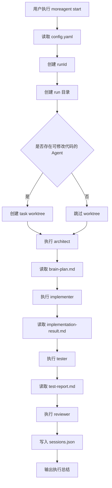
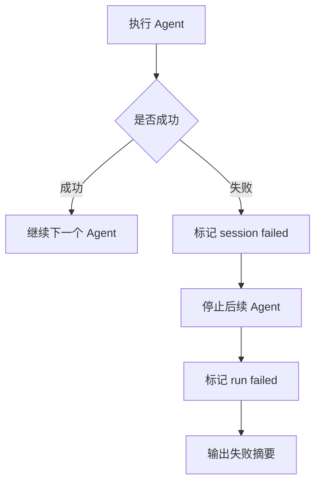
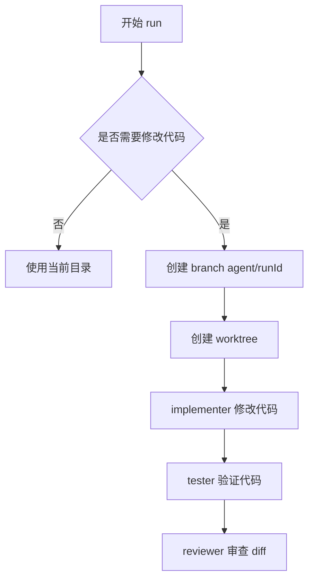
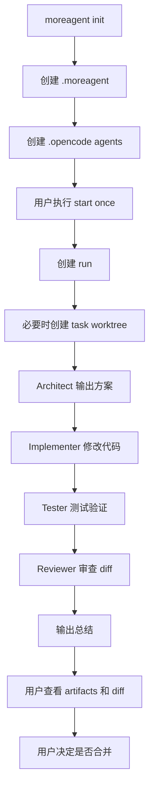
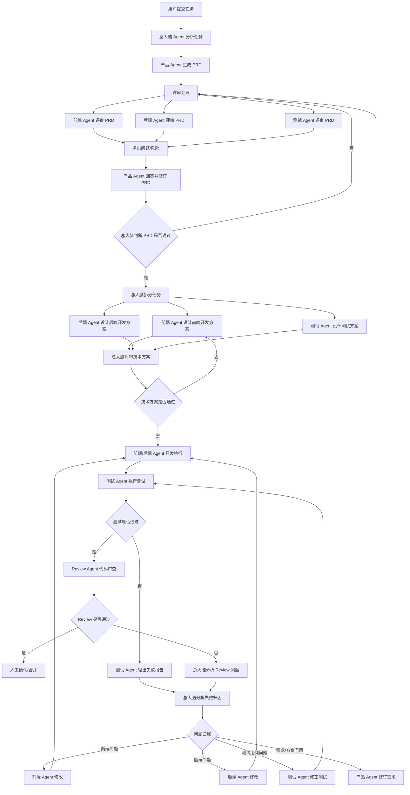

# MoreAgent 产品需求文档

## 一、产品概述

### 1.1 产品名称

MoreAgent

### 1.2 产品定位

MoreAgent 是一个面向单个代码项目的多 Agent / 多 Session 编排工具，优先集成 OpenCode CLI。

它不是要替代 OpenCode、Codex、Claude Code，而是在这些 AI 编程工具之上增加一层项目级调度能力，让一个普通代码仓库具备类似“小型 AI 开发团队”的工作方式。

MoreAgent 的核心目标是：

- 用户提交一个开发任务
- 系统自动创建一次 run
- 架构 Agent 先分析需求并输出方案
- 实现 Agent 根据方案修改代码
- 测试 Agent 编写或执行测试
- Review Agent 审查最终改动
- 所有 Agent 有独立上下文、独立产物目录、独立执行记录
- 修改代码的 Agent 在独立 git worktree 中执行
- 最终是否合并由用户人工决定

### 1.3 一句话描述

MoreAgent 把一个开发任务转化为一条可追踪、可审查、可回放的多 Agent 开发流水线。

### 1.4 目标用户

| 用户类型 | 核心需求 |
|---|---|
| 个人开发者 | 不想手动反复切换多个 AI 会话，希望 AI 能按流程开发 |
| 前端 / 后端工程师 | 希望 AI 先规划、再实现、再测试、再 Review |
| 架构师 / 技术负责人 | 希望把 AI 开发过程标准化、可控化 |
| AI 工具重度用户 | 希望管理多个 OpenCode / Codex / Claude Code 会话 |
| 小团队 | 希望 AI 生成代码后有产物、日志、Review 记录 |

### 1.5 解决的问题

当前直接使用 AI 编程工具时，常见问题包括：

1. 多个 Agent / 多个终端不好管理。
2. AI 经常没有先做设计就直接改代码。
3. 不同 Agent 容易共享过多上下文，互相污染判断。
4. 多个 Agent 同时改代码，容易覆盖或冲突。
5. AI 修改完之后缺少测试报告和 Review 记录。
6. 用户很难追溯某次任务到底发生了什么。
7. 如果让 AI 持续开发，缺少任务队列、失败归因和人工确认机制。

MoreAgent 通过以下方式解决：

- 每个 Agent 一个独立角色
- 每个 Agent 一个独立执行记录
- 每个 Agent 一个独立 artifact 目录
- 每次 run 一个独立 task worktree
- Agent 之间通过文件产物传递上下文
- 失败立即停止，不继续污染后续流程
- 不自动 merge，不自动 push

### 1.6 参考项目与借鉴边界

MoreAgent 可以借鉴两个相关开源项目，但产品定位不同：

| 项目 | 可借鉴内容 | MoreAgent 不应直接照搬 |
|---|---|---|
| CCManager | 多 AI CLI runtime 支持、worktree 管理、session 状态检测、项目级配置 | 完整 TUI、多项目管理、复杂终端复用 |
| gstack | 角色化工作流、可复用 prompt / skill 模板、review / QA / ship 阶段契约 | 庞大的技能市场、浏览器系统、发布自动化、持续记忆系统 |

MVP 阶段的借鉴边界：

- 优先借鉴 CCManager 的运行稳定性：runtime profile、命令预检、worktree 安全、状态识别。
- 适度借鉴 gstack 的工作流设计：明确每个 Agent 的输入、输出、检查清单和产物格式。
- 不在 MVP 中引入 TUI、Web 平台、自动发布、浏览器自动化、长期记忆和技能市场。

## 二、产品目标

### 2.1 MVP 目标

MVP 阶段只解决一件事：

> 在一个本地项目中，稳定跑通一次多 Agent 开发流水线。

MVP 需要支持：

- `moreagent init`
- `moreagent start --once --task "xxx"`
- `moreagent start --once --task "xxx" --agent architect`
- 自动创建 `.moreagent` 目录
- 自动创建 `.opencode/agents` 目录
- 调用 OpenCode CLI
- 顺序执行 Agent
- 保存 Agent 输出产物
- 保存 stdout / stderr 日志
- 创建 git worktree 隔离代码修改
- Agent 失败后中断流程

MVP 暂不支持：

- Web 控制台
- tmux 多窗口
- 持续循环开发
- 自动修复循环
- 自动创建 PR
- 自动 merge
- 多项目管理
- Codex 适配
- Claude Code 适配

### 2.2 中期目标

MVP 稳定后，再逐步支持：

- `moreagent status`
- `moreagent clean`
- `moreagent start --loop`
- runtime profile：支持 OpenCode / Codex / Claude Code 的统一运行时配置
- Agent prompt 模板化：从内联 prompt 演进为可复用 agent / skill 文件
- session 状态检测：识别 running / waiting / timed_out / stale
- 多终端 / tmux 可视化
- 失败归因
- 自动回到对应 Agent 修复
- reviewer 审查最终 worktree diff
- OpenCode 原生 session id 捕获与恢复

### 2.3 长期目标

长期可以演进为一个项目级或团队级 AI 开发平台：

- 多项目管理
- Agent 状态面板
- 任务队列
- GitHub Issue / PR 集成
- Codex / Claude Code / OpenCode 多运行时适配
- Agent 模板市场
- workflow 模板：如 plan -> implement -> test -> review、review-only、qa-only
- 权限控制
- 审计日志
- 团队审批流

## 三、核心产品原则

### 3.1 隔离优先

每个 Agent 应有独立上下文，不能共享完整聊天历史。

Agent 之间只通过结构化产物协作：

- `brain-plan.md`
- `implementation-result.md`
- `test-report.md`
- `review-report.md`
- `stdout.log`
- `stderr.log`

### 3.2 人工保留最终控制权

MoreAgent 可以让 AI 修改代码，但 MVP 阶段不能自动合并、不能自动 push。

用户必须能在合并前检查：

- 改了哪些文件
- 为什么这么改
- 测试是否通过
- Review 是否通过
- 是否存在风险

### 3.3 文件化状态

MVP 不引入数据库。

所有状态先存在本地文件：

- `.moreagent/config.yaml`
- `.moreagent/sessions.json`
- `.moreagent/runs/<runId>/`
- `.moreagent/worktrees/<runId>/`

优点：

- 易于调试
- 易于查看
- 易于让 AI 读取
- 不增加复杂依赖

### 3.4 先稳定单任务，再做持续开发

不要一开始就做自动循环开发。

正确顺序：

1. 单 Agent 跑通
2. 单任务完整流水线跑通
3. 加入 worktree 隔离
4. 加入日志和状态查看
5. 加入失败修复循环
6. 加入任务队列循环
7. 再做平台化界面

### 3.5 运行时可替换，但编排语义稳定

MoreAgent 不应把产品语义绑定到某一个 CLI。

MVP 可以优先支持 OpenCode，但内部抽象应预留 runtime profile：

- command：实际执行命令，如 `opencode`、`codex`、`claude`
- args：默认参数
- detection：状态检测策略
- supportsNativeSession：是否支持原生 session resume
- defaultTimeout：默认超时时间

这样 MoreAgent 的核心能力保持稳定：Agent pipeline、artifact、worktree、session 状态和人工合并控制。

### 3.6 Prompt 是产品资产

Agent prompt 不只是配置字符串，而是 MoreAgent 的产品资产。

MVP 可以先写在 `.moreagent/config.yaml` 中，但后续应演进为：

```txt
.moreagent/agents/
  architect.md
  implementer.md
  tester.md
  reviewer.md
```

这样可以像 gstack 的 skill 一样沉淀角色方法，但保持 MoreAgent 的范围更小：只服务本地开发流水线，不做通用技能市场。

## 四、用户故事

### 4.1 初始化项目

作为开发者，我希望在项目根目录执行：

```bash
moreagent init
```

系统自动生成 MoreAgent 所需目录和 OpenCode Agent 配置。

期望结果：

```txt
.moreagent/
  config.yaml
  sessions.json
  runs/
  worktrees/

.opencode/
  agents/
    architect.md
    implementer.md
    tester.md
    reviewer.md
```

### 4.2 只运行一个 Agent

作为开发者，我希望先测试单个 Agent：

```bash
moreagent start --once --task "给 README 增加 Usage 示例" --agent architect
```

期望结果：

- 只执行 architect
- 不创建代码 worktree，除非该 Agent 需要修改代码
- 生成本次 run 目录
- 生成 architect 的 artifact 目录
- 写入 `brain-plan.md`
- 写入 `stdout.log`

### 4.3 运行完整流水线

作为开发者，我希望执行：

```bash
moreagent start --once --task "给 README 增加 Usage 示例"
```

系统按顺序执行：

```txt
architect -> implementer -> tester -> reviewer
```

期望结果：

- architect 先输出方案
- implementer 根据方案修改代码
- tester 验证修改
- reviewer 审查最终结果
- 任意 Agent 失败则停止后续流程
- 所有产物保存在 `.moreagent/runs/<runId>/`
- 代码改动保存在 `.moreagent/worktrees/agent-<runId>/`

### 4.4 查看运行结果

作为开发者，我希望能直接查看产物：

```bash
find .moreagent/runs -maxdepth 3 -type f
cat .moreagent/sessions.json
```

我可以看到：

- 每个 Agent 是否成功
- 每个 Agent 执行耗时
- 每个 Agent 输出内容
- 是否有错误日志

### 4.5 查看代码改动

作为开发者，我希望 AI 不直接污染当前工作区。

我可以进入 worktree 查看 diff：

```bash
cd .moreagent/worktrees/agent-<runId>
git status
git diff
```

确认没问题后，再由我手动合并。

## 五、核心概念

### 5.1 Project

Project 指一个已经执行 `moreagent init` 的代码仓库。

项目级状态目录：

```txt
.moreagent/
```

OpenCode Agent 配置目录：

```txt
.opencode/agents/
```

### 5.2 Run

Run 表示一次任务执行。

每次执行：

```bash
moreagent start --once --task "xxx"
```

都会生成一个 runId：

```txt
run-2026-06-29T08-23-41-74062a
```

每个 run 包含：

- 用户任务
- 执行状态
- Agent session 列表
- artifact 目录
- worktree 路径

### 5.3 Agent

Agent 是流水线中的一个角色。

MVP 默认 Agent：

| Agent | 角色 | 是否修改代码 |
|---|---|---|
| architect | 架构设计 / 方案规划 | 否 |
| implementer | 代码实现 | 是 |
| tester | 测试 / 验证 | 是 |
| reviewer | 代码审查 | 否 |

### 5.4 Session

Session 表示某个 Agent 在某次 run 中的一次执行记录。

MVP 中，session 是 MoreAgent 自己维护的逻辑 session。

后续版本需要捕获 OpenCode 原生 session id，实现真正的恢复和继续。

### 5.5 Artifact

Artifact 是 Agent 执行后留下的产物文件。

| Agent Role | 主产物 |
|---|---|
| architect | `brain-plan.md` |
| implementer | `implementation-result.md` |
| tester | `test-report.md` |
| reviewer | `review-report.md` |

### 5.6 Worktree

Worktree 是 git 提供的独立工作目录。

MVP 策略：

- 每次 run 创建一个 task worktree
- implementer 和 tester 共享这个 worktree
- reviewer 应该在这个 worktree 中审查最终 diff
- 主项目目录不被 AI 直接修改

## 六、目录结构设计

### 6.1 MoreAgent 状态目录

```txt
.moreagent/
  config.yaml
  sessions.json
  runs/
  worktrees/
```

### 6.2 Run 目录

```txt
.moreagent/runs/<runId>/
  architect/
  implementer/
  tester/
  reviewer/
```

### 6.3 Agent 产物目录

```txt
.moreagent/runs/<runId>/<agentName>/
  task.md
  <primary-artifact>.md
  stdout.log
  stderr.log
```

示例：

```txt
.moreagent/runs/run-xxx/architect/
  task.md
  brain-plan.md
  stdout.log
```

### 6.4 OpenCode Agent 目录

```txt
.opencode/
  agents/
    architect.md
    implementer.md
    tester.md
    reviewer.md
```

## 七、配置设计

### 7.1 `.moreagent/config.yaml`

用途：

- MoreAgent 读取
- 定义 pipeline
- 定义 agent 名称、角色、prompt、是否可修改代码
- 定义 OpenCode 路径和超时时间

示例：

```yaml
version: "1.0"

project:
  name: "my-project"
  description: "Project description"

agents:
  - name: architect
    role: architect
    description: "Designs architecture and creates implementation plan"
    canModifyCode: false
    prompt: |
      You are a senior software architect.

  - name: implementer
    role: implementer
    description: "Implements the solution"
    canModifyCode: true
    dependsOn:
      - architect
    prompt: |
      You are a senior software developer.

runtime:
  opencodePath: "opencode"
  timeout: 1800
  maxRetries: 2
```

### 7.2 `.opencode/agents/*.md`

用途：

- OpenCode 读取
- 让 `opencode run --agent architect` 不再 fallback 到默认 agent

示例：

```md
---
description: Designs architecture and creates implementation plans.
---

You are a senior software architect.

Rules:
- Analyze requirements clearly.
- Produce implementation plans.
- Do not modify code unless explicitly requested.
```

### 7.3 两套配置的关系

| 文件 | 使用方 | 作用 |
|---|---|---|
| `.moreagent/config.yaml` | MoreAgent | 编排流程、执行顺序、角色定义 |
| `.opencode/agents/*.md` | OpenCode | 识别 `--agent xxx` 并加载对应角色提示词 |

后续可以增加：

```bash
moreagent sync-agents
```

用于根据 `.moreagent/config.yaml` 自动同步 `.opencode/agents/*.md`。

### 7.4 后续：runtime profiles

当 MVP 稳定后，`runtime.opencodePath` 应演进为 `runtimes` 配置。

示例：

```yaml
runtimes:
  opencode:
    command: "opencode"
    args:
      - "run"
    detection: "opencode"
    timeout: 1800

  codex:
    command: "codex"
    args:
      - "exec"
    detection: "codex"
    timeout: 1800

defaultRuntime: "opencode"

agents:
  - name: architect
    role: architect
    runtime: opencode
    canModifyCode: false
```

设计要求：

- runtime profile 只描述如何启动和识别 CLI 状态。
- Agent pipeline 仍然由 MoreAgent 控制。
- 不同 Agent 后续可以使用不同 runtime。
- 如果 runtime command 不存在，启动前应失败并给出清晰提示。

## 八、命令设计

### 8.1 `moreagent init`

功能：

初始化 MoreAgent 项目。

命令：

```bash
moreagent init
```

需要创建：

```txt
.moreagent/config.yaml
.moreagent/sessions.json
.moreagent/runs/
.moreagent/worktrees/
.opencode/agents/architect.md
.opencode/agents/implementer.md
.opencode/agents/tester.md
.opencode/agents/reviewer.md
```

行为细节：

- 如果 `.moreagent` 不存在，则创建
- 如果 `config.yaml` 不存在，则写入默认配置
- 如果 `sessions.json` 不存在，则写入 `{ "runs": [] }`
- 每次都检查 `.opencode/agents/*.md`
- 已存在的 OpenCode agent 文件不覆盖
- 后续可增加 `--force` 强制覆盖

### 8.2 `moreagent start --once --task`

功能：

执行一次完整任务。

命令：

```bash
moreagent start --once --task "给 README 增加 Usage 示例"
```

执行步骤：

1. 读取 `.moreagent/config.yaml`
2. 校验 agent 配置
3. 创建 runId
4. 创建 run 目录
5. 判断是否需要 worktree
6. 顺序执行 agents
7. 每个 agent 写入自己的 artifact
8. 任意 agent 失败则停止
9. 写入 sessions.json
10. 打印总结

### 8.3 `moreagent start --once --task --agent`

功能：

只运行指定 Agent，方便调试。

命令：

```bash
moreagent start --once --task "给 README 增加 Usage 示例" --agent architect
```

行为：

- 只运行 architect
- 如果该 Agent 不修改代码，则不创建 worktree
- 仍然创建 run 目录和 session 记录

### 8.4 后续命令：`moreagent status`

功能：

查看最近执行情况。

示例输出：

```txt
Latest runs:
  run-xxx completed  architect OK, implementer OK, tester OK, reviewer OK
  run-yyy failed     architect OK, implementer FAIL
```

### 8.5 后续命令：`moreagent clean`

功能：

清理历史 run 和 worktree。

示例：

```bash
moreagent clean --runs
moreagent clean --worktrees
moreagent clean --all
```

## 九、完整流程设计

### 9.1 正常流程



### 9.2 失败流程



### 9.3 Worktree 流程



## 十、Agent 职责设计

### 10.1 Architect Agent

职责：

- 分析用户任务
- 明确需求范围
- 输出实现方案
- 指出风险
- 给 implementer 提供步骤

输入：

- 用户任务
- 项目代码
- 已有上下文

输出：

- `brain-plan.md`

必须包含：

- 任务理解
- 假设条件
- 实现范围
- 可能影响的文件
- 实现步骤
- 风险点
- 测试建议

不应该做：

- 默认修改代码
- 擅自扩大需求
- 省略不确定点

### 10.2 Implementer Agent

职责：

- 根据 architect 方案实现代码
- 保持改动范围小
- 遵循项目已有风格
- 输出实现总结

输入：

- 用户任务
- `brain-plan.md`
- 项目代码

输出：

- 代码改动
- `implementation-result.md`

必须包含：

- 修改了哪些文件
- 实现了什么功能
- 关键决策
- 是否执行了命令
- 是否存在遗留问题

不应该做：

- 修改无关文件
- 擅自重构大范围代码
- 自动 merge / push

### 10.3 Tester Agent

职责：

- 验证 implementer 的改动
- 编写必要测试
- 执行已有测试命令
- 输出测试报告

输入：

- 用户任务
- `brain-plan.md`
- `implementation-result.md`
- 代码改动

输出：

- 测试改动
- `test-report.md`

必须包含：

- 执行了哪些命令
- 测试是否通过
- 失败详情
- 失败归因
- 测试覆盖缺口

不应该做：

- 测试失败却报告成功
- 忽略失败原因

### 10.4 Reviewer Agent

职责：

- 审查最终代码 diff
- 审查测试覆盖
- 发现潜在 bug 和风险
- 给出是否建议合并

输入：

- 用户任务
- `brain-plan.md`
- `implementation-result.md`
- `test-report.md`
- 最终代码 diff

输出：

- `review-report.md`

必须包含：

- Review 结论
- 严重问题
- 一般问题
- 测试缺口
- 风险判断
- 是否建议合并

不应该做：

- 默认修改代码
- 不看 diff 就通过

## 十一、Artifact 产物规范

### 11.1 `task.md`

内容：

- Agent 名称
- Agent 角色
- 用户任务
- 上游上下文
- 期望输出

### 11.2 `brain-plan.md`

内容：

- 任务理解
- 假设条件
- 实现范围
- 影响文件
- 实现步骤
- 风险点
- 测试建议

### 11.3 `implementation-result.md`

内容：

- 实现总结
- 文件变更表
- 关键决策
- 执行命令
- 遗留问题

### 11.4 `test-report.md`

内容：

- 测试命令
- 测试结果
- 失败详情
- 覆盖情况
- 建议

### 11.5 `review-report.md`

内容：

- Review 结论
- 问题列表
- 文件位置
- 测试缺口
- 是否建议合并

### 11.6 日志文件

每个 Agent 目录需要保存：

```txt
stdout.log
stderr.log
```

## 十二、状态设计

### 12.1 Run 状态

| 状态 | 含义 |
|---|---|
| running | 正在执行 |
| completed | 所有选中 Agent 执行成功 |
| failed | 至少一个 Agent 失败 |

后续可扩展：

| 状态 | 含义 |
|---|---|
| blocked | 等待用户输入 |
| cancelled | 用户取消 |
| review-required | 已完成但等待人工确认 |

### 12.2 Session 状态

| 状态 | 含义 |
|---|---|
| pending | 尚未开始 |
| running | 正在执行 |
| completed | 执行成功 |
| failed | 执行失败 |

后续可扩展：

| 状态 | 含义 |
|---|---|
| skipped | 因上游失败跳过 |
| waiting | 等待用户输入或权限确认 |
| timed_out | 超时终止 |
| stale | sessions.json 中仍是 running，但本地进程已不存在 |
| cancelled | 用户取消 |

### 12.3 后续：运行时状态检测

借鉴 CCManager 的状态检测思路，MoreAgent 后续不应只依赖进程退出码判断状态。

至少应支持：

| 状态 | 识别方式 |
|---|---|
| running | 子进程仍在运行 |
| waiting | runtime 输出中出现权限确认、等待输入等特征 |
| timed_out | 超过 timeout 后被 MoreAgent 终止 |
| stale | sessions.json 记录 running，但进程不存在或无法恢复 |

OpenCode 的第一版检测可以很简单：

- 输出包含 `Permission required` 时标记为 waiting。
- 输出包含 `esc` 和 `interrupt` 时保持 running。
- 子进程退出码为 0 时标记 completed。
- 子进程退出码非 0 时标记 failed。

状态检测只用于报告和恢复，不应在 MVP 中自动批准权限请求。

## 十三、异常处理

### 13.1 OpenCode 不存在

典型错误：

```txt
spawn opencode ENOENT
```

原因：

- OpenCode 未安装
- PATH 中找不到 opencode
- `runtime.opencodePath` 配置错误

处理：

- 当前 Agent 标记 failed
- run 标记 failed
- 停止后续流程
- 提示用户检查 `.moreagent/config.yaml`

### 13.2 OpenCode Agent 不存在

典型提示：

```txt
agent "architect" not found. Falling back to default agent
```

原因：

- `.opencode/agents/architect.md` 不存在

处理：

- `moreagent init` 必须自动生成 agent 文件
- 后续可增加启动前校验

### 13.3 Worktree 创建失败

可能原因：

- 当前目录不是 git 仓库
- branch 已存在
- 权限问题
- git 状态异常

建议处理：

- 如果本次任务存在 `canModifyCode: true` 的 Agent，直接失败
- 不要 fallback 到当前目录

原因：

fallback 会让 AI 修改用户当前工作区，不安全。

### 13.4 Agent 超时

可能原因：

- OpenCode 卡住
- 网络问题
- 模型响应慢
- 等待权限确认

处理：

- kill 子进程
- 写入 stdout / stderr
- session 标记 failed
- run 标记 failed

### 13.5 Artifact 未写入

可能原因：

- Agent 没按要求写文件
- 只输出到了 stdout
- 文件权限问题

处理：

- 如果主 artifact 仍是模板，则用 stdout 兜底写入
- 后续增加 artifact 校验

## 十四、安全与约束

### 14.1 不自动合并

MVP 禁止自动执行：

```bash
git merge
git push
gh pr create
```

### 14.2 保护文件

后续可支持配置：

```yaml
protectedFiles:
  - .env
  - .env.local
  - package-lock.json
  - pnpm-lock.yaml
```

如果 Agent 修改了保护文件，应提示或失败。

### 14.3 只读 Agent

`canModifyCode: false` 的 Agent 应该：

- 不修改代码
- 不执行破坏性命令
- 只读文件、分析、输出报告

后续可以通过：

- OpenCode tools 权限
- git diff 检查
- 只读 worktree

来强约束。

## 十五、当前需要优先修复的问题

### 15.1 `moreagent init` 自动生成 OpenCode Agents

当前问题：

`.moreagent/config.yaml` 中有 architect，但 OpenCode 不认识。

应新增：

```txt
.opencode/agents/architect.md
.opencode/agents/implementer.md
.opencode/agents/tester.md
.opencode/agents/reviewer.md
```

### 15.2 暂时不要传 `--session`

当前风险：

OpenCode 的 `--session` 是继续已有 session，不一定支持传 MoreAgent 自己生成的 session id。

MVP 建议：

```bash
opencode run --agent architect "<prompt>"
```

不要先传：

```bash
--session <sessionId>
```

### 15.3 实时输出 OpenCode 日志

当前问题：

MoreAgent 缓存 stdout，用户会以为卡住。

应修改为：

```ts
proc.stdout.on("data", data => {
  stdout += data.toString();
  process.stdout.write(data);
});
```

stderr 同理。

### 15.4 Reviewer 应在 task worktree 中审查

当前风险：

reviewer 如果在原项目目录运行，看不到 implementer / tester 的真实改动。

建议逻辑：

```txt
如果存在 taskWorktree:
  reviewer 也在 taskWorktree 中运行
但 prompt 约束 reviewer 不修改代码
```

### 15.5 Worktree 创建失败不能 fallback

当前风险：

如果 worktree 创建失败，代码 Agent fallback 到当前目录，会污染主工作区。

建议：

```txt
如果 needsWorktree = true 且 createTaskWorktree 失败:
  直接终止 run
```

### 15.6 启动前校验 runtime command

当前风险：

如果本机没有安装 `opencode`，运行时只会得到底层错误：

```txt
spawn opencode ENOENT
```

建议：

- `start` 前检查 `runtime.opencodePath` 是否可执行。
- 不存在时直接失败，不创建误导性的 running session。
- 错误信息给出具体配置路径：`.moreagent/config.yaml`。

### 15.7 清理 stale running run

当前风险：

如果进程异常退出，`sessions.json` 中可能留下 `running` 状态。

建议：

- `moreagent status` 显示 stale run。
- `moreagent clean --stale` 将不可恢复的 running session 标记为 failed 或 stale。
- 后续实现 native session resume 后，再支持真正恢复。

## 十六、MVP 验收标准

### 16.1 初始化验收

执行：

```bash
moreagent init
```

必须生成：

```txt
.moreagent/config.yaml
.moreagent/sessions.json
.moreagent/runs/
.moreagent/worktrees/
.opencode/agents/architect.md
.opencode/agents/implementer.md
.opencode/agents/tester.md
.opencode/agents/reviewer.md
```

### 16.2 OpenCode Agent 验收

执行：

```bash
opencode run --agent architect "只输出 OK"
```

必须不再出现：

```txt
agent "architect" not found. Falling back to default agent
```

### 16.3 单 Agent 验收

执行：

```bash
moreagent start --once --task "给 README 增加 Usage 示例" --agent architect
```

必须：

- 正常结束
- 生成 run 目录
- 生成 `brain-plan.md`
- 生成 `stdout.log`
- sessions.json 中状态正确

### 16.4 完整流水线验收

执行：

```bash
moreagent start --once --task "给 README 增加 Usage 示例"
```

必须：

- architect 完成
- implementer 完成
- tester 完成
- reviewer 完成
- 生成 task worktree
- 代码改动存在 worktree 中
- 主工作区不被污染

## 十七、后续路线图

### Phase 1：稳定 MVP

必须完成：

1. init 自动生成 `.opencode/agents`
2. adapter 实时打印 stdout / stderr
3. 暂时移除 `--session`
4. reviewer 进入 task worktree 审查
5. worktree 创建失败直接中断

### Phase 2：状态查看

新增：

1. `moreagent status`
2. 最近 run 列表
3. 每个 Agent 执行耗时
4. worktree 路径展示
5. 失败原因展示
6. stale running 检测
7. runtime command 预检结果

### Phase 3：失败修复循环

新增：

1. tester 输出失败归因
2. 判断问题属于 implementer / tester / requirement
3. 自动回到对应 Agent
4. 最大修复轮次

### Phase 4：持续开发

新增：

1. `.moreagent/task-queue.md`
2. `moreagent start --loop`
3. 每次取一个任务
4. 每个任务完成后等待人工确认

### Phase 5：可视化

新增：

1. tmux 多窗口
2. 每个 Agent 一个终端
3. 实时状态面板
4. 简单本地 Web UI

### Phase 6：多运行时

新增：

1. runtime profile 抽象
2. Codex Adapter
3. Claude Code Adapter
4. per-agent runtime 配置
5. 不同 Agent 使用不同模型
6. runtime-specific state detector

### Phase 7：工作流模板与 Agent 模板

新增：

1. `.moreagent/agents/*.md`
2. `moreagent sync-agents`
3. 内置 workflow 模板：default、review-only、qa-only
4. Agent prompt 版本化
5. 检测 `.moreagent/config.yaml` 与 `.opencode/agents/*.md` 是否漂移

### Phase 8：平台级多 Agent 协作

新增：

1. 总大脑 Agent：负责全局判断、任务拆分、方案评审和失败归因
2. 产品 Agent：负责 PRD 生成、答疑和需求修订
3. 前端 Agent：负责前端方案评审、前端实现和前端问题修复
4. 后端 Agent：负责后端方案评审、后端实现和后端问题修复
5. 测试 Agent：负责 PRD 可测性评审、测试方案、测试执行和测试用例修正
6. Review Agent：负责最终代码审查和合并建议
7. 多 Agent 评审会议：让产品、前端、后端、测试围绕 PRD 和技术方案提出问题
8. 失败归因回流：根据失败归属回到前端、后端、测试或产品阶段

这一阶段不是 MVP 的直接目标。它依赖前面阶段已经稳定具备：

- 可恢复的 session 管理
- 可观察的多终端执行
- 稳定的 worktree 隔离
- 可配置 workflow 模板
- 自动状态查看和失败诊断

## 十八、当前阶段定位

当前 MoreAgent 已经进入单任务 MVP 可试跑阶段，但还没有达到平台级多 Agent 协作。

已经完成或已有雏形：

| 能力 | 状态 |
|---|---|
| `moreagent init` 项目初始化 | 已完成 |
| `.moreagent/config.yaml` 配置文件 | 已完成 |
| 多 Agent 配置 | 已完成 |
| `start --once --task` | 已完成雏形 |
| 顺序执行 Agent pipeline | 已完成 |
| OpenCode CLI 调用 | 已接入 `opencode run --agent <name>` |
| 每个 Agent 独立 artifact 目录 | 已完成 |
| stdout / stderr 日志保存 | 已完成 |
| `sessions.json` 状态记录 | 已完成 |
| 一个 run 一个 git worktree | 已完成 |
| Agent 失败后中断流程 | 已完成 |
| 产品文档同步 | 基本完成 |

尚未完成：

| 能力 | 当前状态 |
|---|---|
| 真正恢复 OpenCode 原生 session | 未完成 |
| 每个 Agent 独立终端窗口可见 | 未完成 |
| tmux 多窗口模式 | 未完成 |
| `start --loop` 持续任务队列 | 未完成 |
| 多 Agent 评审会议 | 未完成 |
| 产品 / 前端 / 后端 / 测试完整角色链 | 未完成，当前仍是 architect / implementer / tester / reviewer 简化链 |
| 自动归因失败原因 | 未完成 |
| Review 不通过后自动回到修改 | 未完成 |
| 人工确认 / merge 流程 | 未完成 |
| Codex 适配 | 未完成 |

当前判断：

```txt
设计文档阶段          已完成
项目骨架阶段          已完成
单任务执行 MVP        已完成雏形，待稳定试跑
多 Session 稳定管理   未完成
多终端可观察          未完成
持续自动开发          未完成
平台化                未完成
```

下一步优先级：

1. 本地试跑一次 `moreagent start --once --task "xxx"`。
2. 修复 reviewer 没有进入 task worktree 的问题。
3. 禁止 worktree 创建失败后回退到当前目录。
4. 增加 runtime command 预检和 stale run 检测。
5. 再做 tmux / 多终端可视化。
6. 最后再做持续循环 `start --loop` 和平台级多 Agent 评审。

## 十九、本地使用流程

### 19.1 安装

```bash
npm install
npm run build
npm link
```

### 19.2 初始化

```bash
moreagent init
```

### 19.3 验证 OpenCode

```bash
opencode run "只输出 OK"
opencode run --agent architect "只输出 OK"
```

### 19.4 运行单 Agent

```bash
moreagent start --once --task "给 README 增加 Usage 示例" --agent architect
```

### 19.5 运行完整流水线

```bash
moreagent start --once --task "给 README 增加 Usage 示例"
```

### 19.6 查看产物

```bash
find .moreagent/runs -maxdepth 3 -type f
cat .moreagent/sessions.json
```

### 19.7 查看代码改动

```bash
cd .moreagent/worktrees/agent-<runId>
git status
git diff
```

## 二十、MVP 产品定义

MoreAgent MVP 完成的标准是：

1. 用户可以一键初始化项目。
2. 初始化后 OpenCode 能识别 MoreAgent 定义的 agents。
3. 用户可以运行单 Agent。
4. 用户可以运行完整流水线。
5. 每个 Agent 有自己的产物目录。
6. stdout / stderr 完整保存。
7. 修改代码发生在 task worktree 中。
8. 任意 Agent 失败后停止。
9. 用户可以人工查看 diff 再决定是否合并。

## 二十一、MVP 流程图



## 二十二、最终平台版流程图



MoreAgent 在平台化之前，最重要的是保持：明确、可控、可追踪、可回滚。
