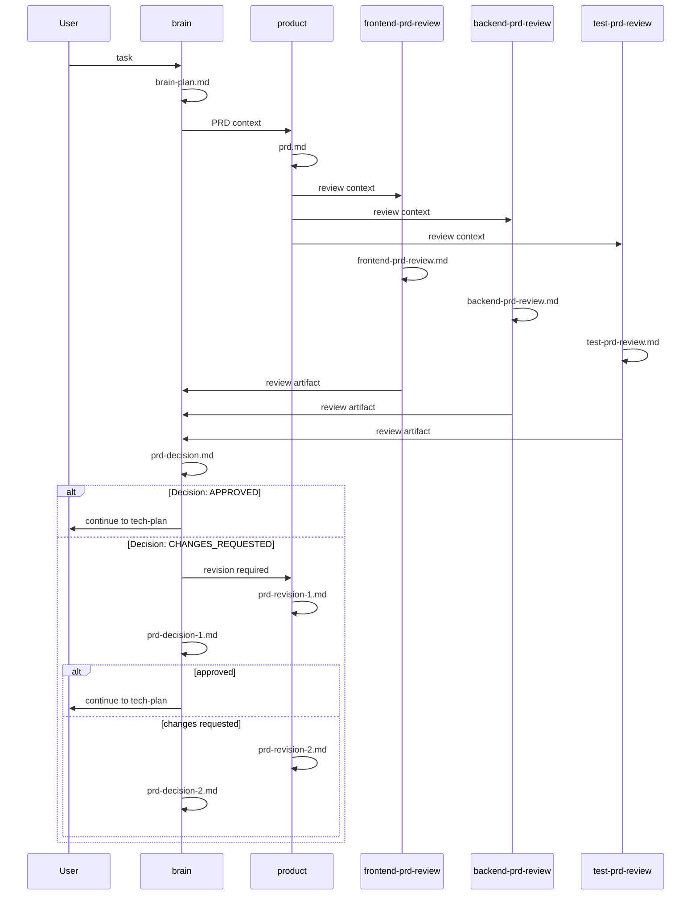

# MoreAgent V4.0 Tech Plan: PRD Review Meeting

## 1. 文档目标

本文件面向实现者，说明如何基于当前真实源码，把 full workflow 中的 PRD review meeting 做成稳定协议。

本方案不凭空造新架构，全部建立在当前真实实现之上。

## 2. 需要阅读和修改的源码文件

## 2.1 必须阅读

1. `src/commands/start.ts`
2. `src/workflow.ts`
3. `src/artifacts.ts`
4. `src/commands/report.ts`
5. `src/commands/status.ts`
6. `src/commands/inspect.ts`
7. `src/types.ts`

## 2.2 预计需要修改

1. `src/artifacts.ts`
2. `src/commands/start.ts`
3. `src/workflow.ts`
4. `README.md`
5. `CHANGELOG.md`
6. `test/regression.test.js`

说明：

1. `src/workflow.ts` 不一定需要改 phase 列表，但实现时必须检查是否需要补注释、session naming 一致性或 description 文案。
2. `src/commands/report.ts`、`src/commands/status.ts`、`src/commands/inspect.ts` 原则上不需要改主逻辑，但必须阅读确认不回退。

## 3. 不允许修改的范围

V4.0 不允许修改以下范围：

1. MVP pipeline 顺序和行为
2. `tech-plan -> tech-gate -> implementation -> test -> review` 总体 phase 顺序
3. repair loop 主体逻辑
4. worktree 隔离逻辑
5. merge 逻辑
6. dashboard server / watch 行为
7. runtime adapter 行为

原因：

1. V4.0 目标是强化 PRD review meeting 协议，不是重构整个 full workflow 引擎。

## 4. 当前真实结构分析

## 4.1 `src/workflow.ts` 当前结构

当前 `FULL_WORKFLOW_PHASES` 已定义：

1. `brain`
2. `prd`
3. `prd-review`
4. `prd-gate`
5. `tech-plan`
6. `tech-gate`
7. `implementation`
8. `test`
9. `review`

其中 PRD 相关 phase：

1. `prd`
   - session `product`
   - artifact `prd.md`
2. `prd-review`
   - `frontend-prd-review` -> `frontend-prd-review.md`
   - `backend-prd-review` -> `backend-prd-review.md`
   - `test-prd-review` -> `test-prd-review.md`
3. `prd-gate`
   - `prd-gate-1` -> `prd-decision.md`

结论：

1. phase 结构已经具备
2. V4.0 不需要新增 phase
3. V4.0 重点是协议、artifact 模板、gate 逻辑和测试补强

## 4.2 `src/commands/start.ts` 当前结构

当前 `executePhases()` 的真实行为：

1. 遍历 `FULL_WORKFLOW_PHASES`
2. 普通 phase 逐个执行 session
3. 对特殊 phase 分支处理：
   - `prd-gate` -> `runPrdGate()`
   - `tech-gate` -> `runTechGate()`
   - `test` -> `runTestWithRepair()`
   - `review` -> `runReviewWithRepair()`

当前 `runPrdGate()` 的真实行为：

1. 先执行 brain gate，写 `prd-decision.md`
2. 如果是 `CHANGES_REQUESTED`
   - 最多 2 轮
   - product 写 `prd-revision-1.md` / `prd-revision-2.md`
   - brain 写 `prd-decision-1.md` / `prd-decision-2.md`
3. 超过最大轮次返回 false

当前上下文传递机制：

1. 每个成功 session 的 primary artifact 会加入 `artifactContexts`
2. `executeAgentSession()` 会把 `artifactContexts` 和 `extraContext` 一起写入 `task.md`
3. 因此：
   - `brain` gate 实际能看到 product 和 3 个 review 的输出
   - `product` revision 也能看到之前的 review artifact

结论：

1. 当前控制流并不缺
2. 缺的是文档化协议、模板约束、测试覆盖和判定收紧

## 4.3 `src/artifacts.ts` 当前结构

当前已有 PRD 相关模板：

1. `prd.md`
2. `frontend-prd-review.md`
3. `backend-prd-review.md`
4. `test-prd-review.md`
5. `prd-decision.md`
6. `prd-revision-1.md`
7. `prd-decision-1.md`
8. `prd-revision-2.md`
9. `prd-decision-2.md`

当前问题：

1. review 模板内容过于宽松
2. `frontend-prd-review.md` / `backend-prd-review.md` / `test-prd-review.md` 顶部默认写了 `Decision: CHANGES_REQUESTED`
3. 这些 review 文件不是 machine gate artifact，但默认 decision line 容易误导实现者和用户
4. revision 模板过于简短，没有强制要求回应前一轮问题

## 5. V4.0 实现目标

V4.0 技术目标：

1. 不新增 phase
2. 不新增 CLI 命令
3. 强化 PRD review artifact 模板
4. 明确 brain gate 消费哪些 artifact
5. 收紧 `prd-decision*.md` 的判定
6. 保证 resume、status、report、dashboard 不回退

## 6. PRD review meeting 执行时序图



## 7. Artifact 文件命名和目录结构

## 7.1 正常路径

run 目录示例：

```text
.moreagent/runs/<runId>/
├── brain/
│   └── brain-plan.md
├── product/
│   └── prd.md
├── frontend-prd-review/
│   └── frontend-prd-review.md
├── backend-prd-review/
│   └── backend-prd-review.md
├── test-prd-review/
│   └── test-prd-review.md
└── prd-gate/
    └── prd-decision.md
```

说明：

1. `workflow.ts` 中 session 名是 `prd-gate-1`
2. 但 `runPrdGate()` 实际运行时当前使用 session 名 `prd-gate`
3. 这是当前源码中的命名不一致点

V4.0 推荐处理：

1. 统一为一个规则
2. 建议使用实际运行逻辑为准：
   - 初次 gate session 名 = `prd-gate`
   - revision 后 = `prd-gate-1`, `prd-gate-2`

原因：

1. 这与当前 `runPrdGate()` 实现更接近
2. 也更符合 artifact 文件名 `prd-decision.md`, `prd-decision-1.md`, `prd-decision-2.md`

这属于“源码对齐修正”，不是新增架构。

## 7.2 修订路径

```text
.moreagent/runs/<runId>/
├── prd-revision-1/
│   └── prd-revision-1.md
├── prd-gate-1/
│   └── prd-decision-1.md
├── prd-revision-2/
│   └── prd-revision-2.md
└── prd-gate-2/
    └── prd-decision-2.md
```

## 8. 状态写入 `sessions.json` / `workflow.completedPhases` 规则

## 8.1 session 规则

必须记录到 `run.sessions` 的 session：

1. `product`
2. `frontend-prd-review`
3. `backend-prd-review`
4. `test-prd-review`
5. `prd-gate`
6. `prd-revision-1`
7. `prd-gate-1`
8. `prd-revision-2`
9. `prd-gate-2`

规则：

1. 每个 session 独立 artifactDir
2. 每个 session 独立 status
3. 每个 session 记录 startedAt / completedAt / error

## 8.2 workflow phase 规则

`workflow.completedPhases` 保持 phase 级，而不是 session 级：

1. `prd` phase 完成后，push `prd`
2. `prd-review` phase 完成后，push `prd-review`
3. `prd-gate` 整个流程最终通过后，push `prd-gate`
4. 如果 `prd-gate` 在 revision 耗尽后失败：
   - 不 push `prd-gate`
   - `workflow.failedPhase = 'prd-gate'`

原因：

1. 当前 `executePhases()` 已采用 phase 粒度完成记录
2. V4.0 不应把 completedPhases 改成 session 粒度

## 9. Gate 判断解析逻辑

## 9.1 当前真实逻辑

当前 `runPrdGate()` 使用：

1. `brain` 生成 `prd-decision*.md`
2. `evaluateGateArtifactFile()` 解析 decision

当前解析规则：

1. `Decision: CHANGES_REQUESTED` => failed
2. `Decision: APPROVED` => passed
3. 缺少字段 => passed

这是当前兼容行为。

## 9.2 V4.0 推荐收紧

V4.0 建议对 PRD gate artifact 收紧：

1. `prd-decision*.md` 缺少合法 `Decision:` 行时，不再默认为通过
2. 应视为 gate invalid，当前轮 gate 失败

推荐原因：

1. gate artifact 是 workflow 关键协议边界
2. 不能像 tester/reviewer 那样为了兼容长期接受“缺字段 = 通过”
3. 否则会误放行到 `tech-plan`

推荐判定：

1. `APPROVED` => 通过
2. `CHANGES_REQUESTED` => 不通过，进入 revision 或最终失败
3. missing / malformed => 不通过，并写清错误原因

注意：

1. 这只建议用于 `prd-decision*.md`
2. 不要求把所有 artifact 判定策略一起改掉

## 10. Resume 行为

当前真实源码：

1. `resume` 仅支持 full workflow run
2. 从 `completedPhases` 之后继续
3. 已完成 session 会跳过

V4.0 要求：

1. `prd-review` 中断后 resume，不重复已完成 review session
2. `prd-gate` 中断后 resume，继续 gate 或下一轮 revision
3. 已存在 `prd-revision-1` 成功 session 时，不重复执行该 session

实现提醒：

1. `runner()` 中已有 “completed session 跳过” 逻辑
2. 重点是确保 session naming 统一，否则 resume 会找不到已完成 session

## 11. `status / report / dashboard` 的兼容要求

## 11.1 `status`

当前 `status` 已通过扫描 `prd-decision*.md` 得到 `prdGate`。

要求：

1. V4.0 不修改 `status` JSON schema
2. 保证 `prd-decision*.md` 命名不变
3. 保证 malformed artifact 不导致 `status` 崩溃

## 11.2 `report`

当前 `report` 已把：

1. `prdGate`
2. `techGate`
3. `test`
4. `review`

汇总为 gates / quality。

要求：

1. 继续兼容 `prd-decision*.md`
2. PRD review 会审增强后，不要求新增 report 字段

## 11.3 `dashboard`

当前 `dashboard` 通过 `report` 结果展示 `PRD Gate`。

要求：

1. 不回退
2. 不新增主 schema
3. 可继续只展示 `PRD Gate` 决策，而不必须渲染 3 个 PRD review 详情

结论：

1. V4.0 不强制变更 `status / report / dashboard` schema
2. 重点是保证现有消费链条继续稳定

## 12. 需要的具体实现修改点

## 12.1 `src/artifacts.ts`

建议修改：

1. 重写 `frontend-prd-review.md` 模板
2. 重写 `backend-prd-review.md` 模板
3. 重写 `test-prd-review.md` 模板
4. 重写 `prd-revision-1.md` 和 `prd-revision-2.md` 模板
5. 重写 `prd-decision*.md` 模板说明

模板改造原则：

1. review 文件不要再用误导性的默认 gate line 作为核心模板语义
2. 要有固定章节：
   - Summary
   - Blocking Issues
   - Non-blocking Risks
   - Missing Information
   - Recommendation to product
3. `prd-decision*.md` 必须强调唯一合法 `Decision:` 行

说明：

1. 是否保留 review 文件顶部 `Decision:`，需要实现时二选一
2. 推荐去掉 review 文件顶部 `Decision:`，避免与真正 gate artifact 混淆

## 12.2 `src/commands/start.ts`

建议修改：

1. 统一 `prd-gate` session naming
2. 为 `runPrdGate()` 补充明确的上下文构造注释
3. 收紧 `prd-decision*.md` 判定逻辑
4. 对 malformed gate artifact 给出明确错误
5. 保证 revision session 和 gate session naming 与 workflow/model 一致

可选 helper：

1. `evaluateRequiredGateArtifactFile()`
2. `buildPrdReviewMeetingContext()`

但不要求大重构。

## 12.3 `src/workflow.ts`

只在以下情况修改：

1. `prd-gate` phase 的 session naming 与实际运行 naming 不一致
2. description 文案需要与实现保持一致

如果修改，要求：

1. 仅做对齐
2. 不改 phase 数量
3. 不改 phase 顺序

## 13. 测试用例清单

至少实现以下 12 个回归测试。

## 13.1 `full workflow: PRD initial gate APPROVED`

前置数据：

1. full profile run fixture
2. review artifacts 存在
3. `prd-decision.md = Decision: APPROVED`

执行命令：

1. `moreagent start --once --task "..."` 或等价 fixture 驱动

断言：

1. `workflow.completedPhases` 包含 `prd-gate`
2. 能继续进入 `tech-plan`

## 13.2 `full workflow: frontend review raises blocking issues`

前置数据：

1. `frontend-prd-review.md` 包含阻塞问题
2. `prd-decision.md = Decision: CHANGES_REQUESTED`

断言：

1. 触发 `prd-revision-1`
2. 不直接进入 `tech-plan`

## 13.3 `full workflow: backend review raises blocking issues`

前置数据：

1. `backend-prd-review.md` 指出 API/data 风险
2. gate 为 `CHANGES_REQUESTED`

断言：

1. 触发 `prd-revision-1`
2. gate 不通过

## 13.4 `full workflow: tester review raises testability changes`

前置数据：

1. `test-prd-review.md` 指出 acceptance criteria 不可测
2. gate 为 `CHANGES_REQUESTED`

断言：

1. 触发 `prd-revision-1`
2. run 仍停留在 PRD 会审路径

## 13.5 `full workflow: product revision then gate APPROVED`

前置数据：

1. 初始 `prd-decision.md = CHANGES_REQUESTED`
2. `prd-decision-1.md = APPROVED`

断言：

1. 创建 `prd-revision-1`
2. 创建 `prd-gate-1`
3. `prd-gate` phase 最终成功
4. 进入 `tech-plan`

## 13.6 `full workflow: PRD gate exceeds max revision rounds`

前置数据：

1. `prd-decision.md = CHANGES_REQUESTED`
2. `prd-decision-1.md = CHANGES_REQUESTED`
3. `prd-decision-2.md = CHANGES_REQUESTED`

断言：

1. run 最终 failed
2. `workflow.failedPhase = prd-gate`
3. 不进入 `tech-plan`

## 13.7 `full workflow: gate artifact missing`

前置数据：

1. brain session 成功
2. `prd-decision*.md` 缺失

断言：

1. gate 不被当作通过
2. 错误信息明确
3. run 在 `prd-gate` 失败

## 13.8 `full workflow: malformed Decision line`

前置数据：

1. `prd-decision.md` 顶部为无效内容，如 `Decision: MAYBE`

断言：

1. gate 失败
2. 错误原因可见
3. 不进入 `tech-plan`

## 13.9 `resume: from prd-review`

前置数据：

1. run 已完成 `prd`
2. `frontend-prd-review` 已完成
3. `backend-prd-review` 未完成

执行命令：

1. `moreagent start --resume --run <id>`

断言：

1. 不重跑 `product`
2. 不重跑已完成的 `frontend-prd-review`
3. 继续剩余 PRD review sessions

## 13.10 `status/report/dashboard: PRD meeting changes do not crash`

前置数据：

1. full workflow run 含 `prd-decision*.md`
2. review artifacts 为新模板

执行命令：

1. `moreagent status --latest`
2. `moreagent report --latest`
3. `moreagent dashboard`

断言：

1. 三个命令均成功
2. `PRD Gate` 仍可显示

## 13.11 `mvp profile: unaffected by PRD review meeting hardening`

前置数据：

1. MVP run fixture

执行命令：

1. `moreagent start --once --task "..."`

断言：

1. MVP workflow 不依赖任何 PRD review artifact
2. 命令行为不变

## 13.12 `full workflow: continues into tech-plan after PRD approval`

前置数据：

1. PRD gate 最终为 `APPROVED`

断言：

1. 能创建 `frontend-plan.md`
2. 能创建 `backend-plan.md`
3. 能创建 `test-plan.md`

## 13.13 可选加测：`inspect --workflow` shows prdGate after revision`

前置数据：

1. 存在 `prd-decision-1.md`

断言：

1. inspect 不崩
2. gate 读到最终值

## 14. OpenCode 实现步骤

Step 1:

1. 阅读 `src/workflow.ts`
2. 阅读 `src/commands/start.ts`
3. 阅读 `src/artifacts.ts`
4. 找出 `prd-gate` naming 与 current runtime naming 的差异

Step 2:

1. 修改 `src/artifacts.ts`
2. 收紧 PRD review artifact 模板
3. 收紧 `prd-decision*.md` 模板说明
4. 补 revision 模板说明

Step 3:

1. 修改 `src/commands/start.ts`
2. 对齐 `prd-gate` session naming
3. 收紧 gate artifact 判定
4. 确保 resume 仍按统一 session naming 生效

Step 4:

1. 运行现有 `status/report/inspect/dashboard` 相关测试
2. 新增 PRD review meeting 回归用例

Step 5:

1. 更新 `README.md`
2. 更新 `CHANGELOG.md`

Step 6:

1. `npm run build`
2. `npm test`
3. 手工 smoke test 一条 full workflow 样本

## 15. 风险点和回归点

## 15.1 风险：`prd-gate` session naming 不一致

现状：

1. `workflow.ts` 写的是 `prd-gate-1`
2. `runPrdGate()` 初次执行实际用的是 `prd-gate`

风险：

1. resume 和 inspect/status 显示可能混乱

处理：

1. 在 V4.0 里统一 naming

## 15.2 风险：收紧 gate 判定导致旧 fixture 失败

现状：

1. 当前 missing `Decision` 可能被兼容视为 passed

风险：

1. 旧测试数据没有合法 `Decision` 行时会全部失败

处理：

1. 一起更新 fixture
2. 测试中明确区分 strict gate artifact 行为

## 15.3 风险：review 模板改动影响 agent 输出习惯

风险：

1. OpenCode 可能仍按旧模板输出松散内容

处理：

1. 在模板和 prompt 里写清结构化要求
2. 优先通过 artifact 模板约束，而不是大改 runtime prompt 逻辑

## 15.4 风险：`status/report/dashboard` 读取逻辑被意外破坏

风险：

1. 重构 artifact naming 后消费端扫描不到

处理：

1. 保持 `prd-decision*.md` 前缀不变
2. 不改 `report/status` 主扫描规则

## 15.5 风险：resume 重跑已完成 session

风险：

1. 如果 session naming 改动不一致，resume 识别不到 completed session

处理：

1. 所有修改先统一 session naming，再写测试

## 16. 最终 checklist

实现完成前必须逐项确认：

1. 不新增 phase
2. 不新增 CLI 命令
3. `prd` / `prd-review` / `prd-gate` 顺序保持不变
4. `frontend-prd-review.md` 模板已结构化
5. `backend-prd-review.md` 模板已结构化
6. `test-prd-review.md` 模板已结构化
7. `prd-decision*.md` 模板明确唯一合法 `Decision` 行
8. `prd-revision-1.md` / `prd-revision-2.md` 模板要求回应 review 问题
9. `prd-gate` session naming 已统一
10. `prd-decision*.md` missing / malformed 不再误通过
11. 超过最大修订轮次会在 `prd-gate` 失败
12. `resume from prd-review` 可用
13. `resume from prd-gate` 可用
14. `status` 不崩
15. `report` 不崩
16. `inspect --workflow` 不崩
17. `dashboard` 不崩
18. MVP workflow 不受影响
19. full workflow 在 PRD gate 通过后仍能继续到 `tech-plan`
20. `README.md` 和 `CHANGELOG.md` 已同步
