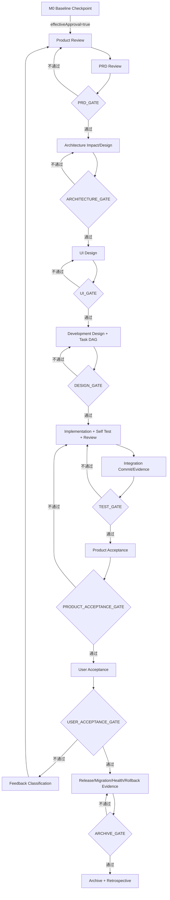

# 业务与产品定义

```yaml
status: draft
version: 0.2-r7
owner: product
last_updated: 2026-07-13
current_validation_project: BossResume
```

## 1. 文档职责与权威边界

本文是 AI Software Company OS 的产品事实源，负责定义产品愿景、目标用户、当前范围、核心场景、人机边界、“快、稳、好”目标和产品验收标准。

执行时遵守以下边界：

- 当前正式 Gate 的唯一权威是 `agent-loop-docs/process/gate-matrix.md`。
- 实时 Workflow 事实来自 `workflow-state.json`、Current Run/Task/Event 和可访问 Artifact。
- 本文件不注册 gateType，不以产品流程图替代 Gate Matrix。
- M0 是 Workflow 启动前的 `M0 Baseline Checkpoint`，不是正式 Gate。
- Integration Commit/Evidence 是 `TEST_GATE` 的强制输入。
- Release、Migration、Health Check 和 Rollback 是 `ARCHIVE_GATE` 前置证据。
- 文档中描述的目标能力不代表当前代码已经实现。

当前正式 Gate 只有：

```text
PRD_GATE
ARCHITECTURE_GATE
UI_GATE
DESIGN_GATE
TEST_GATE
PRODUCT_ACCEPTANCE_GATE
USER_ACCEPTANCE_GATE
ARCHIVE_GATE
```

## 2. 产品愿景与定位

### 2.1 最终愿景

建设一套通用 AI 软件公司操作系统。用户提供业务目标、需求或 PRD、代码仓库和约束，系统按照真实软件公司的工程制度完成：

```text
需求澄清
→ PRD
→ 多角色评审
→ 架构影响/架构设计
→ UI 与开发设计
→ 原子 Task DAG
→ 开发与自测
→ 独立 Review
→ Integration Commit
→ 系统测试
→ 产品验收
→ 用户验收
→ 发布、健康检查与回滚
→ 归档与复盘
```

多 Agent 只是执行组织。产品核心是：

> 使用确定性控制面管理非确定性 Agent，使交付可追踪、可验证、可恢复、可审计、可复盘。

### 2.2 产品不承诺

- 不承诺零缺陷或完全无人参与。
- 不用 Agent 自我声明代替测试和验收。
- 不用 Draft PR、未合并分支或未执行命令代替完成证据。
- 不在没有权限、证据、Migration 和 Rollback 的情况下执行高风险操作。
- 不以 Agent 数量、窗口数量或 Token 消耗作为进步标准。

## 3. 当前 BossResume 范围

当前唯一业务目标：

```text
完整交付 docs/prd/bossresume-full-refactor-prd.md
```

V0.1 约束：

- 本地单用户。
- 单项目：BossResume。
- 项目类型：`existing_refactor`。
- Single 模式。
- Auto 关闭。
- 固定 Agent 团队。
- Git Worktree 隔离。
- Brain Agent 不写业务代码。
- 用户保留真实业务取舍和最终验收权。

BossResume 同时是：

1. 第一项真实交付。
2. 第一套端到端 Benchmark。
3. 通用控制面的提炼来源。

BossResume 未完成前，多租户、多机器、Kubernetes、跨区域高可用和高度自治不作为当前优先级。

## 4. 目标用户与核心痛点

### 4.1 当前用户

- 使用 Codex、OpenCode、Claude Code 等工具进行 Vibe Coding 的个人开发者。
- 正在重构已有项目、但无法稳定管理多个 Agent 的开发者。
- 希望把产品、设计、开发、测试、集成和验收形成确定闭环的人。

### 4.2 核心痛点

1. Agent 角色清楚，但任务仍过大、输出仍不稳定。
2. 多 Agent 重复读取 PRD、代码和历史聊天，造成无效 Token。
3. 同一问题触发新窗口、新 Worktree 和完整重跑。
4. Agent 自己判断是否完成，状态无法信任。
5. Artifact 版本和路径混乱。
6. 多开发分支缺少稳定 Integration Evidence。
7. 失败归因不精确，小问题造成整条流程返工。
8. 系统问题被错误包装成用户决策。
9. 用户无法快速判断阶段、阻塞、风险、成本和剩余工作。
10. 项目完成后经验没有进入可复用知识和 Benchmark。

## 5. “快、稳、好”

### 5.1 快

“快”是减少无效工作：

- Task DAG 识别依赖、冲突和并行机会。
- Context Manifest 只提供任务必要上下文。
- Workstream、Session 和 Workspace 可在 Initial/Repair/Recheck 间复用。
- 缓存具有 Input Hash、失效和 supersede 规则。
- 确定性失败分类后只回流给唯一 Primary Owner。
- Task 运行受影响测试，阶段 Gate 运行更广回归。
- 只有真实业务判断才询问用户。

### 5.2 稳

“稳”依赖确定性控制：

- Workflow Engine 独占状态迁移权。
- Gate Engine 读取结构化 Result、测试和 Artifact。
- Lock、Lease、Heartbeat 防止重复执行和僵尸任务。
- Worktree/Container 隔离写入。
- Artifact Registry 保留唯一 ACTIVE 版本和历史。
- Project Map、Requirement Trace 和 Drift Check 管理影响范围。
- Integration Service 产生最终 Integration Commit/Evidence。
- Checkpoint、Event 和 Reconcile 支持中断恢复。
- Repair、Recheck、成本和时间有上限。

### 5.3 好

“好”是最终用户体验和交付质量：

- 用户看到可运行结果，而不是“Agent 已完成”。
- 产品、UI、开发、测试和用户验收相互独立。
- 界面展示阶段、任务、阻塞、证据、风险和待决策事项。
- Requirement 可追溯到 Design、Task、Commit、Test、Gate 和 Acceptance。
- 用户反馈被分类并定向回流，不无差别重启全流程。

## 6. 核心业务场景

每个场景必须定义：触发条件、输入、角色、状态变化、Artifact、正式 Gate、异常路径、用户介入点和完成标准。

### S01：模糊想法到 PRD

Brain 只澄清关键业务问题；Product 形成 PRD；Frontend、Backend、UI、Test 独立评审；Product 修订；最终进入 `PRD_GATE`。

完成条件：

- 范围、非目标、主流程和异常流程明确。
- 实体、状态机、字段、接口、权限和错误处理可实现。
- 验收标准可推导测试。
- 无 OPEN Blocking/Major。

### S02：已有完整 PRD

不重复讨论已确认内容。重点审查范围、流程、状态、实体、接口、权限、迁移、异常和验收。采用完整初审加有限 Recheck，不无限评审。

### S03：现有项目增量重构

```text
仓库扫描
→ Current Project Map
→ 已有能力与 PRD 差距
→ Architecture Impact Review
→ 兼容、Migration 与 Rollback
→ Development Design
→ Atomic Task DAG
```

每项需求必须标识新增、修改、复用或废弃。禁止忽略已实现能力或把现有项目当成新项目重写。

### S04：从零开发新项目

除业务设计外，增加架构设计、项目初始化、环境、CI、部署、安全和可观测性任务。先形成可运行工程基线和首个业务切片，不一次性生成整个项目。

### S05：Bug 修复

```text
复现
→ Evidence
→ Impact
→ Primary Owner
→ Repair
→ Affected Tests
→ TEST_GATE
```

除非证据证明需求或架构错误，否则不回到 PRD 起点。

### S06：UI 重构

覆盖信息架构、页面职责、视觉令牌、文案、Loading/Empty/Error/Permission、响应式和可访问性。UI 设计通过 `UI_GATE`；前端实现进入最终 `TEST_GATE`。

### S07：数据库迁移

必须覆盖 Schema、索引、兼容、Migration Dry Run、数据回填、校验、幂等、锁影响和 Rollback。高风险变更需明确用户批准。

### S08：测试失败后的定向 Repair

优先依据退出码、文件路径、测试覆盖、OpenAPI Diff、Schema Diff 和环境证据归因。低置信度再交独立 Review，不同时派给多个 Owner。

### S09：Integration 冲突

检测 Git、文件、API、Schema、Migration、Route、Env 和测试资源冲突。禁止“最后写入覆盖”。修复后重新生成 Integration Commit/Evidence，并由 `TEST_GATE` 验证。

### S10：用户中途修改需求

反馈分类：

- Bug → Implementation Repair。
- 体验/视觉 → UI/Frontend Repair。
- 需求误解 → Product Revision。
- 新增需求 → New Feature Workflow。
- 性能问题 → Performance Task。
- 范围变化 → PRD Change Control。

输入基线变化后，受影响 Task、Cache 和 Artifact 必须 supersede。

### S11：产品验收不通过

- 功能偏差 → Developer Repair。
- 体验偏差 → UI/Frontend Repair。
- PRD 错误 → Product Revision。
- 非目标被实现 → Scope Repair。

### S12：用户验收不通过

Brain 只结构化用户原话，不代替用户判断。反馈进入正确回流路径。只有用户明确确认，`USER_ACCEPTANCE_GATE` 才能通过。

### S13：工具或模型不可用

有限重试、退避、Circuit Breaker 和兼容 Provider。Tool、Parser、Workspace、Git 或状态源问题进入 `BLOCKED_BY_SYSTEM`，不得询问用户业务决策。

### S14：系统中断与恢复

停止新调度，对账 Workflow、Current Run/Task/Event、Lock、Session、Worktree 和 Artifact。先 Reconcile 再恢复；无法唯一恢复时保持 `BLOCKED_BY_SYSTEM`。

### S15：发布失败与回滚

用户验收后准备 Release Plan、Migration Evidence、Health Check 和 Rollback。健康检查失败产生 Incident Artifact 并回滚。回滚成功不代表交付完成，仍需 Repair、重新测试和重新验收。

## 7. 正式产品生命周期



规则：

- 设计完整性，包括原子 Task DAG 候选，在 `DESIGN_GATE` 验收。
- 实现、自测、Review、Repair、Integration Commit/Evidence 在 `TEST_GATE` 验收。
- Release 相关产物是 `ARCHIVE_GATE` 的前置证据。
- 任何正式 Gate 不通过都必须产生结构化 Issue、Owner 和 Recheck。

## 8. 人机边界

### 8.1 必须由用户决定

- 业务目标和范围取舍。
- 互斥业务规则。
- 关键主观体验。
- 预算、时间和质量取舍。
- 不可逆或高风险数据操作。
- 产品验收中的真实业务偏差。
- 最终用户验收。

### 8.2 不应询问用户

- 命名、格式、路径、Schema 修复。
- 构建、Lint、Typecheck、测试失败。
- Git、Worktree、Runner、Parser、状态源错误。
- 可以由现有标准确定的问题。
- Agent 之间的实现偏好。

系统问题必须由控制面或对应 Owner 修复，不能伪装成业务问题。

## 9. Product Acceptance

Product Agent 按 PRD 逐项验收：

- 范围和非目标。
- 用户主路径和异常路径。
- 实体、状态机、接口和权限。
- 页面职责和体验状态。
- 测试报告、Requirement Trace 和遗留 Issue。
- Migration、兼容和 Rollback 风险。
- 是否存在 Agent 自我声明代替 Evidence。

Product Agent 只能提出 `PRODUCT_ACCEPTANCE_GATE` 建议，不能自行推进状态。

## 10. User Acceptance

用户验收必须由真实用户确认：

- 输入必须来自受控 CLI/界面记录。
- Brain 只能结构化用户原话。
- 用户未确认时不得假定通过。
- 用户拒绝后按反馈类型回流。
- 用户确认必须绑定 feature、task/round、时间和基线。

## 11. BossResume 当前事实

截至 2026-07-13，完整审核发现本地存在 `state_source_split`：

- Git 中 Workflow State 原记录为 `READY / INTAKE / round 0`。
- 本地 `.agent-runs/current-*` 留有已结束 Product Review round 1。
- Current Run 指向的 Decision、Issue、Gate Result 和 Review Artifact 缺失。
- M0 Result 不存在，`effectiveApproval=false`。
- Product Agent、业务 PRD修改和业务代码开发均被禁止。

在完成确定性 Reconcile 并通过 M0 前，产品阶段不得继续推进。
