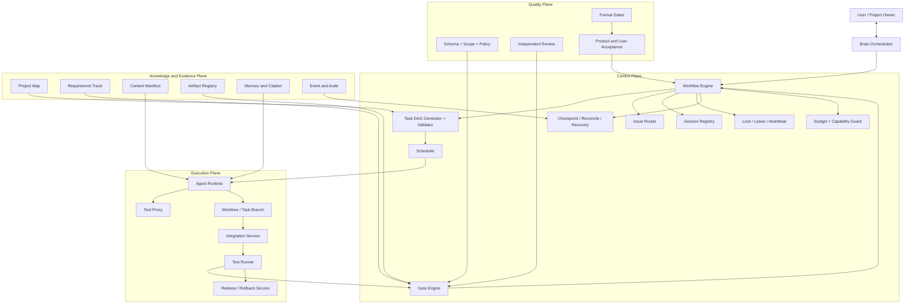

# 架构与系统设计

```yaml
status: draft
version: 0.2-r7
owner: architecture
last_updated: 2026-07-13
project_id: bossresume
workflow_feature: bossresume-full-refactor
```

## 1. 文档职责与权威边界

本文定义系统边界、当前成熟度、目标架构、Workflow Phase、确定性控制面组件、恢复机制和技术演进原则。

执行权威：

1. `agent-loop-docs/process/gate-matrix.md` 是当前正式 Gate 的唯一权威。
2. `agent-loop-docs/process/workflow-state.json`、Current Run/Task/Event 是实时状态事实源。
3. `agent-loop-docs/process/workflow-state.md` 描述正式 Phase 路径。
4. `agent-loop-docs/process/m0-baseline-checkpoint-contract.md` 定义 M0 Result 和 `effectiveApproval`。
5. 本文不得自行注册当前 gateType。
6. 未来能力必须明确标为未注册、未实现、不得推进当前状态。

当前正式 Gate：

```text
PRD_GATE
ARCHITECTURE_GATE
UI_GATE
DESIGN_GATE
TEST_GATE
PRODUCT_ACCEPTANCE_GATE
USER_ACCEPTANCE_GATE
ARCHIVE_GATE
```

当前特殊语义：

- M0 是 Workflow 前的 Baseline Checkpoint。
- Task DAG 设计完整性由 `DESIGN_GATE` 验收。
- Task DAG Validator、Scheduler、Lock、Lease、Heartbeat、Recovery 等实现由 `TEST_GATE` 验收。
- Implementation、Review、Repair 和 Integration Evidence 都是 `TEST_GATE` 输入。
- Release、Migration、Health Check 和 Rollback 是 `ARCHIVE_GATE` 前置证据。

## 2. 架构目标与成熟度

### 2.1 架构目标

系统不是多个 Agent 互相聊天，而是确定性控制平面管理 Agent 执行的软件交付操作系统：

- 支持现有项目重构和新项目开发。
- 支持需求、设计、Task、Commit、Test、Gate 和 Acceptance 全链路。
- 状态、Artifact、Issue 和用户决策可恢复、可审计。
- Agent、模型和工具可替换，合同和质量标准保持稳定。
- 当前先完成 BossResume 单项目闭环，再抽取通用平台。

### 2.2 成熟度

```text
L0：Prompt 驱动、人工确认、弱状态
L1：Workflow、Gate、Worktree、基础 Artifact
L2：原子 DAG、Session/Lock、Artifact Registry、Integration Evidence、可恢复执行
L3：多项目、多技术栈、服务化控制面
L4：高度自治 AI 软件公司
```

BossResume 当前目标是 L2 的最小可靠子集。

### 2.3 当前主要缺口

- M0 合同已有文档，真实 Result 不存在。
- 本地 Runtime 与 Git Workflow State 发生 `state_source_split`。
- Task/Workstream/Session/Lock/Context 合同未全部实现。
- Project Map、Trace 和 Artifact Registry 未形成完整运行闭环。
- Integration Evidence 尚未覆盖每个切片。
- Auto 关闭，Single 是唯一允许模式。

## 3. 总体架构



## 4. Workflow Phase 完整闭集

`workflowRuntimeState.phase` 必须无损记录正式 Phase：

```text
INTAKE
PRODUCT_REVIEW
PRD_REVIEW
ARCHITECTURE_IMPACT_REVIEW
ARCHITECTURE_DESIGN
ARCHITECTURE_REVIEW
UI_DESIGN
DEVELOPMENT_DESIGN
DESIGN_REVIEW
IMPLEMENTATION
TESTING
PRODUCT_ACCEPTANCE
USER_ACCEPTANCE
ARCHIVE
```

Repair、Recheck、Reverify、Integration 和 Release 是阶段内操作或证据，不是本闭集中的独立 Runtime Phase。

### 4.1 existing_refactor

```text
INTAKE
→ PRODUCT_REVIEW
→ PRD_REVIEW
→ ARCHITECTURE_IMPACT_REVIEW
→ UI_DESIGN
→ DEVELOPMENT_DESIGN
→ DESIGN_REVIEW
→ IMPLEMENTATION
→ TESTING
→ PRODUCT_ACCEPTANCE
→ USER_ACCEPTANCE
→ ARCHIVE
```

### 4.2 new_project

```text
INTAKE
→ PRODUCT_REVIEW
→ PRD_REVIEW
→ ARCHITECTURE_DESIGN
→ ARCHITECTURE_REVIEW
→ UI_DESIGN
→ DEVELOPMENT_DESIGN
→ DESIGN_REVIEW
→ IMPLEMENTATION
→ TESTING
→ PRODUCT_ACCEPTANCE
→ USER_ACCEPTANCE
→ ARCHIVE
```

### 4.3 Phase 与 Gate

| Phase | 正式 Gate |
|---|---|
| PRODUCT_REVIEW / PRD_REVIEW | `PRD_GATE` |
| ARCHITECTURE_IMPACT_REVIEW / ARCHITECTURE_DESIGN / ARCHITECTURE_REVIEW | `ARCHITECTURE_GATE` |
| UI_DESIGN | `UI_GATE` |
| DEVELOPMENT_DESIGN / DESIGN_REVIEW | `DESIGN_GATE` |
| IMPLEMENTATION / TESTING | `TEST_GATE` |
| PRODUCT_ACCEPTANCE | `PRODUCT_ACCEPTANCE_GATE` |
| USER_ACCEPTANCE | `USER_ACCEPTANCE_GATE` |
| ARCHIVE | `ARCHIVE_GATE` |

Phase 集变化时必须同步运行代码、Workflow 文档、Gate Matrix、测试和阶段台账。

## 5. 控制平面组件

### 5.1 Workflow Engine

- 独占状态迁移权。
- 读取 Gate Result、用户决策和系统事件。
- 只允许合法 Transition。
- 不执行 LLM 推理和业务代码。
- 状态写入必须同步 JSON、Markdown、Round Context 和 Audit Event。

### 5.2 M0 Capability Guard

Product Agent 启动前必须验证：

```text
checkpoint Result 存在
AND 合同有效
AND status == APPROVED
AND Base SHA 匹配
AND Evidence 有效
AND required Verification 全部 PASS
AND 无 OPEN Blocking/Major
AND Single=true
AND Auto=false
AND 无 Current Run
AND Scope Guard 有效
```

只读取 `status=APPROVED` 不足以放行。`effectiveApproval=false` 时 Preflight 必须阻止真实 Product Run。

### 5.3 Task DAG Generator / Validator

Agent 可生成候选 DAG，程序必须验证：

- 任务存在且粒度可验收。
- 依赖无环。
- `dependsOn`、`conflictsWith` 和 `resourceLocks` 合法。
- 下游输入能由上游输出满足。
- 文件、API、DB、Migration、Route、Env 和测试资源不冲突。
- 每个 Task 有 Owner、写入边界和验收命令。

READY 状态只能由 Validator/Scheduler 计算。

### 5.4 Scheduler

调度条件：

- Task 状态 READY。
- 硬依赖已 APPROVED。
- Lock 可获得。
- Context Manifest 有效。
- Budget 和并发允许。
- Tool/Permission Policy 允许。
- 相同 `taskId + inputHash` 没有其他活动 Attempt。

### 5.5 Gate Engine

Gate 结论来自：

```text
Schema / Scope / Policy
+ Build / Typecheck / Test
+ Artifact / Trace / Integration Evidence
+ Independent Review
+ User Confirmation when required
```

Agent 建议不能覆盖确定性失败。

### 5.6 Issue Router

每个 Issue 必须有：

- issue_id、signature、severity、status。
- decision_type。
- failure_reason。
- Evidence。
- 唯一 Primary Owner。
- Expected Fix。
- Required Recheck。

系统问题不能转为 `HUMAN_DECISION_REQUIRED`。

### 5.7 Session、Lock、Lease、Heartbeat

- 一个 Attempt 对应唯一 Session/Workspace。
- 写资源前必须获取 Lock。
- Lease 可续租、过期和回收。
- Heartbeat 过期进入 STALE。
- 不允许重复活动执行。
- Recovery 先对账进程、Lock、Session、Artifact 和副作用。

### 5.8 State Reconcile

检测以下来源：

- Workflow JSON/Markdown/Round Context。
- `.agent-runs/current-run.json`。
- `.agent-runs/current-tasks.json`。
- `.agent-runs/current-events.jsonl`。
- Run Directory、Decision、Issue、Gate Result、Review Artifact。
- Git Worktree。

发现 Round、Phase、Status、Artifact 或 Worktree 冲突时：

1. 停止新调度。
2. 保存原始指针和 Evidence。
3. 标记 `BLOCKED_BY_SYSTEM / state_source_split`。
4. 明确 supersede 缺失或过期引用。
5. 使用统一状态写入函数同步状态源。
6. 清理或标记 prunable/orphan Worktree。
7. Reconcile 完成不等于 M0 通过。

## 6. 知识与证据合同

### 6.1 Project Map

至少包含：

- 模块、入口、路由、API、DB、Migration、任务、测试和构建命令。
- 依赖方向、Owner、风险区和禁止修改区。
- Snapshot Commit、Hash 和 Drift Check。

Project Map 失效时旧 Context 和 DAG 必须失效。

### 6.2 Requirement Trace

```text
Requirement
→ PRD Section
→ Design Section
→ Atomic Task
→ Task Commit
→ Test Evidence
→ Gate Decision
→ Integration Commit
→ Product Acceptance
→ User Acceptance
```

### 6.3 Context Manifest

必须记录：

- taskId、workstreamId、inputHash。
- Project Map version。
- Consumed Artifact IDs 和 Hash。
- Included Files/Sections。
- Excluded/Forbidden Paths。
- Confirmed Decisions。
- Model、Prompt、Tool 和 Policy version。

### 6.4 Artifact Registry

每个 Artifact 至少包含：

- artifactId、logicalKey、type、version、status、hash。
- projectId、featureKey、phase、round、taskId、attempt。
- producedBy、sourceCommit、inputHash。
- supersedes、approvedBy、retention。

同一 Logical Artifact 最多一个 ACTIVE；历史不可覆盖。

### 6.5 Integration Evidence

每个切片记录：

- Base SHA、Task Commits、Integration Commit。
- 冲突检测和解决。
- Build、Lint、Typecheck、Test、Migration 命令与退出码。
- changedFiles、Requirement IDs 和 Trace 更新。
- 环境、日志、时间和责任人。

`TEST_GATE` 必须验证最终 Integration Commit，不验证孤立 Developer Worktree。

## 7. 执行与质量路径

```text
Atomic Task
→ Developer Self Test
→ Independent Review
→ Repair / Recheck
→ Task Commit
→ Integration Commit / Evidence
→ TEST_GATE
```

正式交付路径：

```text
Final TEST_GATE
→ PRODUCT_ACCEPTANCE_GATE
→ USER_ACCEPTANCE_GATE
→ Release/Migration/Health/Rollback Evidence
→ ARCHIVE_GATE
→ Archive / Retrospective
```

## 8. 状态与恢复

### 8.1 持久化事实

至少保存：

- Workflow State 和 Round Context。
- Current Run/Task/Event。
- Task/Workstream 状态。
- Session/Lock/Lease/Heartbeat。
- Artifact、Issue、Gate Result 和 Decision。
- 用户确认和 Release Evidence。

### 8.2 失败分类

```text
AUTO_FIXABLE
HUMAN_DECISION_REQUIRED
BLOCKED_BY_SYSTEM
BLOCKED_BY_BUDGET
NON_CONVERGENT
```

### 8.3 恢复原则

- 不依赖聊天摘要恢复。
- 先读取持久化事实。
- 先 Reconcile，再续跑。
- 能唯一恢复则续原 Attempt。
- 不能唯一恢复则保留现场并 `BLOCKED_BY_SYSTEM`。
- 新 Attempt 必须保留旧 Attempt 和 Evidence。

## 9. 权限边界

- Brain：只讨论、状态维护、分派和汇总；禁止业务代码。
- Product/UI/Architect：只写授权文档 Worktree。
- Developer：只写 Task 白名单路径。
- Test：默认只写测试路径。
- Review：只审查，不修复。
- Integration：只基于已审核 Commit。
- Release：只执行受控发布步骤，不决定用户验收。
- Secret 通过 Provider 注入，不进入 Prompt、日志或前端。

## 10. 技术演进原则

采用“稳定合同 + 可替换 Adapter”：

- 当前：Node.js、Git Worktree、文件 Artifact、SQLite/现有存储。
- 触发后评估：PostgreSQL、Redis/BullMQ、Container、Temporal、Object Storage、OpenTelemetry、pgvector。
- 每次升级必须有 ADR、Migration、Rollback 和 Benchmark。
- 不因为技术更先进而提前引入。

## 11. 当前系统状态

完整审核发现：

```yaml
portfolioStage: A
portfolioStageStatus: BLOCKED_BY_SYSTEM
failureReason: state_source_split
m0:
  checkpointArtifactExists: false
  checkpointStatus: null
  effectiveApproval: false
```

本地 `.agent-runs/current-*` 与 Git Workflow State 冲突，并存在缺失 Artifact 与遗留 Worktree。必须运行确定性 Reconcile，保留现场证据并统一状态源。完成 Reconcile 后仍需单独执行 M0；不得直接进入 Product Review。
