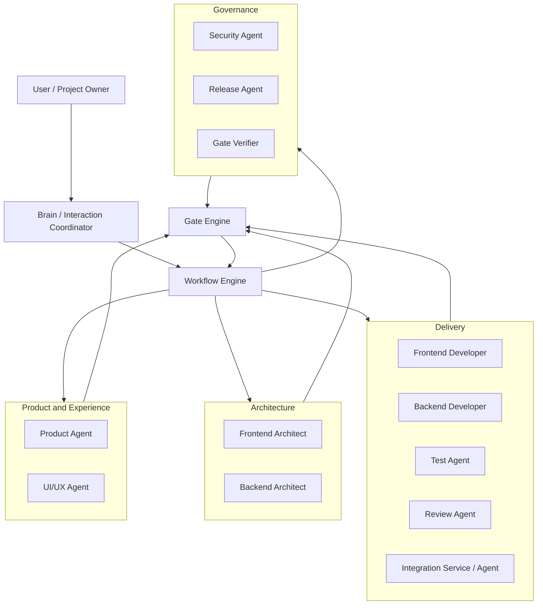

# Agent 核心机制

```yaml
status: draft
version: 0.2-r7
owner: agent-governance
last_updated: 2026-07-13
```

## 1. Agent 设计原则

Agent 是受控岗位，不是流程拥有者。每个 Agent 必须有正式 Contract，包含目标、输入、输出、权限、禁止行为、完成标准、失败类型和升级路径。

统一原则：

- Agent 不写 Workflow State。
- Agent 不直接推进 Phase。
- Agent 不修改正式 Gate 结论。
- Agent 不自行启动其他 Agent。
- Agent 不绕过 Tool、Scope、Security、Budget 和 Capability Policy。
- Agent 不自行宣布项目完成。
- Agent Result 必须结构化并绑定 Task、Attempt、Input Hash 和 Commit。
- Initial、Repair、Recheck 属于同一 Workstream，优先复用 Session 和 Workspace。
- Reviewer 默认不读取 Developer 的完整推理或自我评价，减少锚定偏差。
- Agent、Prompt、模型、工具和 Policy 版本进入执行 Fingerprint。

当前正式 Gate 只由 `agent-loop-docs/process/gate-matrix.md` 定义：

```text
PRD_GATE
ARCHITECTURE_GATE
UI_GATE
DESIGN_GATE
TEST_GATE
PRODUCT_ACCEPTANCE_GATE
USER_ACCEPTANCE_GATE
ARCHIVE_GATE
```

角色名称或流程描述不得创造新的当前 gateType。

## 2. Agent 组织结构



Brain Agent 负责人与系统之间的协调，不是总开发者。Workflow Engine 和 Gate Engine 拥有状态与准入控制权。

## 3. 角色能力与权限

### 3.1 能力矩阵

| Agent | 主要职责 | 业务代码 | 主分支 | Gate 权限 | 用户沟通 |
|---|---|---:|---:|---:|---:|
| Brain | 澄清、决策整理、状态摘要、分派 | 否 | 否 | 无 | 仅按 Human Policy |
| Product | PRD、流程、范围、产品验收 | 否 | 否 | 仅建议 | 通过 Brain |
| UI/UX | 信息架构、交互、视觉、文案体验 | 否 | 否 | 仅建议 | 否 |
| Frontend Architect | 路由、组件、状态、API、性能 | 否 | 否 | 仅建议 | 否 |
| Backend Architect | 领域、DB、API、并发、Migration | 否 | 否 | 仅建议 | 否 |
| Frontend Developer | 前端原子任务和自测 | 授权路径 | 否 | 无 | 否 |
| Backend Developer | 后端/DB/API 原子任务和自测 | 授权路径 | 否 | 无 | 否 |
| Test | 测试设计、执行、缺陷、复测 | 测试白名单 | 否 | 仅建议 | 否 |
| Review | Scope、Code、Trace、Risk Review | 否 | 否 | 仅建议 | 否 |
| Integration | 集成、冲突归因、Integration Evidence | 不直接实现业务 | 否 | 仅建议 | 否 |
| Security | Secret、权限、依赖、威胁审查 | 否 | 否 | 仅建议 | 通过 Brain |
| Release | Release Plan、Migration、Health、Rollback | 受控配置 | 否 | 无独立 Gate 权限 | 通过 Brain |
| Gate Verifier | 确定性检查、合同校验、状态源核对 | 否 | 否 | 产出结构化验证结果 | 否 |

### 3.2 Brain Agent

目标：

- 将用户自然语言转为 Confirmed Decision。
- 汇总阶段状态、阻塞和下一步。
- 根据 Workflow 决定需要哪个角色，不自行启动未经控制面批准的 Agent。
- 只对真实业务、范围、体验和高风险取舍询问用户。

禁止：

- 修改业务代码。
- 代表用户确认验收。
- 将 SYSTEM 问题包装成业务问题。
- 修改 PRD、Gate Result 或代码来“快速通过”。
- 在 M0 `effectiveApproval=false` 时启动 Product Agent。

### 3.3 Product Agent

负责：

- 业务目标、范围、非目标。
- 用户流程、业务规则、状态和异常。
- 实体、字段、权限和验收标准的产品表达。
- PRD Revision 和 Product Acceptance。

禁止：

- 决定底层实现。
- 关闭测试缺陷。
- 修改业务代码。
- 自行宣布 `PRD_GATE` 或 `PRODUCT_ACCEPTANCE_GATE` 通过。
- 在 M0 未有效批准时运行 Product Review。

### 3.4 UI/UX Agent

负责：

- 信息架构和页面职责。
- 交互流程和字段优先级。
- 视觉令牌和组件规则。
- Loading、Empty、Error、Permission、Responsive 和 Accessibility。
- 文案语气与一致性。

不得擅自扩大业务范围或决定数据库实现。

### 3.5 Frontend Architect

负责：

- 路由和页面边界。
- 组件、状态、缓存和 API 接入。
- 权限、错误处理、性能和可测试性。
- 前端原子 Task 候选和冲突区。

### 3.6 Backend Architect

负责：

- 领域模型、DB 约束和索引。
- API、DTO、事务、幂等和并发。
- 权限、Migration、回填、兼容和 Rollback。
- OpenAPI、后端 Task 候选和测试边界。

### 3.7 Developer Agent

Developer 只能在指定 Task Worktree 和授权路径工作。

输出：

- changedFiles。
- implementedRequirementIds。
- testsRun 和退出码。
- knownRisks。
- openIssues。
- sourceCommit。
- Agent Result。

禁止：

- 写 forbiddenPaths。
- 写 master。
- 合并其他分支。
- 修改 Workflow State。
- 删除或弱化测试制造通过。
- 未经批准升级依赖或全局架构。
- 将本地 Worktree 结果直接复制回主工作区。

### 3.8 Test Agent

- 独立验证需求与实现。
- 不以 Developer 自评为依据。
- 可修改测试白名单，不修改业务实现。
- 输出 Test Report、Evidence、缺陷和 Required Recheck。
- Developer 只能标记 `READY_FOR_RECHECK`；Test Agent 复测后才能关闭 Bug。

### 3.9 Review Agent

执行：

- PRD/Design 一致性 Review。
- Scope Review。
- Code Review。
- Requirement Trace Review。
- Security/Risk Review。
- Integration Evidence Review。

每个 Finding 必须包含 Evidence、Severity、Decision Type、Owner、Expected Fix 和 Verification。

### 3.10 Integration Service / Agent

Integration Service 确定性执行：

- Merge/Rebase。
- changedFiles 和冲突检查。
- OpenAPI、DB Schema、Migration、Route 和 Env Diff。
- Build、Typecheck、Lint、Test。
- Integration Commit 和 Evidence。

Integration Agent 只解释复杂语义冲突，不能随意选择一方代码。

Integration 结果进入 `TEST_GATE`，当前不存在独立 Integration gateType。

### 3.11 Security Agent

负责：

- Secret Scan。
- Tool、Network 和 DB Permission。
- 依赖与供应链。
- 数据分类、Retention 和跨境风险。
- Threat Model 和高风险 Migration。

Security Finding 进入对应正式 Gate 的 Issue，不创造单独状态迁移规则。

### 3.12 Release Agent

负责：

- Release Plan。
- 环境和配置检查。
- Migration Dry Run。
- Feature Flag。
- 发布步骤。
- Health Check。
- Rollback。
- Incident Artifact。

Release Agent 不决定用户验收，也没有独立 Gate 权限。Release/Migration/Health/Rollback Evidence 是 `ARCHIVE_GATE` 前置输入。

### 3.13 Gate Verifier

Gate Verifier 负责：

- Schema 和合同校验。
- Artifact 路径和 Hash。
- Base SHA。
- 命令、退出码、环境、日志和时间。
- OPEN Blocking/Major。
- Workflow、Current Run/Task/Event 和 Worktree 一致性。
- M0 `effectiveApproval`。
- 识别 `state_source_split` 和其他系统错误。

Gate Verifier 不修业务需求，不向用户提出系统修复问题。

## 4. Tool 权限矩阵

| Agent | Shell | Network | DB Write | Git Commit | Git Merge | Git Push | Secret | Release |
|---|---:|---:|---:|---:|---:|---:|---:|---:|
| Brain | 最小 | 否 | 否 | 否 | 否 | 否 | 否 | 否 |
| Product/UI/Architect | 只读检查 | 受限 | 否 | 文档 Task Branch | 否 | 否 | 否 | 否 |
| Frontend Developer | 白名单 | 依赖安装受控 | 否 | Task Branch | 否 | 否 | 否 | 否 |
| Backend Developer | 白名单 | 受限 | 开发/测试库 | Task Branch | 否 | 否 | Provider 临时注入 | 否 |
| Test | 测试命令 | 受限 | 测试库 | 测试分支 | 否 | 否 | 否 | 否 |
| Review | 只读 | 否 | 否 | 否 | 否 | 否 | 否 | 否 |
| Integration | Git/Build 白名单 | 受限 | Migration 测试库 | Integration Branch | 受控 | 策略控制 | 否 | 否 |
| Security | 扫描命令 | 受限 | 否 | 否 | 否 | 否 | 只看扫描结果 | 否 |
| Release | 发布白名单 | 目标环境 | 受控 | Release Commit | 受控 | 审批后 | Provider | 用户验收后 |

## 5. Task、Workstream 与 DAG

### 5.1 Task 合同

```json
{
  "taskId": "backend-application-api",
  "workstreamId": "ws-application-api",
  "ownerAgent": "backend_agent",
  "goal": "实现投递管理核心 API",
  "requirementIds": ["REQ-APPLICATION-001"],
  "inputHash": "sha256:...",
  "dependsOn": [],
  "softDependsOn": [],
  "conflictsWith": [],
  "resourceLocks": [],
  "consumes": [],
  "produces": [],
  "editablePaths": [],
  "forbiddenPaths": [],
  "acceptanceCommands": [],
  "requiredTests": [],
  "contextManifestId": "ctx-...",
  "sessionKey": "...",
  "attempt": 1,
  "maxAttempts": 2
}
```

规则：

- Task 必须原子、可验收、可回滚。
- Task 不得同时跨越多个独立领域目标。
- Task 必须绑定 Requirement。
- READY 只能由 DAG Validator/Scheduler 计算。
- 相同 `taskId + inputHash` 最多一个活动 Attempt。

### 5.2 Workstream

Workstream 是连续责任单元，Initial、Repair、Recheck 优先复用：

- Owner Agent。
- Session。
- Workspace/Worktree。
- Baseline Commit。
- Context Version。
- Active Issue。
- Requirement Set。

### 5.3 DAG

DAG 至少包含：

- dependsOn。
- softDependsOn。
- conflictsWith。
- resourceLocks。
- consumes/produces。
- Critical Path。
- READY 计算证据。

`DESIGN_GATE` 验证 DAG 设计完整性；Validator/Scheduler 的代码实现由 `TEST_GATE` 验证。

## 6. Session、Attempt 与恢复

### 6.1 Session Key

```text
project + feature + phase + agent + workstream
```

Session 记录：

- sessionId。
- workspace/worktree。
- model、prompt、tool 和 policy version。
- contextManifestId。
- inputHash。
- lastHeartbeat。
- activeAttempt。
- status。

### 6.2 Attempt

- Initial、Repair 和 Recheck 是不同 Attempt。
- 旧 Attempt 不覆盖。
- 新 Attempt 必须引用 superseded Attempt 和 Issue。
- 重试只针对明确可重试失败。
- 达到上限或无收敛时进入 NON_CONVERGENT。

### 6.3 State Source Reconcile

运行事实来源必须一致：

```text
Workflow JSON/Markdown
Current Run
Current Tasks
Current Events
Run Artifact
Decision/Issue/Gate Result
Worktree
Stage Tracker
```

发现冲突时：

1. 停止调度。
2. 保存旧指针。
3. 生成 Reconciliation Artifact。
4. 写入 `BLOCKED_BY_SYSTEM / state_source_split`。
5. 清理或标记 prunable/orphan Worktree。
6. 不以重新初始化覆盖历史。
7. Reconcile 完成后仍需 M0。

## 7. Agent Result

Agent Result 至少包含：

```json
{
  "taskId": "",
  "attempt": 1,
  "agent": "",
  "status": "READY_FOR_REVIEW",
  "inputHash": "",
  "sourceCommit": "",
  "changedFiles": [],
  "implementedRequirementIds": [],
  "testsRun": [],
  "artifactsProduced": [],
  "knownRisks": [],
  "openIssues": [],
  "selfCheck": {}
}
```

Agent Result 不是 Gate Result。Agent 自测通过只允许进入独立 Review/Test。

## 8. Review、Repair 与 Recheck

```text
Initial
→ Independent Review
→ Issue
→ Primary Owner
→ Repair
→ Affected Tests
→ Recheck
→ Gate
```

规则：

- AUTO_FIXABLE 由 Owner 修复。
- HUMAN_DECISION_REQUIRED 才通过 Brain 询问用户。
- SYSTEM 错误归 Gate Verifier/Orchestrator。
- 同一 Issue Signature 记录 repeat_count。
- 连续无收敛停止自动 Repair。

## 9. Prompt、模型和上下文

### 9.1 Prompt Registry

Prompt 必须有：

- promptId、version、role、phase。
- requiredInputs、outputs、schema。
- editable/forbidden paths。
- tools、model constraints。
- self-check 和 escalation。
- hash、status、supersedes。

### 9.2 Model Routing

Model Routing 考虑：

- 风险和复杂度。
- Context 长度。
- 工具能力。
- 延迟和成本。
- 独立 Review 隔离要求。
- Provider 可用性。

替换模型后执行 Fingerprint 变化，旧结果不能无条件复用。

### 9.3 Context

Context Builder 只从 Task、Project Map、Confirmed Decision、依赖 Artifact 和批准 Memory 构造 Context Manifest。禁止让 Agent自行搜索所有历史 Review/Gate 文件作为默认策略。

## 10. 当前边界

截至 2026-07-13：

- M0 Result 不存在。
- `effectiveApproval=false`。
- 本地状态源发生 `state_source_split`。
- Product Agent 禁止启动。
- 业务 PRD保持 `review_only`。
- 业务代码禁止开发。
- Auto 保持 OFF。

必须先运行确定性 Reconcile，保全旧 Current Run/Task/Event 和 Worktree 证据；然后执行 M0。任何 Agent 都不得通过修改台账文字绕过该阻塞。
