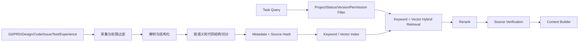

# 数据与知识工程

```yaml
status: draft
version: 0.2
owner: data-knowledge
last_updated: 2026-07-12
schema_standard: JSON Schema 2020-12
runtime_validator: Ajv
```

## 1. 数据与知识目标

数据与知识工程负责解决四个问题：

1. Agent 之间交换什么结构化数据。
2. 哪个 Artifact 是当前有效事实。
3. Agent 如何获得当前任务所需的最小上下文。
4. 系统如何沉淀、检索、更新和淘汰长期知识。

核心原则：

- Markdown 用于人类阅读，JSON Schema 用于程序决策。
- 向量检索不是唯一事实源。
- 已批准 Artifact、Confirmed Decision 和当前 Project Map 的优先级高于 Session 摘要和 Agent 推断。
- Agent 不能直接把任意内容写入长期记忆。
- 所有可消费数据必须有版本、Hash、Owner、状态和 Trace。

## 2. 核心数据实体与契约

### 2.1 公共标识

```text
tenantId      预留租户边界，V0.1 固定 local
userId        操作用户
projectId     项目标识
workspaceId   Worktree / Container 标识
workflowId    一次 Feature 交付流程
phaseId       阶段实例
workstreamId  Initial/Repair/Recheck 连续责任单元
taskId        原子任务
runId         一次实际执行尝试
sessionId     Agent 会话
artifactId    正式产物
issueId       问题
gateId        阶段准入结果
traceId       全链路 Trace
checkpointId  恢复点
```

### 2.2 契约原则

1. JSON Schema 2020-12 是跨 Agent、跨模型、跨语言的唯一正式运行时合同。
2. TypeScript Interface 只用于编译期，不替代运行时校验。
3. 所有 Schema 必须有 `$id`、版本和兼容策略。
4. 缺少必填字段、未知枚举或证据不可访问时进入 `OUTPUT_CONTRACT_ERROR`。
5. ID 由控制平面生成，Agent 不得覆盖已有 ID。
6. 时间使用 ISO 8601 UTC，Hash 使用 `sha256:<hex>`。
7. Agent Prompt 中引用字段必须与 Schema 一致。

### 2.3 Task Contract

Task 是调度、锁、上下文、执行、测试和追踪的核心实体。

```json
{
  "schemaVersion": "1.0",
  "taskId": "backend-application-api",
  "workstreamId": "ws-application-api",
  "projectId": "bossresume",
  "workflowId": "wf-bossresume-full-refactor",
  "phase": "IMPLEMENTATION",
  "ownerAgent": "backend_agent",
  "goal": "实现投递管理核心 API",
  "requirementIds": ["REQ-APPLICATION-001"],
  "inputHash": "sha256:...",
  "dependsOn": [],
  "softDependsOn": [],
  "conflictsWith": [],
  "resourceLocks": [],
  "consumes": [],
  "produces": [],
  "editablePaths": [],
  "forbiddenPaths": [],
  "acceptanceCommands": [],
  "requiredTests": [],
  "contextManifestId": "ctx-...",
  "sessionKey": "...",
  "attempt": 1,
  "maxAttempts": 2,
  "status": "READY"
}
```

执行幂等键：

```text
executionKey = projectId + taskId + inputHash + executionMode
```

### 2.4 Workstream Contract

Workstream 记录：

- workstreamId。
- feature、phase、owner。
- currentTaskId。
- sessionId、workspaceId。
- baselineCommit。
- contextVersion。
- activeIssueIds。
- lifecycleState。

### 2.5 Context Manifest Contract

```json
{
  "contextManifestId": "ctx-...",
  "contextVersion": 3,
  "taskId": "...",
  "inputHash": "sha256:...",
  "generatedFromProjectMapVersion": "pm-12",
  "files": [
    {
      "path": "docs/prd/bossresume-full-refactor-prd.md",
      "sha256": "sha256:...",
      "role": "prd_section",
      "sections": ["4.2", "4.3"]
    }
  ],
  "artifactIds": [],
  "confirmedDecisionIds": [],
  "editablePaths": [],
  "forbiddenPaths": [],
  "tokenBudget": 60000,
  "summaryArtifactId": null,
  "expiresAt": "..."
}
```

Agent 启动前必须验证 Manifest 中的文件、Artifact、Project Map 和 Decision 版本；失效则进入 `CONTEXT_STALE`。

### 2.6 Agent Result Contract

必须包含：taskId、runId、sessionId、agent、agentContractVersion、modelProvider、modelVersion、conclusion、changedFiles、implementedRequirementIds、artifactIds、testsRun、issues、knownRisks、evidence、allowsNextGate、startedAt、finishedAt。

`allowsNextGate` 只是 Agent 建议，Gate Engine 必须独立计算。

### 2.7 Issue Contract

必须包含：

- Issue Type。
- Severity。
- Decision Type。
- Status。
- Primary/Candidate Owners。
- Attribution Confidence。
- Evidence。
- Required Retest。
- Repeat Count。
- 是否由当前变更引入。

Issue Type：SYSTEM、ENVIRONMENT、OUTPUT_CONTRACT、BUSINESS、DESIGN、IMPLEMENTATION、INTEGRATION、TEST、SECURITY、PERFORMANCE、EXPERIENCE。

Decision Type：AUTO_FIXABLE、HUMAN_DECISION_REQUIRED、SYSTEM_RECOVERY_REQUIRED、SECURITY_APPROVAL_REQUIRED、DEFERRED。

### 2.8 Gate Contract

Gate 必须记录：

- Gate Type 和 Phase。
- Input Artifact IDs。
- Deterministic Checks。
- Reviewer Recommendations。
- Issue IDs。
- Blocking/Major Count。
- Status。
- Next State。
- Gate Engine Version。

如果确定性检查失败，Agent APPROVED 建议不能使 Gate 通过。

### 2.9 Event Contract

```json
{
  "eventId": "evt-...",
  "eventType": "task.completed",
  "eventVersion": "1.0",
  "traceId": "trace-...",
  "tenantId": "local",
  "userId": "user-local",
  "projectId": "bossresume",
  "workflowId": "...",
  "phaseId": "...",
  "workstreamId": "...",
  "taskId": "...",
  "runId": "...",
  "sessionId": "...",
  "actor": "agent_runtime",
  "occurredAt": "...",
  "idempotencyKey": "...",
  "payload": {}
}
```

Event 追加写，重复 idempotencyKey 不产生第二次副作用。

### 2.10 其他契约

后续还需要正式 Schema：

- Session。
- Project Map。
- Trace Link。
- Cost Record。
- User Decision。
- Prompt Definition。
- Model Routing Policy。
- Release。
- Side-effect Ledger。

机器契约统一存放在 `schemas/`，本文件只定义语义。

## 3. Artifact Registry

### 3.1 Artifact Contract

```json
{
  "artifactId": "artifact-prd-review-summary-v3",
  "projectId": "bossresume",
  "workflowId": "...",
  "type": "PRD_REVIEW_SUMMARY",
  "logicalKey": "prd-review-summary",
  "version": 3,
  "status": "ACTIVE",
  "path": "...",
  "contentHash": "sha256:...",
  "producedByTaskId": "...",
  "producedByRunId": "...",
  "supersedes": "artifact-prd-review-summary-v2",
  "approvedByGateId": "gate-prd-3",
  "sourceArtifactIds": [],
  "retentionClass": "PROJECT_LIFETIME",
  "createdAt": "..."
}
```

### 3.2 Artifact 状态

- DRAFT：尚未通过合同和 Gate。
- ACTIVE：当前唯一有效版本。
- SUPERSEDED：被新版本替代。
- REJECTED：合同或 Gate 失败。
- ARCHIVED：流程结束后冻结。
- EXPIRED：缓存或临时 Artifact 过期。

同一 `project + workflow + type + logicalKey` 最多一个 ACTIVE。

### 3.3 存储策略

- Git：PRD、设计、标准、Schema、代码等需要 Review 的文本。
- PostgreSQL/SQLite：Artifact Metadata、索引和关系。
- 文件系统/S3：日志、截图、视频、测试附件和构建产物。

数据库不保存所有大型正文。

### 3.4 版本规则

- 不原地覆盖已批准 Artifact。
- 新版本通过 `supersedes` 关联旧版本。
- 下游只读取 ACTIVE 且兼容的版本。
- Artifact Hash 不一致时进入 `ARTIFACT_INTEGRITY_ERROR`。

## 4. Project Map 与 Traceability

### 4.1 Project Map 目标

正式表达：

- Module/File。
- API/Call Dependency。
- Table/Migration。
- Route/Page/Component。
- Environment Variable。
- Background Job。
- Permission。
- Test Coverage。

### 4.2 数据模型

```json
{
  "projectMapVersion": "pm-12",
  "projectId": "bossresume",
  "baseCommit": "...",
  "nodes": [
    {
      "id": "module:applications",
      "type": "MODULE",
      "path": "server/src/modules/applications",
      "evidence": []
    }
  ],
  "edges": [
    {
      "from": "api:/api/applications",
      "to": "table:applications",
      "type": "READS_WRITES",
      "evidence": []
    }
  ],
  "generatorVersion": "...",
  "driftStatus": "VALID"
}
```

### 4.3 Drift Check

以下变化会使 Map 失效或部分失效：

- Base Commit 变化。
- 路由/API/Schema/Migration 变化。
- Build Config 和目录结构变化。
- Lockfile、Runtime 和 Env Contract 变化。

Map 失效后，影响分析、Context、测试选择和缓存都必须重新计算。

### 4.4 Traceability Matrix

```text
Requirement
→ PRD Section
→ Design Section
→ Task
→ Run
→ Commit/Diff
→ Test
→ Gate
→ Product Acceptance
→ User Acceptance
→ Release
```

Trace 断链在对应 Gate 中视为失败或风险，不能只用“最终测试通过”替代。

## 5. Working Memory

Working Memory 只服务当前 Task/Workstream，不等于整个聊天历史。

固定组成：

```text
Agent Contract 摘要
+ Task Contract
+ Context Manifest
+ 当前 Issue / Required Recheck
+ 相关 PRD/Design 章节
+ 依赖 Artifact
+ 相关代码
+ Confirmed Decisions
+ Project Rules
+ 最近必要交互窗口
+ Versioned Summary
```

默认禁止读取：

- 整份仓库。
- 全部历史聊天。
- 所有 Agent 的完整输出。
- 已 SUPERSEDED 的 Artifact 正文。
- 与影响范围无关的代码。

## 6. Long-term Memory

长期记忆只保存经过筛选、可复用且有来源的知识。

| 类型 | 示例 | 存储 |
|---|---|---|
| 项目事实 | 技术栈、目录、API、表 | PostgreSQL/Project Map |
| 已确认决策 | 范围、状态规则 | Confirmed Decisions |
| 正式文档 | PRD、设计、标准 | Git/Artifact Store |
| 运行经验 | 失败原因、修复结果 | Experience Record |
| 测试证据 | 关键回归和缺陷 | Artifact Store |
| 用户偏好 | 交互和产品偏好 | User Preference Store |
| 语义索引 | 文档/代码 Embedding | pgvector/Qdrant Adapter |

### 6.1 长期记忆写入 Gate

写入前必须满足：

- 有 Source Artifact。
- 事实已通过 Gate 或用户确认。
- 不包含 Secret 和未授权个人数据。
- 有 Scope、Retention、Owner 和过期策略。
- 与现有事实冲突时进入 Review，不覆盖。

### 6.2 Experience Record

记录问题签名、症状、根因、成功/失败动作、证据、适用范围、置信度和过期时间。经验只能作为建议，不能跳过当前项目验证。

## 7. Shared Memory

Shared Memory 是受控协作区，不是任意可编辑白板。

分区：

- `confirmed-decisions`：Brain/Workflow 经用户确认写入。
- `project-map`：Map Service 更新，Agent 只提交候选变化。
- `artifact-registry`：Registry Service 写状态。
- `issue-board`：Issue Router 管理。
- `task-board`：Scheduler 管理。
- `working-notes`：短期可写，不能被 Gate 当作事实。

写入规则：

- 乐观版本或锁。
- 每次写入产生 Event。
- 不覆盖已批准版本。
- 记录 Actor、Reason 和 Source。
- Agent 只能写 Contract 允许的分区。

受控白板关闭时必须生成 Summary Artifact，之后只读。

## 8. Token 与上下文压缩

### 8.1 Token 预算

每个 Task 必须有 tokenBudget。建议初始比例：

| 内容 | 预算比例 |
|---|---:|
| Task/Contract/Rules | 10% |
| PRD/Design/Decision | 20% |
| Code/Project Map | 40% |
| Dependency Artifact | 15% |
| 最近交互/错误证据 | 10% |
| 安全余量 | 5% |

### 8.2 压缩触发条件

- Working Memory 达到模型上下文的 70%。
- Session 累计超过 Token 阈值。
- Repair/Recheck 进入新 Attempt。
- 讨论超过固定消息数。
- 旧消息不再直接影响当前 Task。

### 8.3 结构化摘要

摘要必须拆成：confirmedFacts、confirmedDecisions、openIssues、attemptedActions、failedActions、currentHypothesis、nextRequiredActions、evidenceArtifactIds 和 sourceRange。

不得用摘要替代：

- 用户原始确认。
- 安全审批。
- PRD 和技术合同关键规则。
- 原始错误日志和测试证据。
- API/DB Schema。
- Artifact Hash 和状态。

### 8.4 Fresh Session 条件

- PRD/Design Baseline 不兼容变化。
- Agent Contract Major Version 改变。
- Context Manifest 无法验证。
- Session 达到最大 Token、Task 数或生命周期。
- Workstream Owner 改变。
- Workspace 丢失或发生上下文污染。

同一 Workstream 的 Initial → Repair → Recheck 在条件允许时优先复用 Session。

## 9. RAG 知识库设计

RAG 是知识检索机制，不是 Workflow、Memory 或事实源本身。

### 9.1 架构流程



### 9.2 数据源

- ACTIVE PRD 和 Design。
- Project Map。
- 代码、接口和 Schema。
- Issue、Gate、Test Report。
- Confirmed Decisions。
- Approved Experience Record。
- Capability Pack 和平台标准。

默认不索引：

- Secret。
- 未批准草稿。
- SUPERSEDED 且无历史检索需求的正文。
- 无权限的其他项目数据。
- 纯临时日志和低价值对话。

### 9.3 Chunk 策略

- Markdown：按标题层级、列表和代码块切分，保留父章节路径。
- Code：按文件、类、函数、路由和类型定义切分。
- API/Schema：按 Endpoint、Entity 和 Migration 切分。
- Issue/Test：按问题、复现、证据和结论切分。

每个 Chunk 必须携带 projectId、artifactId、path、version、status、sourceHash、permissions、createdAt 和 embeddingVersion。

### 9.4 检索策略

```text
结构化过滤
→ 路径/关键词检索
→ 向量召回
→ Rerank
→ Source Verification
→ Context Manifest
```

不得只按向量相似度返回结果。必须优先过滤：

- 当前 Project/Tenant。
- ACTIVE Artifact。
- 兼容版本。
- 权限。
- Base Commit/Project Map Version。

### 9.5 失效规则

以下变化使 Embedding 或索引失效：

- Source Hash 改变。
- Artifact 被 SUPERSEDED/REJECTED。
- 权限或数据分类变化。
- Chunk Algorithm 变化。
- Embedding Model Version 变化。
- Project Map/Base Commit 变化影响代码语义。

### 9.6 检索质量指标

- Recall@K。
- Precision@K。
- Source Validity Rate。
- Stale Source Rate。
- Cross-project Contamination，目标为 0。
- Citation Coverage。
- Context Token Savings。
- Retrieval-caused Error Rate。

### 9.7 分阶段实现

- **V0.1：**Artifact Registry + 精确路径/Metadata 检索 + Context Manifest。
- **V1：**PostgreSQL + pgvector，支持 Hybrid Search。
- **后期：**规模和 QPS 明显增长后评估 Qdrant；复杂图查询成为核心后评估 Neo4j。

## 10. 数据生命周期与质量

### 10.1 生命周期

```text
Collect
→ Classify
→ Validate
→ Store
→ Use
→ Version/Supersede
→ Archive
→ Delete/Anonymize
```

### 10.2 Retention

| 数据 | 生命周期 |
|---|---|
| Working Memory | Session |
| 临时白板 | Phase |
| Task Summary | Workflow |
| Approved Decision | 项目永久或 supersede |
| Project Map | 新版本 supersede，历史保留 |
| Experience Record | 定期复审 |
| Embedding | Source/Model 变化即失效 |
| Cache | Fingerprint 或 TTL 失效 |

### 10.3 数据质量

- Schema Validation。
- Hash/Integrity。
- Source Availability。
- Version Compatibility。
- Duplicate Detection。
- Provenance Completeness。
- Permission Correctness。
- Freshness/Drift。
- Trace Coverage。

### 10.4 事实优先级

```text
Approved ACTIVE Artifact
> Confirmed Decision
> Valid Project Map
> Approved Long-term Memory
> Working Memory Summary
> Agent Inference
```

冲突时创建 `MEMORY_CONFLICT` 或 `DATA_CONFLICT` Issue，不自动覆盖高优先级事实。

## 11. Schema 版本兼容

- **Patch：**增加可选字段、描述和约束修正，不破坏旧 Reader。
- **Minor：**增加枚举或可选结构，Reader 需支持 Unknown/Extension。
- **Major：**删除/重命名必填字段或改变语义，需要迁移和旧 Run Reader。

正在运行的 Workflow 固定 Schema Major Version，不能中途无迁移升级。

Schema Gate 必须验证：

- Ajv 可编译。
- 正负例测试存在。
- Unknown Field 策略明确。
- Version 和 Compatibility 明确。
- Prompt 字段与 Schema 一致。
- Workflow/Gate 不依赖 Markdown 关键字作为唯一判断。
