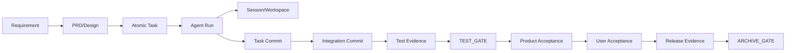

# 工程与运维保障

```yaml
status: draft
version: 0.2-r6
owner: engineering-operations
last_updated: 2026-07-13
project_id: bossresume
workflow_feature: bossresume-full-refactor
```

## 1. 文档职责与 Gate 权威

本文件定义开发、测试、集成、发布和运行阶段的质量、安全、成本、可观测性、恢复和运维要求。

当前正式 Gate 类型以 `agent-loop-docs/process/gate-matrix.md` 为唯一权威：

```text
PRD_GATE
ARCHITECTURE_GATE
UI_GATE
DESIGN_GATE
TEST_GATE
PRODUCT_ACCEPTANCE_GATE
USER_ACCEPTANCE_GATE
ARCHIVE_GATE
```

当前工程执行语义：

- Task DAG/原子任务的设计完整性由 `DESIGN_GATE` 检查。
- Implementation、Developer Self Test、Independent Review、Repair、Integration Commit 和 Integration Evidence 统一作为 `TEST_GATE` 输入。
- 当前没有独立 `IMPLEMENTATION_GATE` 或 `INTEGRATION_GATE`。
- Release Plan、Migration Dry Run、Release Result、Health Check、Rollback Plan/Result 是 `ARCHIVE_GATE` 前置证据。
- 当前没有独立 `RELEASE_GATE`。
- 未来独立 Gate 只能标记为 `Future Target / 未注册 / 未实现 / 不得用于当前 Workflow 状态推进`。

## 2. 工程保障目标

系统必须具备：

- 可重复、可定位、可审计的质量证据。
- 最小权限、Secret 隔离和个人数据保护。
- 可预测预算、资源和并发。
- 完整 Logs、Metrics、Trace 和 Dashboard。
- 故障检测、隔离、恢复、降级和回滚。
- 第三方模型、供应商、数据跨境和退出风险控制。
- 从本地可恢复逐步演进到服务端高可用的明确路线。

这些能力必须通过 Policy、Contract、Validator、Tool Proxy、Test Runner、State 和 Artifact 执行，不能只写在 Prompt 中。

## 3. 工程质量分层

```text
Schema Validation
→ Contract Validation
→ Scope / Permission Guard
→ Project Map Drift Check
→ Context / Input Hash Check
→ Build / Typecheck / Lint
→ Required Unit / Contract / Integration / E2E
→ Independent Review
→ Integration Commit / Evidence
→ TEST_GATE
→ Product Acceptance
→ User Acceptance
→ Release Evidence
→ ARCHIVE_GATE
```

### 3.1 Task 启动前

必须验证：

- Task/Workstream/Context Manifest 合同完整。
- Requirement IDs 可追溯。
- Project Map Snapshot 与当前 Base SHA 一致。
- dependsOn、conflictsWith、resourceLocks 可计算。
- editablePaths/forbiddenPaths 明确。
- Session、Lock、Lease、Heartbeat 可用。
- Acceptance Commands 和 Required Tests 可执行。
- 当前模式为 Single，Auto 为 OFF。

任一关键条件不满足，不得启动 Agent。

### 3.2 Developer Self Test

Developer Agent 必须输出：

- changedFiles。
- implementedRequirementIds。
- commands、cwd、exitCode、environment、commitSha、executedAt、logPath。
- 未执行测试及原因。
- 已知风险、兼容和回滚说明。
- Self Check。

Developer 自我声明不能替代 Independent Review 或 `TEST_GATE`。

### 3.3 Independent Review

Review 必须独立于实现责任：

- Review Agent 不修改业务实现。
- Test Agent 默认不修业务代码。
- 高风险变更按独立 Review Policy 执行。
- 问题必须结构化为 Issue，包含 severity、decisionType、owner、expectedFix 和 verification。
- 修复后按问题类型进入 Recheck。

### 3.4 TEST_GATE

`TEST_GATE` 的验收对象是最终 Integration Commit/Branch，而不是孤立 Developer Worktree。

最低输入：

- 实现结果和 Task Branch Commit。
- Developer Self Test。
- Independent Review Result。
- Repair/Recheck Evidence。
- Integration Commit 与 Integration Evidence。
- Build、Typecheck、Lint、Unit、Contract、Integration、E2E、Migration/Compatibility 证据。
- Gate Results 和 Open Issue 状态。

通过标准：

- 必需命令全部可重复执行并通过。
- 无 OPEN Blocking/Major Issue。
- 无未解决自动集成冲突。
- Requirement Trace 已更新。
- Test Agent 没有越权修改业务实现。
- Evidence 与当前 Base/Integration SHA 完全匹配。

## 4. Integration 工程合同

当前 Integration 不是独立 Gate，而是 `TEST_GATE` 的强制输入和通过条件。

### 4.1 集成流程

```text
Approved Task Commit
→ Rebase / Merge against current Integration Base
→ Conflict Detection
→ Primary Owner Fix
→ Integration Commit
→ Build / Test / Migration Verification
→ Integration Evidence
→ TEST_GATE
```

### 4.2 Integration Evidence

至少记录：

```yaml
projectId: bossresume
featureKey: bossresume-full-refactor
sliceId: M5-M10-or-final
baseBranch: master
baseSha: ""
taskCommits: []
integrationBranch: ""
integrationCommit: ""
conflicts: []
verificationResults: []
changedFiles: []
implementedRequirementIds: []
traceUpdated: false
createdAt: ""
createdBy: ""
```

每个 verification result 必须包含 command、cwd、exitCode、environment、commitSha、executedAt 和 logPath。

### 4.3 集成硬边界

- 禁止复制 Worktree 文件回主工作区代替 Git 集成。
- 禁止跳过 Review/Test 直接合并。
- 禁止基于过期 Base 复用旧测试证据。
- 冲突必须生成 Integration Issue，并指定 Primary Owner。
- 集成失败不得让用户替系统决定代码取舍，除非确实涉及业务范围或体验选择。

## 5. Release、Rollback 与 Archive

当前没有独立 Release gateType。Release 是用户验收后、Archive 前的受控工程动作。

```text
Final TEST_GATE
→ PRODUCT_ACCEPTANCE_GATE
→ USER_ACCEPTANCE_GATE
→ Release Plan
→ Migration Dry Run
→ Rollback Plan
→ Release Execution
→ Health Check
→ Release Result / Rollback Result
→ ARCHIVE_GATE
```

### 5.1 Release Plan

至少包含：

- Release ID、目标环境、Base/Integration SHA。
- 变更范围、Requirement Coverage、风险。
- Migration、Backfill、兼容和停机策略。
- Rollout、Feature Flag、监控和负责人。
- Rollback 触发条件、命令和数据恢复路径。
- 用户验收记录引用。

### 5.2 发布前检查

- `USER_ACCEPTANCE_GATE=APPROVED`，确认记录严格匹配 featureKey/taskId/round/time。
- Secret、权限、个人数据和供应商风险检查通过。
- Migration Dry Run 和备份有效。
- 关键 SLO、Dashboard、Alert 和 On-call Owner 可用。
- Release/rollback 命令已验证。

### 5.3 发布后检查

- 健康检查、关键业务 Smoke、错误率、延迟和数据一致性。
- Migration/Backfill 状态。
- 关键日志与 Trace。
- 异常时按阈值停止或回滚。
- Release Result 不得只写“发布成功”，必须附证据。

### 5.4 Archive

`ARCHIVE_GATE` 只有在全部 PRD、Design、Review、Test、Product/User Acceptance、Release/Rollback Evidence 和 Issue 历史完整时才能通过。

没有用户确认不得 Archive；产品验收、测试通过或 Brain 判断都不能代替用户确认。

## 6. 安全、权限与合规

### 6.1 Agent 权限

| 角色 | 允许 | 禁止 |
|---|---|---|
| Brain | 讨论、状态、计划、分派、汇总、归档 | 编写业务代码、替用户确认 |
| Product | PRD Review/修订（按模式） | 写业务代码 |
| Architect/UI | 设计和评审 | 写业务实现 |
| Developer | Task 授权路径内实现 | 主分支直写、越界文件 |
| Test | 测试、报告、缺陷 | 默认修改业务实现 |
| Review | 独立审查 | 修复被审代码 |
| Integration | 合并已审核 Commit、生成 Evidence | 复制未提交文件、隐式取舍 |

### 6.2 Secret

- Secret 不进入 Prompt、前端、日志、Artifact、Commit 或截图。
- 通过 Secret Provider/环境注入，记录用途和最小权限。
- 泄漏后立即撤销、轮换、保留事件证据。
- Provider Key 与业务个人数据分离。

### 6.3 个人数据

必须记录：

- 数据来源和授权。
- 使用目的和合法性。
- 最小字段、访问控制和脱敏。
- Retention、删除和导出。
- 第三方处理者、区域和传输。
- Incident 和用户请求处理路径。

### 6.4 第三方模型与供应商

登记：

- Provider、Model、地区、数据处理条款。
- 是否训练、保留、记录。
- SLA、配额、费用和退出计划。
- Fallback Provider 和兼容边界。
- Security/Compliance Review。

跨境或第三方处理必须遵守已批准 Policy；`review` 状态 Policy 不能作为 Gate 通过证据。

### 6.5 事件响应

```text
Detect
→ Contain
→ Revoke / Isolate
→ Identify Impact
→ Preserve Evidence
→ Notify Owner
→ Remediate
→ Recover / Delete / Rotate
→ Post-incident Review
```

Incident Artifact 必须包含影响范围、时间线、数据类型、供应商、根因、修复、恢复和防复发措施。

## 7. 成本、预算与并发

### 7.1 成本维度

- 模型输入/输出/缓存 Token 和费用。
- Tool、CPU、Memory、Storage、Network。
- Agent 等待、重试、Repair 和无效返工。
- 人工决策和重复分析。

### 7.2 预算层级

```text
Task Budget
→ Workstream Budget
→ Phase Budget
→ Feature Budget
→ Project Monthly Budget
```

至少包含 maxInputTokens、maxOutputTokens、maxEstimatedCost、maxDurationMinutes、maxAttempts 和 maxConcurrentAgents。

### 7.3 超预算

- 80%：预警，优先缓存、缩小 Context、摘要和降低并发。
- 100%：停止新调度，进入 `BLOCKED_BY_BUDGET`。
- 不允许通过跳过测试、安全或正式 Gate 降低成本。
- 只有范围/质量/预算真实取舍才进入用户决策。

### 7.4 BossResume 初始并发

```text
maxConcurrentCodeAgents = 2
maxConcurrentTestTasks = 1
maxConcurrentIntegrationTasks = 1
maxConcurrentWindows = 4
```

Single 模式不等于只运行一个任务，但所有并发必须由确定性 DAG、Lock 和资源限制控制。Auto 当前保持关闭。

### 7.5 重试与收敛

- Initial Attempt：1。
- Repair：最多 2。
- Recheck：最多 2。
- System Recovery：最多 1 次自动恢复。
- Provider Retry：只处理限流和短暂网络错误。

连续 3 轮问题不下降、同一测试重复失败、达到最大 Attempt 或无有效修改时进入 `NON_CONVERGENT`。

## 8. 可观测性

### 8.1 三类信号

- Logs：单次操作和错误细节。
- Metrics：趋势、阈值、资源和质量。
- Traces：Requirement、Task、Run、Session、Tool、Commit、Test、Gate、Acceptance、Release。

### 8.2 全链路 Trace



### 8.3 Dashboard

必须回答：

- 当前 Workflow/Phase/Gate/Checkpoint。
- READY、Running、Blocked、Stale Task。
- Session、Lock、Lease、Heartbeat 和 Workspace。
- Artifact、Issue、Requirement Coverage 和 Gate Result。
- Integration Commit、Test Evidence、Release 状态。
- Cost、Budget、Retry、Cache 和资源。
- 当前事实时间和数据来源。

### 8.4 “快、稳、好”指标

**快：**Lead Time、Phase Cycle Time、Ready Queue Wait、Parallel Efficiency、Cache Hit、Invalid Rerun、Mean Repair Time。

**稳：**Duplicate Active Execution=0、State Inconsistency、Artifact Overwrite=0、Stale Context Escape、Integration First-pass、Recovery Success、Defect Escape、Flaky Test。

**好：**Wrong User Question、Product Acceptance First-pass、User Acceptance Rework、Requirement Coverage、UX Issue、Scope Drift、User Satisfaction。

**成本：**Cost per Approved Requirement/Task、Cost per Repair、Token per Phase、Cached Token Ratio、Wasted Cost、Model ROI。

## 9. 备份、恢复与高可用

### 9.1 演进等级

```text
V0.1 本地可恢复
V1 单机服务高可靠
V2 多实例高可用
V3 跨区域灾难恢复
```

### 9.2 V0.1 当前要求

- Workflow/Task/Event/Artifact 定期备份。
- SQLite 一致性备份。
- Git Commit/Branch 可重建 Workspace。
- Checkpoint、State 和 Artifact Hash 可对账。
- Agent 退出后可识别 STALE 并恢复。
- 定期执行恢复演练。

### 9.3 升级目标

- V1：PostgreSQL、Redis/BullMQ 幂等、Process Supervisor、对象存储版本、Provider Fallback。
- V2：多实例控制面、Leader Election/无状态 Scheduler、数据库/Redis HA、跨可用区和集中 Trace。
- V3：跨区域备份、PITR、对象存储复制、正式 RPO/RTO 和 DR Runbook。

### 9.4 初始 RPO/RTO

| 阶段 | RPO | RTO |
|---|---:|---:|
| V0.1 本地开发 | 24 小时以内 | 4 小时以内 |
| V1 本地多项目 | 1 小时以内 | 1 小时以内 |
| V2 多用户服务 | 15 分钟以内 | 30 分钟以内 |

发布前需根据真实业务风险和成本重新批准。

## 10. 故障、降级与恢复

### 10.1 Provider 不可用

有限重试 → Circuit Breaker → 兼容备用 Provider → 重算 Fingerprint → `BLOCKED_BY_SYSTEM`。

### 10.2 Agent 无响应

Heartbeat 过期进入 STALE，保留日志和 Workspace；Recovery 对账进程、Lock、Session、Artifact 和副作用后决定续跑或新 Attempt。

### 10.3 Worktree 丢失或污染

从 Commit 可重建则恢复；未提交修改丢失必须生成 SYSTEM Issue 和损失报告，不伪造成功。

### 10.4 Artifact 损坏

Hash 失败后停止下游消费，从 Source Task/Commit 重建，新建 Verification Attempt，保留原记录。

### 10.5 状态不一致

停止新调度，依据 Event、Task、Lock、Session、Artifact Reconcile；无法唯一恢复时进入 `BLOCKED_BY_SYSTEM`。

### 10.6 Integration 冲突

生成 Integration Issue，指定 Primary Owner，在最新 Base 上修复并重跑 Integration，不自动选择一方代码。

### 10.7 自动降级顺序

```text
有效缓存
→ 缩小 Context
→ 结构化摘要
→ 降低并发
→ 同等级备用 Provider
→ 低风险任务低成本模型
→ 暂停非关键任务
→ 请求用户决定范围/预算
```

不得跳过正式 Gate、关键测试、安全和 Migration 检查。

## 11. 工程验收标准

- Gate 名称与 Gate Matrix 完全一致。
- Integration Evidence 明确作为 `TEST_GATE` 输入。
- Release/Rollback Evidence 明确作为 `ARCHIVE_GATE` 前置证据。
- Build、Typecheck、Lint、Unit、Contract、Integration、E2E、Migration 有可重复 Evidence。
- 开发代码只通过 Task Branch → Integration Commit → `TEST_GATE` 进入后续阶段。
- Secret 泄漏和越权操作为 0。
- 个人数据有来源、目的、权限、保留、删除和第三方处理记录。
- 超预算不会继续无界调用。
- Duplicate Active Execution 为 0。
- Provider 故障不会产生重复副作用。
- State、Artifact、Workspace 和 Release 可恢复。
- Dashboard 能回答阶段、阻塞、证据、成本和风险。
- 高可用按版本演进，不为 V0.1 提前建设完整多机系统。
