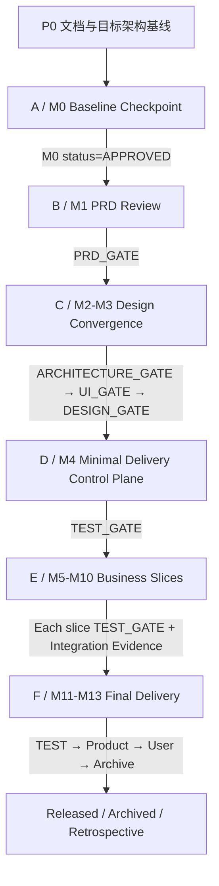

# 项目管理与演进

```yaml
status: draft
version: 0.2-r6
owner: program-management
last_updated: 2026-07-13
project_id: bossresume
workflow_feature: bossresume-full-refactor
```

## 1. 项目目标与事实源

### 1.1 当前唯一主目标

```text
完整交付 docs/prd/bossresume-full-refactor-prd.md
```

最终目标是通用 AI 软件公司，但当前所有平台能力都必须证明它直接帮助 BossResume 更快、更稳、更好地完成真实交付。

### 1.2 唯一事实源

| 内容 | 唯一事实源 |
|---|---|
| 产品目标、用户、范围 | `01-business-and-product.md` |
| 架构、Workflow Phase、技术边界 | `02-architecture-and-system-design.md` |
| Agent、Task、DAG、Session、Prompt | `03-agent-core-mechanisms.md` |
| 数据合同、Artifact、Project Map、Trace | `04-data-and-knowledge-engineering.md` 与 `schemas/` |
| 工程质量、安全、成本、Integration/Release Evidence | `05-engineering-and-operations.md` |
| 当前正式 Gate | `agent-loop-docs/process/gate-matrix.md` |
| 当前 Workflow | `agent-loop-docs/process/workflow-state.json`、Run/Task/Event |
| M0 Checkpoint 合同 | `agent-loop-docs/process/m0-baseline-checkpoint-contract.md` |
| 阶段 A～F 当前进度 | `appendices/bossresume-delivery-stage-tracker.md` |
| 业务需求 | `docs/prd/bossresume-full-refactor-prd.md` |
| 代码事实 | GitHub Commit/Branch/PR |

聊天、Agent 自我声明、未合并分支和 Draft PR 不能覆盖上述事实源。

## 2. 当前真实状态

```yaml
portfolioStage: A
portfolioStageStatus: IN_PROGRESS
workflowStatus: READY
phase: INTAKE
round: 0
gate: NONE
gateStatus: DRAFT
currentRunId: null
projectType: existing_refactor
productPrdEditMode: review_only
singleMode: true
auto: false
m0CheckpointArtifactExists: false
m0CheckpointStatus: null
m0EffectiveApproval: false
```

含义：

- P0 文档与目标架构基线已经建立，但仍有 4 项 Policy/Contract Follow-up。
- 阶段 A 正在推进 M0 人工/系统基线核查。
- Agent Workflow 尚未启动正式 Product Run。
- M0 没有符合合同的结构化 Result，因此阶段 B 不得 `READY`。
- Product Agent、业务 PRD 修改和业务代码开发全部禁止。
- Auto 在所有入口继续关闭。

## 3. 当前正式 Gate 权威

当前正式 Gate 只有：

```text
PRD_GATE
ARCHITECTURE_GATE
UI_GATE
DESIGN_GATE
TEST_GATE
PRODUCT_ACCEPTANCE_GATE
USER_ACCEPTANCE_GATE
ARCHIVE_GATE
```

项目管理规则：

- `gate-matrix.md` 是当前 Gate 清单和执行合同的唯一权威。
- 路线图、阶段台账和流程图只能引用上述 Gate。
- M0 是 Workflow 前置 `Baseline Checkpoint`，不是正式 Gate。
- Integration Commit/Evidence 是 `TEST_GATE` 强制输入，不是独立 Gate。
- Release/Rollback/Health Check 是 `ARCHIVE_GATE` 前置证据，不是独立 Gate。
- 未来可能引入的 `TECH_GATE`、`TASK_DAG_GATE`、`IMPLEMENTATION_GATE`、`INTEGRATION_GATE`、`RELEASE_GATE` 必须标记：

```text
Future Target
未注册
未实现
不得用于当前 Workflow 状态推进
```

## 4. A～F 与 M0～M13 路线



| 顶层阶段 | 里程碑 | 当前正式 Gate/检查 |
|---|---|---|
| P0 | 文档与目标架构基线 | 文档 Commit/Review；不属于业务 Workflow |
| A | M0 基线冻结 | M0 Baseline Checkpoint；非正式 Gate |
| B | M1 需求收敛 | `PRD_GATE` |
| C | M2～M3 设计收敛 | `ARCHITECTURE_GATE → UI_GATE → DESIGN_GATE` |
| D | M4 最小开发控制面 | `TEST_GATE` |
| E | M5～M10 业务切片 | 每切片独立 `TEST_GATE` |
| F | M11～M13 最终交付 | `TEST_GATE → PRODUCT_ACCEPTANCE_GATE → USER_ACCEPTANCE_GATE → ARCHIVE_GATE` |

## 5. 阶段管理规则

### 5.1 阶段状态

```text
NOT_STARTED
READY
IN_PROGRESS
NEEDS_FIX
NEEDS_USER
BLOCKED_BY_SYSTEM
GATE_REVIEW
APPROVED
COMPLETED
ARCHIVED
```

项目阶段状态与 Workflow Runtime 状态必须分开记录。

### 5.2 阶段完成

阶段只有同时满足以下条件才能 `COMPLETED`：

1. 所需正式 Gate 全部通过；无正式 Gate 的 Checkpoint 符合独立合同并有批准人。
2. 无 OPEN Blocking/Major Issue。
3. 必需 Artifact 存在、可访问、Hash/版本匹配。
4. 命令 Evidence 包含 command、cwd、exitCode、environment、commitSha、executedAt、logPath。
5. Workflow 合法迁移，或明确属于 Workflow 启动前阶段。
6. 下一阶段输入准备完成。

Agent 声明、只编译通过、Markdown 结论、Draft PR 或未合并分支不能单独作为完成证据。

### 5.3 更新台账

每次 Checkpoint/Gate/Phase/Run 状态变化必须同步：

- `bossresume-delivery-stage-tracker.md` 总览。
- 对应阶段/切片状态和证据。
- Change Log。
- 必要的 Decision、Issue、Artifact 和 Trace。

历史记录不可覆盖，使用新版本或 supersedes 关联。

## 6. M0 Baseline Checkpoint

### 6.1 合同与固定路径

合同：

```text
agent-loop-docs/process/m0-baseline-checkpoint-contract.md
```

BossResume Result 固定路径：

```text
agent-loop-docs/checkpoints/bossresume-full-refactor-m0-baseline-checkpoint.json
```

当前文件不存在，必须记录：

```yaml
checkpointArtifactExists: false
checkpointStatus: null
effectiveApproval: false
```

不得创建假 Result 让文档检查通过。

### 6.2 唯一批准值

M0 状态闭集：

```text
DRAFT
IN_PROGRESS
CHANGES_REQUESTED
NEEDS_USER
BLOCKED_BY_SYSTEM
APPROVED
```

只有 `APPROVED` 可以使阶段 B 变为 `READY`。禁止使用 `NOT_APPROVED`、`M0_BASELINE_APPROVED`、`M0 Gate PASS` 等平行值。

### 6.3 M0 验收范围

- Master/Base SHA 和远端基线。
- 工作区、Worktree、分支和残留进程。
- Workflow/Run/Task/Event/Artifact 一致性。
- `verify`、`doctor`、`status`、`jobs`、Single Preview。
- 无 Current Run 场景的 Baseline Verify。
- Auto 在 CLI、Preview、Orchestrator、环境变量入口确定性拒绝。
- Brain 无业务代码权限。
- 本轮未修改业务 PRD 或业务代码。
- Evidence Manifest、命令、退出码、环境、Commit、日志和时间。

### 6.4 M0 未通过时

- 阶段 A 不得 `COMPLETED`。
- 阶段 B 不得 `READY`。
- Product Agent 不得启动。
- 业务 PRD 不得修改。
- 业务代码不得开发。
- Auto 保持关闭。

## 7. 阶段 B：需求收敛（M1）

### 7.1 流程

```text
Product Initial Review
→ Product 修订候选
→ FE / BE / Test / UI 独立 PRD Review
→ Issue 汇总与 Owner 分派
→ Product Revision
→ Recheck
→ PRD_GATE
```

### 7.2 准入

- M0 Result 存在、合同有效、`status=APPROVED`。
- Workflow 仍可从 INTAKE 合法启动。
- PRD 路径和 Base SHA 固定。
- 无系统阻塞或活动冲突 Run。

### 7.3 退出

- PRD 可推导实体、状态机、权限、接口、异常、验收和测试。
- 多方 Review 完成。
- 无 OPEN Blocking/Major/Open Question。
- `PRD_GATE=APPROVED`。

## 8. 阶段 C：设计收敛（M2～M3）

BossResume 为 existing_refactor，采用：

```text
ARCHITECTURE_IMPACT_REVIEW
→ ARCHITECTURE_GATE
→ UI_DESIGN
→ UI_GATE
→ DEVELOPMENT_DESIGN
→ DESIGN_REVIEW
→ DESIGN_GATE
```

新项目则使用 `ARCHITECTURE_DESIGN → ARCHITECTURE_REVIEW → ARCHITECTURE_GATE`。

设计必须覆盖：

- Current Project Map 与影响分析。
- 前后端边界、接口、数据模型、Migration、兼容。
- 页面、组件、交互和异常状态。
- 测试策略、数据和回归。
- Atomic Task 候选、依赖、写入范围、自测和风险。

当前不存在独立当前 `Tech Gate`；三个正式 Gate 必须依次通过。

## 9. 阶段 D：最小开发控制面（M4）

只实现 BossResume 当前交付必需能力：

- Project Map/Drift。
- Requirement Trace。
- Workstream/Atomic Task Contract。
- DAG Generator/Validator/READY。
- Context Manifest/Input Hash。
- Session/Lock/Lease/Heartbeat。
- Artifact Registry 基础。
- Integration Evidence 接入。
- Attempt、Repair/Recheck、预算和收敛。

Task DAG 的设计部分由 `DESIGN_GATE` 检查；控制面实现、恢复测试和 Integration Evidence 通过 `TEST_GATE` 验收。当前不存在独立 Task DAG/Control Plane gateType。

D 完成后才能启动业务切片。

## 10. 阶段 E：业务切片（M5～M10）

### 10.1 切片

1. M5：Application 领域模型与兼容层。
2. M6：投递管理前端。
3. M7：AI Prompt Registry。
4. M8：AI 模板测试中心。
5. M9：数据导入中心。
6. M10：导航与体验收口。

### 10.2 统一切片流程

```text
Approved Requirement/Design
→ Project Map Impact
→ Requirement Trace
→ Atomic Task DAG
→ Implementation
→ Developer Self Test
→ Independent Review
→ Test / Repair / Recheck
→ Task Commit
→ Integration Commit / Evidence
→ TEST_GATE
→ Slice Regression
→ Trace Update
```

每个切片独立记录状态、Task/Artifact、Integration Commit、`TEST_GATE` 和 Trace，不等待所有代码完成后一次性大合并。

### 10.3 初始并发

```text
maxConcurrentCodeAgents = 2
maxConcurrentTestTasks = 1
maxConcurrentIntegrationTasks = 1
maxConcurrentWindows = 4
```

并行必须由 DAG、Lock、资源和预算控制；Auto 仍关闭。

## 11. 阶段 F：最终交付（M11～M13）

```text
Full Integration
→ Final TEST_GATE
→ PRODUCT_ACCEPTANCE_GATE
→ USER_ACCEPTANCE_GATE
→ Release Plan / Migration Dry Run / Rollback Plan
→ Release / Health Check / Rollback if required
→ ARCHIVE_GATE
→ Retrospective
```

当前没有独立 Release gateType。Release 证据完整后进入 `ARCHIVE_GATE`。

### 11.1 完成定义

- PRD 全范围通过 Product 和用户验收。
- 无已知 Blocking/Major Issue。
- 关键 Build/Test/E2E/Migration/Compatibility 通过。
- 代码通过 Integration Commit 正式进入目标分支。
- Requirement Trace 完整。
- 有 Release、Health Check、Rollback 和风险报告。
- 有“快、稳、好”和成本复盘。
- 有严格匹配的用户确认记录。

## 12. 当前暂缓能力

BossResume 首次闭环前暂缓：

- 服务端多租户。
- 多机器 Worker。
- Kubernetes。
- Neo4j。
- 独立向量数据库。
- Temporal 全面迁移。
- 动态多模型自动路由。
- 自动生产发布。
- 完整跨区域高可用。
- Auto 模式。

暂缓能力可保留接口和升级触发条件，但不得阻塞 BossResume 当前闭环。

## 13. 版本路线

### V0.1：BossResume 单项目可靠闭环

必须具备 Single、固定 Agent Team、正式 Workflow/Gate、Task/Workstream/DAG、Session/Lock、Context、Artifact、Integration Evidence、Trace 和基础治理。

退出标准：BossResume PRD 全范围通过用户验收，并有真实复盘。

### V0.2：独立建仓与核心提取

BossResume 完成后创建独立 OS 仓库，将业务硬编码提取为 Project Profile、Workflow Profile、Agent Contract Pack、Capability Pack 和 Acceptance Profile。

### V0.3：第二项目验证

选择与 BossResume 在技术栈、项目类型、数据库、业务领域或测试工具上有差异的项目，验证核心无需修改即可接入。

### V1.0：本地多项目平台

PostgreSQL、Redis/BullMQ、Web Console、多项目 Artifact/Trace/Cost、Profile/Capability Registry、pgvector、Container Adapter 和 OpenTelemetry。

### V1.5：多技术栈 Capability Packs

支持 React、Vue、Node、Java/Spring、Python/FastAPI、Mobile 和 Data/AI。

### V2.0：服务端多用户

Tenant/User/Project 权限、Secret Provider、Container Sandbox、配额、S3 Artifact、Worker Pool 和可观测性。

### V2.5：半自治

自动团队组建、DAG 规划、失败归因和低风险 Repair；人工仍保留 PRD、关键设计、Product、User 和 Release 决策。

### V3.0：高度自治

用户主要提供业务目标、关键决策和最终验收；系统自动规划、开发、测试、集成、发布、监控、修复和知识沉淀。

## 14. 基础设施升级触发条件

### SQLite → PostgreSQL

本地多项目、多进程并发、复杂查询、统一审计或 pgvector 需求出现时升级。

### Worktree → Worktree + Container

多用户、不可信代码、技术栈冲突或需要 CPU/Memory/Network/Secret 隔离时升级。

### 自研 Workflow → 评估 Temporal

多机器、跨天任务、大量 Signal/Pause/Resume，且 Durable History/Recovery 自研成本持续过高时评估。

### pgvector → 评估 Qdrant

向量规模/QPS、复杂过滤或多集合成为瓶颈时评估。

### Nodes/Edges → 评估 Neo4j

跨项目复杂图查询和影响分析成为主路径，关系数据库维护成本显著上升时评估。

## 15. Auto 开启条件

Auto 当前为 OFF。只有同时满足以下条件才允许另行提案：

- Single 在多个真实项目连续稳定。
- Task DAG、Lock、Session、Context、Artifact、Integration Evidence 可确定性验证。
- 重复执行、越权和状态不一致为 0 或达到批准阈值。
- 失败归因、Repair/Recheck 和预算能收敛。
- 高风险操作仍有明确人工 Gate。
- 用户单独批准 Auto Capability 变更。

不得因为文档完成、PR 合并或 M0 通过自动开启 Auto。

## 16. 项目管理验收标准

- 当前 Gate 清单只引用 Gate Matrix 注册类型。
- M0 统一使用 Baseline Checkpoint 合同和唯一 `APPROVED` 值。
- A～F 与 M0～M13 映射无遗漏、重复或双重解释。
- 项目阶段状态与 Workflow Runtime 状态分离。
- 每个阶段和切片有准入、产物、验收、目标、状态和证据。
- Product/User Acceptance 不可被测试或 Agent 判断替代。
- Release Evidence 不伪装成独立 Gate。
- 当前事实、目标架构和 Future Target 明确区分。
- 未通过 M0 前，阶段 B、Product Agent、业务 PRD 修改和业务开发保持禁止。
