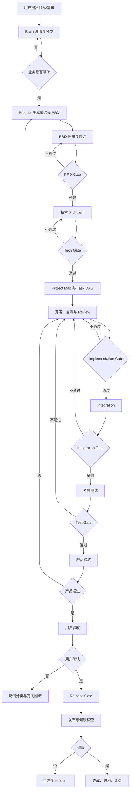
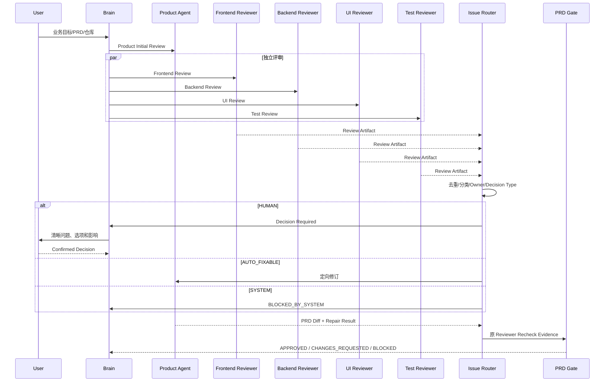

# 业务与产品定义

```yaml
status: draft
version: 0.2
owner: product
last_updated: 2026-07-12
current_validation_project: BossResume
```

## 1. 文档目标

本文档是 AI Software Company OS 的产品事实源，统一定义产品愿景、当前范围、目标用户、核心场景、人机边界、“快、稳、好”指标和产品验收标准。

技术架构、Agent 执行细节、数据契约和工程保障分别由其他五份主文档定义；本文件只描述产品为什么存在、服务谁、解决什么问题、交付什么结果。

## 2. 产品愿景与定位

### 2.1 最终愿景

建设一套通用 AI 软件公司（AI Software Company OS）。用户提供业务目标、需求或 PRD、代码仓库、项目规范和约束，系统按照真实软件公司的工程制度完成：

```text
需求澄清
→ 产品设计
→ 多角色评审
→ 技术设计
→ Task DAG
→ 开发与自测
→ Review
→ Integration
→ 系统测试
→ 产品验收
→ 用户验收
→ 发布与回滚
→ 持续维护
```

多 Agent 不是产品本身，而是执行组织。产品核心是：

> 使用确定性的控制平面管理非确定性的 Agent，使软件交付可追踪、可验证、可恢复、可审计并能够持续优化。

### 2.2 产品定位

AI Software Company OS 不是“同时打开多个 Coding Agent 窗口”，也不是单纯的 Prompt 集合。它是一套软件交付操作系统，负责：

- 管理目标、需求、设计、任务、证据和版本。
- 调度不同岗位 Agent，限制其权限和写入范围。
- 通过 Gate、测试和独立验收控制质量。
- 在失败、超时、冲突和中断后精确恢复。
- 记录成本、风险和全链路 Trace。
- 将真实项目中的有效能力提炼为通用核心。

### 2.3 产品不承诺

- 不承诺零缺陷。
- 不承诺所有项目完全无人参与。
- 不用 Agent 自我声明代替测试和验收。
- 不在没有权限、证据和回滚方案时执行不可逆操作。
- 不以增加 Agent 数量作为进步标准。

## 3. 当前 BossResume 目标

最终目标保持不变，但 v0.1 当前只支持：

- 本地单用户。
- 单项目：BossResume。
- 现有项目增量重构。
- Single 模式。
- 固定核心 Agent 团队。
- Git Worktree 隔离。
- 人工保留关键业务决策、产品验收和发布审批。

当前唯一交付目标：完整实现并验收：

```text
docs/prd/bossresume-full-refactor-prd.md
```

BossResume 同时承担三个角色：

1. 第一家真实客户项目。
2. 第一套完整交付 Benchmark。
3. 通用能力的提炼来源。

BossResume 未完成前，不以多租户、多机器、多技术栈和 Auto 作为最高优先级。

## 4. 目标用户与核心痛点

### 4.1 当前目标用户

- 使用 Codex、OpenCode、Claude Code 等工具进行 Vibe Coding 的个人开发者。
- 需要重构已有项目，但难以管理多个 Agent 输出和返工的人。
- 希望把产品、设计、开发、测试、集成和验收形成稳定闭环的人。

### 4.2 未来目标用户

- 小型软件团队和创业公司。
- 同时维护多个项目的研发组织。
- 需要可审计、可配置、可控制成本的 AI 研发平台团队。

### 4.3 核心痛点

1. Agent 角色描述清楚，但执行结果仍不稳定。
2. 多 Agent 重复读取仓库、PRD 和历史对话，Token 浪费严重。
3. 同一问题触发新窗口、新 Worktree、新 Round 和完整重跑。
4. Agent 自己判断是否通过，流程状态不可靠。
5. Artifact 版本混乱，下游不知道应读取哪个文件。
6. 多个开发结果缺少稳定集成层，容易产生覆盖和冲突。
7. 失败归因不精确，小问题引发整条流程重跑。
8. SYSTEM 问题可能被错误地交给用户决策。
9. 用户难以判断当前进度、阻塞、成本和剩余风险。
10. 项目结束后经验没有形成可复用知识。

## 5. “快、稳、好”

### 5.1 快

“快”不是无限启动 Agent，而是减少无效工作：

- Task DAG 识别依赖和可并行任务。
- 最小 Task Context 避免重复读取全部资料。
- Session、Workstream 和 Worktree 复用。
- 分析缓存和结果缓存具备完整失效规则。
- 确定性失败分类和定向 Repair。
- 每次 Repair 只运行受影响测试，阶段 Gate 运行更广回归。
- 用户只处理真正需要业务判断的问题。

### 5.2 稳

“稳”依赖确定性控制：

- Workflow Engine 决定状态跳转。
- Gate Engine 校验结构、证据和自动化测试。
- Task Lock、Lease、Heartbeat 防止重复执行和僵尸任务。
- Worktree/Container 隔离写入。
- Artifact Registry 保证唯一有效版本和历史追踪。
- Project Map 和 Drift Check 管理影响范围。
- Integration Service 独立执行合并、构建、契约检查和回归。
- Checkpoint、Event Log 和恢复协议支持中断后继续。
- Repair、Recheck、成本和时间都有上限。

### 5.3 好

“好”意味着降低用户负担并提升最终产品体验：

- 只有业务歧义、范围决策、高风险操作和主观验收才询问用户。
- Agent 通过结构化 Artifact 协作，不依赖无限群聊。
- 产品、UI、代码、测试和用户验收相互独立。
- 界面清楚展示阶段、任务、阻塞、成本、风险和待决策事项。
- 需求到设计、任务、代码、测试和验收全链路可追踪。
- 用户能够看到可运行结果，而不是只看到 Agent “已完成”。

## 6. 核心业务场景

每个业务场景都必须定义：触发条件、输入、参与角色、状态变化、正式 Artifact、Gate、异常路径、用户介入点和完成标准。

### S01：模糊想法到 PRD

- **触发：**用户只有业务目标，没有完整需求。
- **流程：**Brain 澄清关键业务问题；Product 生成 PRD；前端、后端、UI、测试独立评审；Product 修订；PRD Gate。
- **用户介入：**业务歧义、范围和体验取舍。
- **完成：**PRD 可设计、可开发、可测试，无 OPEN Blocking/Major。

### S02：已有完整 PRD

- 不重新讨论已明确内容。
- 重点验证范围、流程、状态、实体、字段、接口、权限、异常、迁移和验收。
- 采用一次完整初审和有限定向 Recheck，禁止无限评审。

### S03：现有项目增量重构

```text
仓库扫描
→ Current Project Map
→ 已有能力与需求差距
→ 影响范围
→ 改造 PRD
→ 迁移与兼容方案
→ Task DAG
```

禁止忽略已有功能、按全新项目重写、未经证据删除旧逻辑。每项需求必须标明新增、修改、复用或废弃。

### S04：从零开发新项目

除业务设计外，必须增加项目初始化、架构模板、环境、CI、部署、安全和可观测性任务。完成标准是可运行工程基线和首个业务切片，而不是一次性生成整个项目。

### S05：小型 Bug 修复

```text
复现
→ 证据
→ 影响范围
→ 唯一 Primary Owner
→ Repair
→ Affected Tests
→ Regression Gate
```

除非 Bug 证明需求或架构错误，否则不重新运行 PRD 和完整技术设计。

### S06：UI 重构

由 Product、UI、Frontend、Test 参与，覆盖主路径、页面职责、视觉规范、Loading/Empty/Error/Permission 状态、响应式和可访问性。用户参与关键视觉与体验取舍。

### S07：数据库迁移

必须覆盖 Schema、兼容、Migration Dry Run、数据回填、校验和回滚，重点处理大表锁、旧版本兼容、幂等、批量恢复和数据丢失风险。

### S08：测试失败后的定向 Repair

系统先依据退出码、文件路径、测试覆盖、OpenAPI Diff、Schema Diff 和环境证据进行确定性归因；低置信度时再进入 Review，不允许同时自动派给多个 Agent。

### S09：Integration 冲突

检测 Git、文件、API、Schema、Migration、Route、Env 和测试资源冲突。禁止自动选择“最后写入”或复制文件覆盖。

### S10：用户中途修改需求

用户反馈必须分类：

- Bug → Implementation Repair。
- 体验/视觉 → UI/Frontend Repair。
- 需求误解 → Product Revision。
- 新增需求 → New Feature Workflow。
- 性能问题 → Performance Task。
- 范围变化 → PRD Change Control。

输入基线变化后，受影响 Task、Cache 和 Artifact 必须 SUPERSEDED。

### S11：产品验收不通过

- 功能偏差 → Development Repair。
- 体验偏差 → UI/Frontend Repair。
- PRD 错误 → Product Revision。
- 非目标被误做 → Scope Repair。

### S12：用户验收不通过

Brain 将反馈结构化为 Bug、体验、需求误解、新增需求、性能或范围变化，进入正确回流路径。只有用户明确确认才能进入 Release。

### S13：模型或工具不可用

- 临时错误：有限重试和退避。
- Provider 连续失败：Circuit Breaker。
- 模型替换：重新计算执行 Fingerprint。
- Tool、Parser、Workspace 故障：BLOCKED_BY_SYSTEM，不询问用户业务决策。

### S14：系统中断与恢复

系统停止新调度，对账 Workflow、Task、Lock、Session、Workspace、Artifact 和 Event。依据副作用和现场完整性决定续跑或新 Attempt，不从 PRD 起点全部重跑。

### S15：发布失败与回滚

健康检查失败后执行应用版本、Feature Flag 和兼容数据库回滚，产生 Incident Artifact。回滚成功不等于交付完成，仍需重新进入 Repair 和 Release Gate。

## 7. 产品全生命周期



## 8. PRD 评审与收敛



收敛限制：

- 完整 Initial Review：1 次。
- Product Repair：默认最多 2 次。
- 原 Reviewer Recheck：默认最多 2 次。
- Recheck 只读取原 Issue、修复 Diff、相关章节和 Confirmed Decisions。
- 连续 3 轮关闭问题数不高于新增问题数时进入 NON_CONVERGENT。
- 新 Issue 必须说明是否由当前变更引入。

## 9. 人机交互与过程控制

### 9.1 必须询问用户

- 业务规则存在多个合理解释。
- 范围、优先级和产品体验取舍。
- 不可逆数据变更。
- 超过成本、时间、安全或合规阈值。
- 生产发布和高风险外部副作用。
- 产品最终验收。

### 9.2 禁止询问用户

- Lint、格式、类型和编译错误。
- 明确测试失败和可确定 Owner 的 Bug。
- Agent JSON Schema 失败。
- Worktree、Parser、状态同步和工具故障。
- 可自动修复的文档格式问题。
- 不改变产品行为的实现细节。

### 9.3 提问格式

```text
问题
为什么现在必须决定
选项及各自影响
推荐及原因
不决定会阻塞什么
是否可稍后决定
```

### 9.4 暂停、恢复和取消

- **Pause：**停止新任务；运行任务到安全点；保存 Checkpoint。
- **Resume：**验证输入 Hash、State、Session、Workspace、Lock 和 Artifact 后恢复。
- **Cancel：**取消未开始 Task；安全终止运行 Task；保留审计；外部副作用执行补偿。
- **Scope Change：**生成 Change Request，计算影响范围，Supersede 受影响对象，由 Gate 决定回退阶段。

### 9.5 用户界面应展示

- 当前阶段和目标。
- 已完成内容和证据。
- 活跃 Task/Agent，但不要求用户管理每个窗口。
- 阻塞原因和责任类型。
- 待用户决定事项。
- 当前成本、重试和风险。
- 下一 Gate 和通过条件。

## 10. 范围与非目标

### 10.1 v0.1 范围

- 单项目 BossResume。
- 本地单用户。
- Single 模式。
- 固定产品、UI、前后端、测试和 Review 角色。
- Worktree、Gate、Repair、Integration 和验收。
- 最小 Session、Lock、Context、Artifact 和 Trace 能力。

### 10.2 v0.1 非目标

- 服务端多租户 SaaS。
- 多机器和 Kubernetes 调度。
- 支持所有语言和技术栈。
- 复杂在线 Prompt CMS。
- 无限 Agent 群聊。
- 自动生产发布。
- 完整多区域高可用。
- 在 BossResume 与第二项目稳定 Single 前开放 Auto。
- 以向量数据库作为唯一事实源。

## 11. 产品指标

### 快

- 总 Lead Time。
- 各阶段 Cycle Time。
- Ready Queue Wait。
- 并行效率。
- Context/Session 复用率。
- 缓存命中率。
- 无效重跑次数。
- 平均 Repair 时间。

### 稳

- 重复活动 Task 数量，目标为 0。
- 状态不一致次数。
- Artifact 覆盖次数，目标为 0。
- Context Stale Escape。
- Integration 一次通过率。
- 恢复成功率。
- Reopened Issue Rate。
- Blocking/Major 缺陷逃逸率。

### 好

- 每个 Feature 用户提问次数。
- 错误询问用户次数。
- 产品验收一次通过率。
- 用户验收返工率。
- 需求覆盖率。
- UX Issue 数量。
- Scope Drift 数量。
- 用户满意度。

### 成本

- 每个 Approved Requirement 的 Token 和模型费用。
- 每个 Approved Task 成本。
- 每次 Repair 成本。
- 缓存节省成本。
- 不同模型投入产出比。

## 12. 产品验收标准

### 12.1 BossResume v0.1

- `bossresume-full-refactor-prd.md` 全范围完成。
- PRD、Tech、Implementation、Integration、Test Gate 通过。
- Product Acceptance 和 User Acceptance 通过。
- 无已知 Blocking/Major Issue。
- Build、Typecheck、关键单测、集成测试和 E2E 关键路径通过。
- 数据迁移、兼容和回滚可验证。
- 不发生重复活动 Task、无意义窗口、越权修改和 Artifact 覆盖。
- Requirement → Design → Task → Code → Test → Acceptance Trace 完整。

### 12.2 平台长期目标

- 第二个独立项目接入时不需要修改核心流程代码。
- 不同模型可以通过 Adapter 替换。
- 项目规则通过 Profile 和 Capability Pack 加载。
- 用户主要负责目标、关键决策和最终验收。
- 系统能够稳定处理失败、恢复、集成、发布和持续维护。
