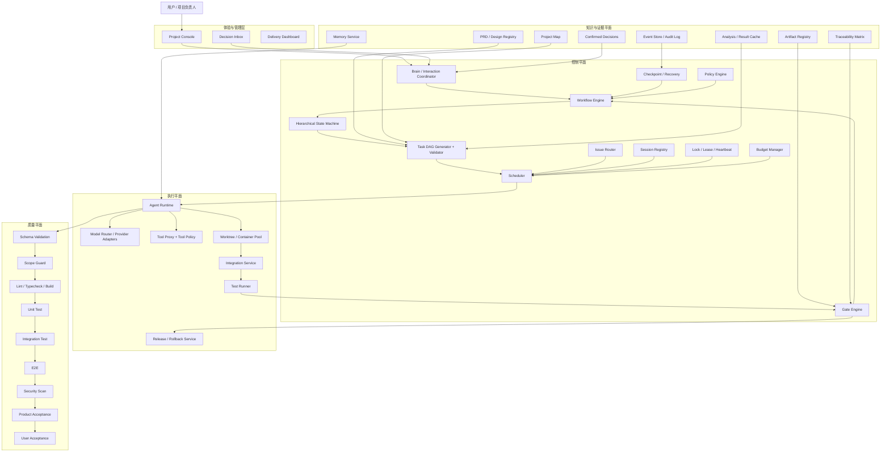
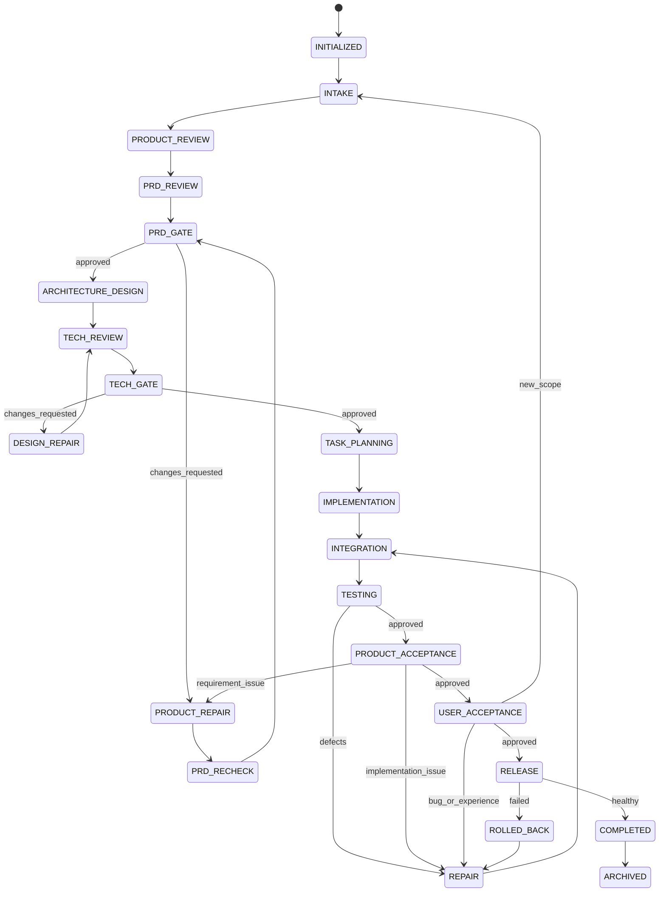

# 架构与系统设计

```yaml
status: draft
version: 0.2
owner: architecture
last_updated: 2026-07-12
```

## 1. 架构目标

目标系统不是“多个 Agent 互相聊天”，而是一个由确定性控制平面管理 Agent 执行的软件交付操作系统。

设计目标：

- 支持从模糊需求到发布维护的完整生命周期。
- 支持现有项目增量改造和新项目开发。
- 支持多模型、多技术栈和多项目能力包。
- 所有状态、Artifact、测试和决策可追踪、可恢复、可审计。
- Agent 可替换，流程和质量标准不能依赖单一模型。
- 当前 BossResume 可使用本地 Adapter 渐进落地，不要求一次迁移到最终基础设施。

## 2. 当前系统架构与成熟度

### 2.1 当前定位

BossResume 当前已经形成一个“阶段式多 Agent 控制面原型”，不是简单 Prompt 集合；但它仍不是通用 AI 软件公司，也尚未证明能完整交付一个真实大型 PRD。

```text
L0 多 Agent 可启动：已完成
L1 确定性阶段、Gate、Worktree：基本完成
L2 单项目可靠完整交付：当前目标
L3 多项目、多技术栈平台：未完成
L4 高度自治 AI 软件公司：长期目标
```

### 2.2 当前核心入口

根 `package.json` 已提供：

- `npm run agent`
- `npm run agent:status`
- `npm run agent:brain`
- `npm run agent:state`
- `npm run agent:loop`
- `npm run agent:loop:verify`
- `npm run agent:checkpoint`

### 2.3 当前 Workflow State

```json
{
  "featureKey": "bossresume-full-refactor",
  "prdPath": "docs/prd/bossresume-full-refactor-prd.md",
  "projectType": "existing_refactor",
  "workflowStatus": "READY",
  "phase": "INTAKE",
  "round": 0,
  "nextAgent": "product_agent"
}
```

这说明控制面已准备，但正式 Product Initial Review 尚未开始。

### 2.4 当前已支持能力

- Product、PRD、Architecture、UI、Design、Implementation、Testing、Acceptance 等阶段。
- `CHANGES_REQUESTED`、`RECHECK_REQUIRED`、`BLOCKED` 分流。
- Brain、Product、UI、Frontend/Backend Architect、Frontend/Backend Developer、Test、Review、Repair 等角色。
- 独立 Git Worktree。
- Integration Branch 和 Integration Worktree 基础。
- Gate、Issue、Repair、Recheck、Reverify。
- Auto 从 CLI、Preview、Orchestrator 和环境变量入口统一拒绝。
- `BLOCKED_BY_SYSTEM` 与 `NEEDS_USER` 已区分。
- 结构化状态、运行日志、Gate Result 和 Issue Artifact。

## 3. 当前主要差距

### GAP-001：Planner 还不是 Task DAG

当前 Planner 主要按 Phase 返回固定任务列表，例如 IMPLEMENTATION 固定生成前端大任务和后端大任务。缺少：

- `dependsOn`
- `softDependsOn`
- `conflictsWith`
- `resourceLocks`
- `produces`
- DAG Validator
- 基于依赖完成情况的 READY 计算

风险：任务过大、错误并行、共享文件冲突、失败归因不精确。

### GAP-002：Task 不是完整一等实体

当前 Task 仍缺少 workstreamId、inputHash、sessionKey、attempt、Lease/Heartbeat、Context Manifest、Requirement IDs、Acceptance Commands、Required Tests 和 Resource Locks。

### GAP-003：Session、Window、Worktree、Round 耦合

当前 Orchestrator 倾向为每个 Task 创建 Worktree、脚本和窗口，尚无正式 Session Registry 和 Workstream 复用合同。

### GAP-004：上下文以广泛搜索为主

Task 仍可能搜索 Feature 的历史 Review、Gate、Decision、Issue、Tech、Test 和 Acceptance 文件，容易引入旧结论和过量 Token。

目标：Context Builder 必须基于 Task、Project Map、依赖 Artifact 和写入边界生成固定 Manifest。

### GAP-005：缺少 Artifact Registry

目前主要依赖路径和命名约定，缺少 artifactId、type、version、status、hash、supersedes、producedByTask、approvedByGate 和 retention policy。

### GAP-006：Integration 未彻底替代文件复制

目标正式路径必须是：

```text
Task Branch
→ Integration Branch
→ Integration Gate
→ Pull Request / Merge
→ master
```

主工作区不得成为隐式集成目标。

### GAP-007：缺少完整 Integration Gate

尚缺 API Contract Diff、DB Schema/Migration Check、环境变量冲突、路由冲突、Feature Flag 冲突以及正式 Build/Test Evidence Contract。

### GAP-008：缺少 Project Map 与 Drift Check

Project Map 应覆盖模块、目录、API、表、路由、组件、权限、环境变量、后台任务和测试关系，并记录 Evidence 与版本。

### GAP-009：Failure Attribution 不够确定性

必须先由程序依据退出码、文件路径、测试覆盖、API Diff、Migration 和环境错误分类，再由 Agent 处理低置信度情况。

### GAP-010：记忆体系尚未正式化

Working、Long-term、Shared Memory 尚缺写入、检索、过期和冲突策略。

### GAP-011：成本与收敛控制不完整

缺少 Task/Phase/Project 预算、最大 Repair/Recheck、并发上限、连续无收敛停止条件和 Provider Circuit Breaker。

### GAP-012：安全主要依赖 Prompt

需要程序化 Tool Policy、Secret Redaction、Shell/Network/DB/Git 权限和高风险操作 Gate。

### GAP-013：可观测性偏文件日志

缺统一 Trace、Metrics、成本、DAG 阻塞、缓存命中、锁和 Session 可视化。

### GAP-014：通用能力尚未与 BossResume Profile 分离

需要未来抽取 Project Configuration、Workflow Profile、Agent Contract Pack、Capability Pack 和 Acceptance Profile。

### 最大架构问题

> Task、Workstream、Session、Window、Worktree、Artifact、Context 和 Repair 尚未形成统一、可验证、可恢复的执行合同。

## 4. 目标四平面架构



### 4.1 控制平面

负责“应该做什么、何时做、是否允许继续”：

- Workflow Engine。
- 分层 State Machine。
- Task DAG Generator/Validator。
- Scheduler。
- Gate Engine。
- Issue Router。
- Session Registry。
- Lock/Lease/Heartbeat。
- Checkpoint/Recovery。
- Budget Manager。
- Policy Engine。

### 4.2 知识与证据平面

负责“系统知道什么，以及凭什么做出结论”：

- PRD/Design Registry。
- Project Map。
- Artifact Registry。
- Confirmed Decisions。
- Traceability Matrix。
- Memory Service。
- Cache。
- Event Store/Audit Log。

### 4.3 执行平面

负责“安全地完成实际工作”：

- Agent Runtime。
- Model Router/Provider Adapter。
- Tool Proxy。
- Worktree/Container Pool。
- Integration Service。
- Test Runner。
- Release/Rollback Service。

### 4.4 质量平面

质量不是单独一个 Agent，而是确定性工具和独立验收角色组合：

```text
Schema Validation
→ Scope Guard
→ Lint / Typecheck / Build
→ Unit Test
→ Integration Test
→ E2E
→ Migration / API Contract
→ Security Scan
→ Product Acceptance
→ User Acceptance
```

## 5. 核心组件与边界

### Workflow Engine

- 读取当前 Workflow State。
- 接收 Gate Result、用户决策、系统事件和人工信号。
- 只通过合法 Transition 推进状态。
- 不直接执行 LLM 推理和业务代码。

### DAG Generator / Validator

Generator 可以由 Agent 生成候选任务；Validator 必须由程序校验：

- 依赖是否存在。
- 是否有环。
- 输出是否满足下游输入。
- 是否有文件、API、Migration、环境和测试资源冲突。
- Task 是否有 Owner、验收命令和写入边界。

### Scheduler

只调度同时满足以下条件的 Task：

- 状态为 READY。
- 所有硬依赖 APPROVED。
- 资源锁可获得。
- 预算允许。
- Context Manifest 有效。
- 安全策略允许。

### Gate Engine

由确定性检查、结构化 Artifact 和 Agent 建议共同形成结论。Agent 建议不能覆盖确定性失败。

### Issue Router

依据 Issue Type、证据、阶段、文件 Owner 和归因置信度选择唯一 Primary Owner，并记录 Required Recheck。

### Session Registry

以 `project + feature + phase + agent + workstream` 为主键管理 Session、Window、Workspace、上下文版本和生命周期。

### Lock / Lease / Heartbeat

相同 `taskId + inputHash` 不允许存在两个活动执行。进程失联先进入 STALE，再由 Recovery 决定接管或终止。

### Checkpoint / Recovery

Checkpoint 记录状态版本、活动任务、锁、Session、Worktree、Artifact 和最后处理事件。恢复时先 Reconcile，再调度。

### Policy Engine

统一执行 Human Decision、Tool Permission、Security、Budget、Auto Capability 和 Release Policy。

## 6. Workflow、Gate 与控制流

### 6.1 总控制流

```text
INTAKE
→ PRODUCT_REVIEW
→ PRD_REVIEW
→ PRD_GATE
→ ARCHITECTURE_DESIGN
→ TECH_REVIEW
→ TECH_GATE
→ TASK_PLANNING
→ IMPLEMENTATION
→ INTEGRATION
→ TESTING
→ PRODUCT_ACCEPTANCE
→ USER_ACCEPTANCE
→ RELEASE
→ COMPLETED
→ ARCHIVED
```

每个阶段都必须有正式输入、输出、Gate 和回流路径。

### 6.2 依赖方向

```text
Experience → Control → Execution
Control → Knowledge
Execution → Knowledge/Event
Agent → Contract/Artifact
Gate → Workflow
```

禁止：

- Agent 直接写 Workflow Store。
- Agent 直接写 Artifact ACTIVE 状态。
- Execution 绕过 Policy Engine。
- UI 手动标记 Gate PASS 而没有 Gate Evidence。
- Memory 覆盖正式文档和 Confirmed Decision。

## 7. 分层状态机

系统不得使用一个包含所有组合状态的超级状态机。

### 7.1 Workflow State



### 7.2 Phase State

```text
NOT_STARTED
→ PREPARING
→ READY
→ RUNNING
→ VERIFYING
→ APPROVED
```

异常与回流：

```text
VERIFYING → CHANGES_REQUESTED → REPAIRING → RECHECKING → VERIFYING
RUNNING/VERIFYING → BLOCKED → RECOVERING → READY
```

Phase 不得直接从 RUNNING 进入 APPROVED。

### 7.3 Task State

```text
PENDING
→ WAITING_DEPENDENCY
→ READY
→ LOCKING
→ LOCKED
→ RUNNING
→ WAITING_AGENT
→ VERIFYING
→ APPROVED
```

异常状态：

- BLOCKED_BY_RESOURCE。
- STALE。
- RECOVERING。
- CHANGES_REQUESTED。
- REPAIR_READY。
- FAILED。
- CANCELED。
- SUPERSEDED。

关键约束：

- READY 必须满足依赖、上下文、资源、预算和安全条件。
- LOCKED 必须存在 `taskId + inputHash` Lease。
- RUNNING 必须存在 Session、Workspace 和 Heartbeat。
- STALE 不得直接启动第二份执行。
- SUPERSEDED 不删除历史。
- APPROVED 只代表 Task Gate 通过，不代表项目完成。

### 7.4 Issue State

```text
OPEN
→ TRIAGED
→ ASSIGNED
→ FIXING
→ READY_FOR_RECHECK
→ VERIFIED
→ CLOSED
```

辅助状态：REOPENED、DUPLICATE、REJECTED、DEFERRED。

### 7.5 Session State

```text
CREATED
→ ACTIVE
→ IDLE
→ STALE
→ RECOVERING
→ ACTIVE / INVALIDATED
→ CLOSED
```

Session 失效条件：

- PRD/Design Baseline 不兼容变化。
- Agent Contract Major Version 改变。
- Context Manifest Hash 不一致。
- 达到最大 Token、Task 数或生命周期。
- Workspace 丢失或无法验证。
- Model/Tool 版本变化导致上下文不可安全续用。

### 7.6 Integration State

```text
PENDING
→ MERGING
→ CONTRACT_CHECK
→ BUILDING
→ TESTING
→ APPROVED
→ MERGED
```

异常状态：CONFLICTED、WAITING_REPAIR、REJECTED、SUPERSEDED。

### 7.7 Release State

```text
CANDIDATE
→ PRECHECK
→ READY_TO_RELEASE
→ DEPLOYING
→ VERIFYING_HEALTH
→ RELEASED
```

失败路径：DEPLOYING/VERIFYING_HEALTH → ROLLING_BACK → ROLLED_BACK → INCIDENT_REVIEW。

### 7.8 阻塞状态分类

| 状态 | 含义 | 是否询问用户 |
|---|---|---:|
| NEEDS_USER | 业务、范围、体验或高风险决策 | 是 |
| BLOCKED_BY_SYSTEM | Parser、状态、Workspace、工具故障 | 否 |
| BLOCKED_BY_DEPENDENCY | 上游 Task/Artifact 未完成 | 否 |
| BLOCKED_BY_RESOURCE | Lock、端口、测试库、并发配额冲突 | 否 |
| BLOCKED_BY_SECURITY | 权限、Secret、策略拒绝 | 高风险时 |
| BLOCKED_BY_BUDGET | Token、成本、时间超限 | 超阈值时 |
| NON_CONVERGENT | Repair/Recheck 不收敛 | 可能 |

## 8. Adapter 与部署架构

核心依赖接口：

```text
WorkflowStore
EventStore
TaskQueue
LockProvider
SessionRegistry
ArtifactStore
MemoryStore
VectorStore
ProjectMapStore
ModelProvider
SandboxProvider
TraceProvider
SecretProvider
ReleaseProvider
```

### 8.1 BossResume v0.1 Adapter

| 接口 | 当前/目标最小实现 |
|---|---|
| WorkflowStore | JSON / 文件状态 |
| EventStore | 结构化 Event Log |
| TaskQueue | 直接进程；后续 BullMQ |
| LockProvider | 最小文件/Redis Lock |
| ArtifactStore | Git + 文件系统 |
| MemoryStore | JSON / Markdown / SQLite |
| ProjectMapStore | JSON Nodes + Edges |
| SandboxProvider | Git Worktree |
| TraceProvider | Run Log + Winston |

### 8.2 独立平台目标 Adapter

| 接口 | 目标实现 |
|---|---|
| WorkflowStore | PostgreSQL |
| EventStore | PostgreSQL Event Table / Durable History |
| TaskQueue | BullMQ，必要时评估 Temporal |
| LockProvider | Redis |
| ArtifactStore | Git + S3 Compatible Object Storage |
| MemoryStore | PostgreSQL + Git |
| VectorStore | pgvector，规模增长后评估 Qdrant |
| ProjectMapStore | PostgreSQL Nodes + Edges |
| SandboxProvider | Worktree + Container |
| TraceProvider | OpenTelemetry |

### 8.3 部署阶段

- **V0.1 本地单用户：**本地控制面、SQLite/文件、Git Worktree、可选 Redis/BullMQ。
- **V1 本地多项目：**PostgreSQL、Redis/BullMQ Worker、Web Dashboard、Container 可选。
- **V2 服务端多用户：**Tenant/User/Project/Workspace 权限、Secret Provider、强制 Sandbox、资源配额和完整 Observability。

## 9. 技术选型

### 9.1 决策汇总

```text
核心语言：Node.js + TypeScript
当前 Workflow：自研确定性引擎
目标 Durable 方案：达到触发条件后评估 Temporal
任务执行：BullMQ + Redis
当前持久化：SQLite / File Adapter
目标持久化：PostgreSQL
Agent 数据合同：JSON Schema 2020-12 + Ajv
HTTP 合同：OpenAPI 3.1
当前 Sandbox：Git Worktree
目标 Sandbox：Container
当前记忆：Git + JSON/SQLite
目标长期记忆：PostgreSQL + pgvector
Project Map：Nodes + Edges
当前日志：Winston + Event Log
目标可观测性：OpenTelemetry + Prometheus + Grafana
部署路线：本地单项目 → 本地多项目 → 多用户服务端
Auto：BossResume 和第二项目稳定 Single 前保持关闭
```

### 9.2 选型摘要

- **Node.js + TypeScript：**与当前 Agent Loop、CLI、JSON 和 Web 工具链一致；Python/Java/Go 通过 Capability Adapter 接入。
- **自研 Workflow：**BossResume 首次闭环前继续保留；多机器、跨天任务、大量 Signal 或恢复成本过高时评估 Temporal。
- **BullMQ + Redis：**负责 Task Queue、Lock、Lease、Heartbeat 和热状态；Redis 不是唯一事实源。
- **SQLite → PostgreSQL：**当前本地验证保留 SQLite；多项目、多进程、复杂查询和 pgvector 触发迁移。
- **JSON Schema + Ajv：**作为 Agent/Task/Artifact 等唯一正式运行时合同；HTTP 使用 OpenAPI 3.1。
- **Nodes + Edges：**当前 Project Map 方案；跨大量项目且图查询成为核心后再评估 Neo4j。
- **pgvector：**V1 长期记忆和语义检索首选；规模明显增长后评估 Qdrant。
- **Git Worktree → Container：**当前轻量隔离；多用户、不可信代码和资源隔离需求触发 Container。
- **OpenTelemetry：**当前先统一 Event Envelope 与 Trace ID，再逐步接入 Prometheus 和 Grafana。

### 9.3 当前不引入

- Kafka/RocketMQ。
- Neo4j。
- Milvus。
- Kubernetes。
- 全面微服务化。
- Temporal 全面迁移。
- LangGraph 作为唯一状态源。
- 自动生产发布。

## 10. 架构不变量

1. Agent 永远不能直接推进 Workflow。
2. 所有执行必须对应 Task Contract。
3. 所有可消费输出必须对应 Artifact Registry 记录。
4. 同一 `taskId + inputHash` 最多一个活动执行。
5. SYSTEM 问题不能自动转为用户业务问题。
6. Reverify 不创建新的业务 Round。
7. 原始 Artifact 不可覆盖，只能 supersede。
8. 开发代码必须通过 Integration Gate 才能进入主分支。
9. 缓存 PASS 不能替代必要的轻量验证。
10. Auto 必须由 Capability Gate 在所有入口统一控制。
11. Workflow、Task、Issue、Session、Integration 和 Release 状态语义不得混用。
12. 所有状态变化必须包含 Actor、Reason、Evidence 和 State Version。

## 11. 架构验收标准

- 当前 Adapter 与目标 Adapter 边界明确。
- 每个核心模块职责唯一，没有循环控制权。
- 控制、执行、知识和质量平面可独立演进。
- BossResume 可以渐进迁移，不要求一次重写。
- 所有关键状态和副作用可追踪。
- 未来多项目不需要修改 BossResume 业务代码扩展核心。
- 状态机覆盖暂停、恢复、取消、阻塞和 Supersede。
- 技术选型均有 ADR 和重新评估条件。
- 文档描述的目标能力与当前已实现能力清晰区分。
