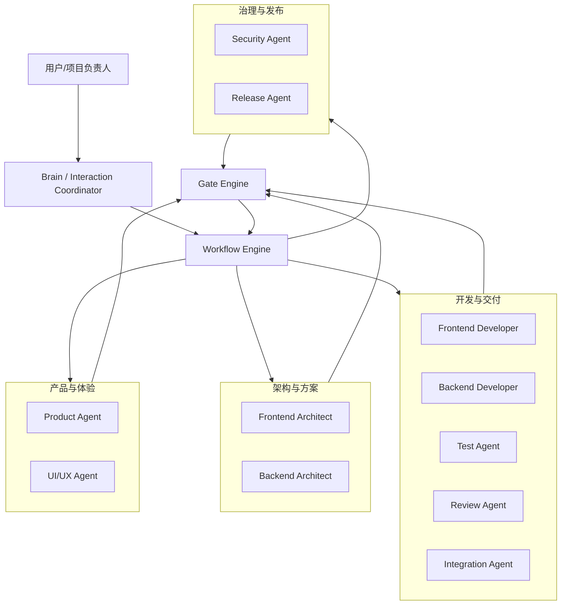
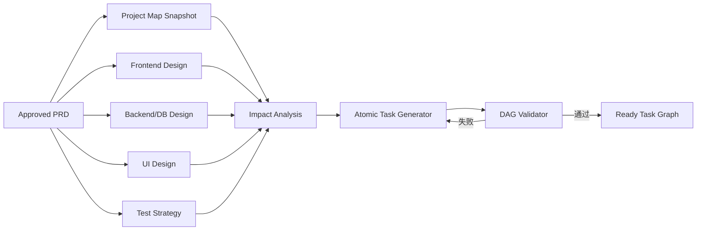
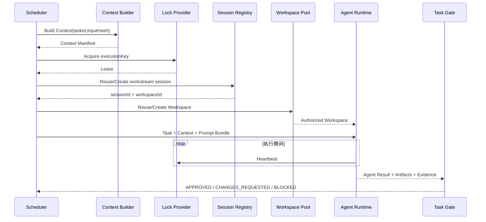
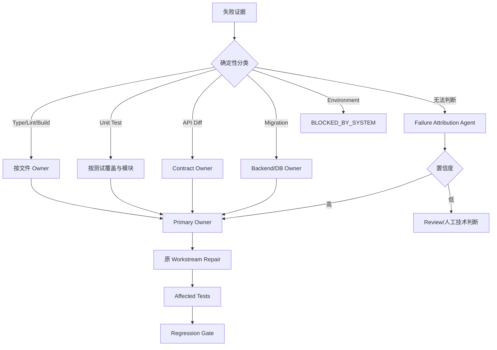

# Agent 核心机制

```yaml
status: draft
version: 0.2
owner: agent-governance
last_updated: 2026-07-12
```

## 1. Agent 设计原则

Agent 是受控岗位，不是流程拥有者。每个 Agent 必须有正式 Contract，包含目标、输入、输出、权限、禁止行为、完成标准、失败类型和升级路径。

统一原则：

- Agent 不写 Workflow State。
- Agent 不直接推进 Phase。
- Agent 不修改 Gate 结论。
- Agent 不启动其他 Agent。
- Agent 不绕过 Tool Policy。
- Agent 不自行宣布整个项目完成。
- 所有可消费结果必须符合 JSON Schema 并注册为 Artifact。
- Reviewer 默认不读取 Developer 的完整推理和自我评价，减少锚定偏差。
- Initial、Repair、Recheck 属于同一 Workstream，默认复用 Session 和 Workspace。
- Agent 的能力、Prompt、模型和工具版本都必须进入执行 Fingerprint。

## 2. Agent 组织结构



## 3. 角色能力与权限

### 3.1 能力矩阵

| Agent | 主要职责 | 是否写业务代码 | 是否写主分支 | 是否决定 Gate | 是否直接询问用户 |
|---|---|---:|---:|---:|---:|
| Brain | 用户沟通、决策整理、阶段摘要 | 否 | 否 | 否 | 是，仅按 Human Policy |
| Product | PRD、范围、流程、产品验收 | 否 | 否 | 建议 | 否，通过 Brain |
| UI/UX | 信息架构、交互、视觉、文案体验 | 否 | 否 | 建议 | 否 |
| Frontend Architect | 前端架构、组件/状态/API 边界 | 否 | 否 | 建议 | 否 |
| Backend Architect | 领域、DB、API、并发、迁移 | 否 | 否 | 建议 | 否 |
| Frontend Developer | 前端原子任务实现和自测 | 是，授权路径 | 否 | 否 | 否 |
| Backend Developer | 后端/DB/API 原子任务实现和自测 | 是，授权路径 | 否 | 否 | 否 |
| Test | 测试设计、执行、缺陷、复测 | 仅测试文件 | 否 | 建议 Test Gate | 否 |
| Review | Scope、Code、跨文档一致性 | 否 | 否 | 建议 | 否 |
| Integration | 复杂冲突解释、集成 Issue 归因 | 不直接实现业务 | 否 | 建议 | 否 |
| Security | Secret、依赖、权限、威胁审查 | 否 | 否 | 建议 Security Gate | 高风险通过 Brain |
| Release | 发布计划、部署验证、回滚 | 仅受控发布配置 | 否 | 建议 Release Gate | 高风险通过 Brain |

### 3.2 Brain Agent

**目标：**将用户自然语言目标转化为 Feature Context、Confirmed Decisions 和用户验收结论。

**输入：**用户消息、当前 Workflow 摘要、待决策 Issue、Approved Artifact 摘要、Human Decision Policy。

**输出：**User Decision Artifact、澄清结果、阶段摘要、用户验收结果。

**禁止：**修改业务代码、代表用户确认、将 SYSTEM 问题包装成业务问题、启动 Sub-agent、直接修改 PRD/Gate。

### 3.3 Product Agent

**目标：**确保范围、用户流程、业务规则、异常路径和验收标准足够明确。

**输入：**用户目标、Confirmed Decisions、当前 PRD、多角色 Review Issue、Project Profile。

**输出：**PRD Draft/Revision、Product Review Result、Product Acceptance Result。

**禁止：**决定底层技术实现、关闭测试 Bug、修改业务代码、自行宣布 PRD Gate 通过。

### 3.4 UI/UX Agent

负责信息架构、页面职责、交互、视觉令牌、文案语气、Loading/Empty/Error/Permission 状态、响应式和可访问性。不得擅自扩大业务范围或决定数据库实现。

### 3.5 Frontend Architect

负责路由、组件边界、状态管理、API 接入、权限、性能、错误处理和前端 Task 候选。不得把所有实现聚合成一个“大前端任务”。

### 3.6 Backend Architect

负责领域模型、DB 约束和索引、API、事务、幂等、并发、权限、迁移、回填、兼容和回滚。必须输出 OpenAPI、Migration Plan 和后端 Task 候选。

### 3.7 Frontend/Backend Developer

只在指定 Worktree 和授权路径完成 Task，输出 Code Diff、changedFiles、implementedRequirementIds、testsRun、knownRisks 和 openIssues。

禁止：

- 修改 forbiddenPaths。
- 写 master。
- 自行合并其他分支。
- 修改 Workflow State。
- 删除或弱化测试来制造通过。
- 未经批准升级依赖或修改全局架构。

后端额外要求：Migration 提供回滚或补偿方案；API 变更同步 OpenAPI；禁止读取或输出真实 Secret。

### 3.8 Test Agent

独立验证需求与实现，不以 Developer 自评为依据。可运行测试并修改测试白名单目录，不能修改业务实现。Developer 只能标记 `READY_FOR_RECHECK`，Test Agent 复测后才能关闭 Bug。

### 3.9 Review Agent

执行 PRD/Design 一致性、Scope Review、Code Review、Traceability Review 和 Risk Review。输出 Issue、Evidence、Severity、Decision Type、Owner 建议和 Required Recheck。

### 3.10 Integration Agent / Service

- **Integration Service：**确定性执行 Merge、Rebase、OpenAPI Diff、DB Schema/Migration Check、Build、Typecheck 和回归。
- **Integration Agent：**解释复杂语义冲突，生成 Integration Issue 和 Primary Owner 建议。

Integration Agent 不得随意选择一方代码或绕过冲突。

### 3.11 Security Agent

负责 Secret Scan、Tool/Network/DB Permission、依赖与供应链、数据分类、Threat Model、高风险 Migration 和发布审批建议。

### 3.12 Release Agent

负责 Release Plan、环境和配置检查、Migration Dry Run、Feature Flag、发布步骤、健康检查、回滚和 Incident Artifact。不得绕过 Release Gate。

### 3.13 Tool 权限矩阵

| Agent | Shell | Network | DB Write | Git Commit | Git Merge | Git Push | Secret Read | Release |
|---|---:|---:|---:|---:|---:|---:|---:|---:|
| Brain | 最小 | 否 | 否 | 否 | 否 | 否 | 否 | 否 |
| Product/UI/Architect | 只读检查 | 受限 | 否 | 文档 Worktree | 否 | 否 | 否 | 否 |
| Frontend Dev | 白名单 | 依赖安装受控 | 否 | Task Branch | 否 | 否 | 否 | 否 |
| Backend Dev | 白名单 | 受限 | 仅开发/测试库 | Task Branch | 否 | 否 | Secret Provider 临时注入 | 否 |
| Test | 测试命令 | 受限 | 测试库 | 测试分支 | 否 | 否 | 否 | 否 |
| Review | 只读命令 | 否 | 否 | 否 | 否 | 否 | 否 | 否 |
| Integration | Git/Build 白名单 | 受限 | Migration 测试库 | Integration Branch | 是 | 策略控制 | 否 | 否 |
| Security | 扫描命令 | 受限 | 否 | 否 | 否 | 否 | 只看扫描结果 | 否 |
| Release | 发布白名单 | 目标环境 | 受控 | Release Branch | 受控 | 审批后 | Secret Provider | 审批后 |

## 4. Task、Workstream 与 DAG

### 4.1 Task 是执行核心实体

每个 Task 必须明确：

```json
{
  "taskId": "backend-application-api",
  "workstreamId": "ws-application-api",
  "ownerAgent": "backend_agent",
  "goal": "实现投递管理核心 API",
  "requirementIds": ["REQ-APPLICATION-001"],
  "inputHash": "sha256:...",
  "dependsOn": [],
  "softDependsOn": [],
  "conflictsWith": [],
  "resourceLocks": [],
  "consumes": [],
  "produces": [],
  "editablePaths": [],
  "forbiddenPaths": [],
  "acceptanceCommands": [],
  "requiredTests": [],
  "contextManifestId": "ctx-...",
  "sessionKey": "...",
  "attempt": 1,
  "maxAttempts": 2
}
```

### 4.2 Workstream

Workstream 是连续责任单元，Initial、Repair、Recheck 优先复用：

- Owner Agent。
- Session。
- Workspace/Worktree。
- Baseline Commit。
- Context Version。
- Active Issue。

### 4.3 Task DAG 生成



### 4.4 DAG Validator

必须校验：

- 依赖 Task 存在。
- 无循环依赖。
- produces 能满足下游 consumes。
- 写入路径、API、Migration、Env 和 Test Resource 无未声明冲突。
- Task 有 Owner、Goal、Requirement、Context、Acceptance Commands 和 Tests。
- 原子任务粒度能够在一个 Workstream 中完成和验证。

### 4.5 任务粒度标准

Task 不应以“完成全部前端”或“完成全部后端”为目标。一个合格 Task 应：

- 有单一可验证目标。
- 写入边界清晰。
- 可在合理 Token/时间预算内完成。
- 失败可唯一归因。
- 有独立测试和输出 Artifact。
- 不需要同时修改大量无关模块。

## 5. Scheduler、Session 与 Lock

### 5.1 Scheduler READY 条件

只有同时满足以下条件才能调度：

- 所有硬依赖 APPROVED。
- 资源锁可获得。
- Context Manifest 有效。
- Workspace 可创建或复用。
- Agent Contract 与 Prompt Version 可用。
- 预算、并发和安全策略允许。

### 5.2 执行时序



### 5.3 Execution Key

```text
executionKey = projectId + taskId + inputHash + executionMode
```

同一 Execution Key 最多存在一个非终态 Run。

### 5.4 Session Registry

Session Key：

```text
project + feature + phase + agent + workstream
```

Session 记录：Agent/Prompt/Model Version、Context Version、Workspace、Token、Task Count、Heartbeat、Lease、状态和失效原因。

### 5.5 Task Lock、Lease、Heartbeat

- Lock 防止重复启动。
- Lease 避免进程死亡后永久占用。
- Heartbeat 证明执行仍存活。
- Heartbeat 过期进入 STALE，先 Recovery，不直接开第二窗口。
- Lock 和 Session 状态必须可通过 Event/DB 重建。

## 6. Worktree 与 Container

### 6.1 当前 Worktree

BossResume v0.1 使用 Git Worktree：

- 每个 Workstream 独立 Branch/Workspace。
- 通过 editablePaths/forbiddenPaths 控制范围。
- Task Branch 不直接写 master。
- Repair 复用原 Worktree。

### 6.2 目标 Container

多用户、不可信代码、多语言环境或网络/资源隔离要求出现时使用 Container：

- CPU/Memory/Time 限制。
- Network Policy。
- Secret 临时注入。
- Disposable Workspace。
- 依赖和运行环境隔离。

Worktree 和 Container 都通过 SandboxProvider 接口接入。

## 7. 通信与协作

### 7.1 默认协作方式

不使用无限自由群聊。默认链路：

```text
Task Contract
→ Agent 执行
→ Agent Result / Artifact
→ Artifact Registry / Gate / Issue Router
→ 下一个 Task
```

### 7.2 通信渠道

- **Task Dispatch：**Scheduler 单向派发 Task、Context、Prompt、Budget 和 Workspace。
- **Artifact：**用于 PRD、设计、Review、代码结果、测试和验收。
- **Event Bus：**用于状态、Heartbeat、完成、失败、权限拒绝和预算告警。
- **Issue Board：**用于问题、归因、Owner、Recheck 和收敛。
- **Controlled Meeting：**只用于真实多方案权衡、复杂 Contract 冲突或低置信度归因。

### 7.3 Controlled Meeting 规则

- 参与者、议题、轮次和 Token 有上限。
- 不允许讨论无限扩展。
- 最终必须沉淀 Decision/Issue Artifact。
- 聊天记录不是最终事实源。

### 7.4 消息幂等与顺序

每个命令消息有 messageId、idempotencyKey、stateVersion 和 payloadRef。重复消息不得产生重复 Task 或副作用。过期、Schema 错误、Recipient 不存在或引用失效的消息进入 Dead Letter 并生成 SYSTEM Issue。

### 7.5 Human Decision Channel

只有 Brain 与用户直接交互。提问必须包含问题、必要背景、选项、影响、推荐和阻塞后果。用户回答形成不可变 Decision Artifact。

## 8. Failure Attribution、Repair 与 Recheck

### 8.1 归因流程



### 8.2 归因结果

必须包含 candidateOwners、primaryOwner、confidence、evidence、automaticDispatchAllowed 和 requiredTests。

低置信度不得自动同时修改多个模块。

### 8.3 Repair 规则

- 回到原 Workstream、Session 和 Workspace。
- 只注入原 Issue、失败证据、相关代码和必要设计。
- 不重新执行无关评审和实现。
- 默认最多 2 次 Repair。
- Developer 标记 Ready for Recheck；原 Reviewer/Test 关闭问题。

### 8.4 Recheck 与 Reverify

- Recheck 验证业务或技术修复结果。
- Reverify 用于确认已有 Artifact 和 State 一致，不增加业务 Round。
- 原 Artifact 不覆盖，新增 verificationAttempt。
- 连续不收敛进入 NON_CONVERGENT。

## 9. Prompt 管理

Prompt 是受版本管理的运行资产，不得散落在 Agent 文件、脚本和聊天中。

### 9.1 Prompt 分层

```text
Platform System Prompt
→ Agent Role Prompt
→ Workflow/Phase Prompt
→ Project Profile Prompt
→ Task Prompt
→ Repair/Recheck Prompt
→ Runtime Context
```

低层 Prompt 不得覆盖高层安全、权限和状态规则。

### 9.2 Prompt Definition

每个 Prompt 至少包含：

```json
{
  "promptId": "backend-agent-implementation",
  "version": "1.2.0",
  "status": "ACTIVE",
  "scope": "IMPLEMENTATION",
  "agentContractVersion": "backend-agent@1.0.0",
  "template": "...",
  "variables": [],
  "requiredArtifacts": [],
  "outputSchemaId": "agent-result@1.0",
  "riskLevel": "MEDIUM",
  "createdBy": "...",
  "approvedBy": "prompt-gate-..."
}
```

### 9.3 Prompt Registry

负责：

- 唯一 Prompt ID 和版本。
- DRAFT、REVIEW、ACTIVE、SUPERSEDED、ROLLED_BACK 状态。
- 与 Agent Contract、Phase、Project Profile 的绑定。
- Prompt Hash、变更记录和回滚。
- 运行时只加载 ACTIVE 版本。

### 9.4 Prompt 变更 Gate

Prompt 变更必须执行：

- Template Variable 校验。
- Output Schema 测试。
- Golden Cases。
- Negative Cases。
- Prompt Injection/越权测试。
- 与旧版本对比。
- 必要时 Shadow Run。

### 9.5 Prompt 失效影响

Prompt Major Version 或关键安全规则变化时：

- 失效相关 Session。
- 失效执行缓存。
- 更新 executionFingerprint。
- 不影响已归档历史 Run 的可读性。

## 10. 模型路由与降级

### 10.1 Model Provider Adapter

平台定义统一接口：

```text
ModelProvider
PlanningModel
CodingModel
ReviewModel
ClassificationModel
EmbeddingModel
FallbackModel
```

不绑定 Codex、OpenCode、Claude 或单一供应商。

### 10.2 路由维度

- Task 类型。
- 风险等级。
- Context 长度。
- Tool/代码能力。
- 结构化输出稳定性。
- 成本和延迟。
- 数据合规与地区限制。
- Provider 健康状态。
- 是否需要与开发模型不同的 Review 模型。

### 10.3 推荐路由

| 任务 | 能力要求 | 策略 |
|---|---|---|
| 分类、去重、格式检查 | 稳定结构化输出 | 低成本模型可用 |
| PRD/架构分析 | 长上下文、推理 | 高能力模型 |
| 代码实现 | 工具与代码能力 | Coding Model |
| Code Review | 独立性、证据分析 | 尽量不同模型 |
| Failure Attribution | 低幻觉、证据能力 | 确定性优先，模型补充 |
| 摘要 | 高保真结构化摘要 | 可使用专用低成本模型 |
| Embedding | 稳定向量版本 | 固定模型和版本 |

### 10.4 降级策略

```text
缓存命中
→ 缩小 Context
→ 结构化摘要
→ 同等级备用 Provider
→ 低风险任务切换低成本模型
→ 暂停非关键 Task
→ BLOCKED_BY_SYSTEM/BUDGET
```

不得通过降低模型能力跳过关键 Gate、测试或高风险 Review。

### 10.5 Provider Circuit Breaker

- 短暂网络/限流：有限重试和指数退避。
- 连续失败：打开 Circuit Breaker。
- 替换模型：重新计算 Fingerprint，必要时增加 Review。
- 无兼容 Provider：BLOCKED_BY_SYSTEM。

## 11. Agent 版本与评估

### 11.1 Agent Contract 版本

修改 Contract 必须：

- 增加版本号。
- 跑 Golden Cases 和 Contract Regression。
- 必要时 Shadow Run。
- 说明旧 Session、Prompt 和 Cache 是否失效。
- 不覆盖正在运行任务使用的版本。

### 11.2 Agent 评估指标

- Task 一次通过率。
- Schema 合规率。
- Scope Violation 数量。
- 平均 Token/Cost。
- Repair 次数。
- 用户介入次数。
- Review 发现缺陷率。
- 缺陷逃逸率。
- Tool Permission Denial。
- Agent 之间结果一致性。

### 11.3 进入通用核心条件

一个 Agent 或机制进入通用核心必须：

- 在 BossResume 或第二项目真实使用。
- 有正式 Contract、Prompt 和 Schema。
- 有自动化回归与 Benchmark。
- 不依赖 BossResume 业务实体和路径。
- 证明提升效率、稳定性或体验。
